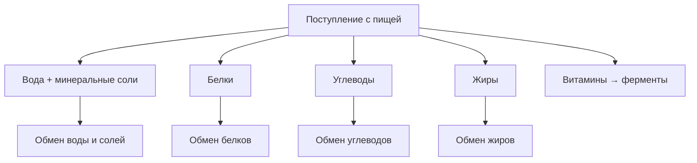
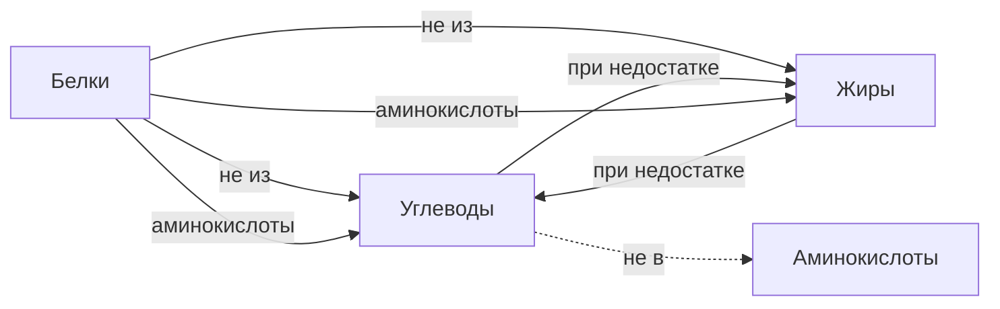

# 10.2 Виды обмена веществ

> [!abstract] Тема
> Обмен воды и солей, белков, углеводов и жиров; азотистый баланс; регуляция гормонами. Связь с пищеварением: [[7.1_Основные_понятия|7.1]], [[7.6_Желудок|7.6]].

---

## Общая схема

| Вид обмена | Основное назначение |
|---|---|
| **Вода и минеральные соли** | Среда метаболизма, осмос, нервная и мышечная функция |
| **Белки** | Пластика, ферменты, гормоны, энергия (резерв) |
| **Углеводы** | Основной **источник энергии** (по массе в рационе) |
| **Жиры** | Энергия, мембраны, депо, терморегуляция |
| **Витамины** | В основном **катализаторы** (часть входит в состав ферментов) |

> Ни вода, ни минеральные вещества **не являются** источниками энергии.

---

## 🔵 Обмен воды и минеральных солей

| Показатель | Значение |
|---|---|
| **Вода в тканях** | От **10 %** (жировая) до **90 %** (кровь, лимфа) |
| **В среднем в теле** | **65–70 %** массы |
| **Потребление воды/сут** | **1,5–2,5 л** |
| **Выведение** | Почки (моча), **кожа** (пот), **лёгкие** (пары) — примерно столько же |
| **Почки** | Объём мочи зависит от **температуры** (может меняться в разы) |

### Функции воды

1. **Универсальный растворитель** — метаболизм в растворе  
2. Доставка **минералов** и **водорастворимых** витаминов  
3. Защита от **переохлаждения** (высокая теплоёмкость)  
4. Защита от **перегрева** (испарение с кожи и слизистых)  
5. Участие в **биохимических** реакциях (образуется и расходуется)

### Основные минералы

| Элемент | Где / роль |
|---|---|
| **Натрий (Na⁺)** | Преобладает **внеклеточно**, плазма; нервные импульсы, **выделение**, **осмотическое давление** |
| **Калий (K⁺)** | Преимущественно **в цитоплазме**; нервы, **сердце** |
| **Кальций, фосфор** | **Кости**; Ca, P, **фтор** — **эмаль зубов**; Ca — мышцы, синапсы, **свёртывание крови** |
| **Железо (Fe)** | **Гемоглобин**; недостаток → **железодефицитная анемия** |
| **Йод (I⁻)** | Гормоны **щитовидной** железы |
| **Хлор (Cl⁻)** | Основной **анион** жидкостей; нервы, синапсы, **HCl** желудка |
| **Zn, Cu, Mg, Co, Fe** | Состав **ферментов** |

> [!note] Осмотическое давление
> Избыточное давление на раствор, отделённый **полупроницаемой мембраной** от чистого растворителя, при котором **прекращается диффузия** — **осмотическое давление**.

---

## 🔵 Обмен белков

> «Жизнь — есть способ существования белковых тел» (Ф. Энгельс).

| Понятие | Содержание |
|---|---|
| **Состав** | **Аминокислоты** |
| **У человека** | **20** белоксинтезирующих АК: **10 заменимых**, **10 незаменимых** |
| **Незаменимые** | **Только с пищей** |
| **Полноценные белки** | Полный набор АК (часто **животные**) |
| **Неполноценные** | Нет ≥1 незаменимой АК |

### Переваривание и судьба аминокислот

| Отдел | Что происходит |
|---|---|
| Рот, глотка, пищевод | **Нет** специфических ферментов |
| **Желудок** | **Пепсин** → **полипептиды** |
| **Тонкая кишка** | Трипсин, химотрипсин, карбоксипептидаза, аминопептидаза → **аминокислоты** → **кровь** |
| **Печень** | Синтез **белков крови**, свёртывания |
| **Ткани** | Синтез **собственных белков** на **рибосомах** по информации **ДНК**; оформление в **комплексе Гольджи** |

### Азотистый баланс

| Показатель | Значение |
|---|---|
| Потребность | **100–110 г** белка/сут |
| **Азотистое равновесие** (взрослый) | Азот с пищей ≈ азот с **мочевиной** и др. |
| **Положительный баланс** | Поступление > распад (рост, выздоровление) |
| **Отрицательный баланс (дефицит)** | Распад > поступление (старость, голодание, болезнь) |

### Функции белков

1. **Пластическая** — мембраны, органеллы  
2. **Ферментативная** — все ферменты  
3. **Регуляторная** — гормоны (инсулин), медиаторы (адреналин, дофамин)  
4. **Энергетическая** — **17,6 кДж/г**  
5. **Специфические** — актин/миозин, фибриноген, иммуноглобулины  

> [!warning] Особенности
> - Белки **не синтезируются** из углеводов или жиров  
> - При недостатке жиров/углеводов АК могут идти на их синтез  
> - Белки **не депонируются** — при дефиците разрушаются белки крови и тканей  
> - В норме — в основном **пластический** обмен  
> - Конечный распад: H₂O, CO₂, **аммиак → мочевина**

| Гормоны | Действие на белковый обмен |
|---|---|
| **Соматотропин**, **тироксин**, **Т₃** | **Анаболическое** (↑ синтез) |
| **Глюкокортикоиды**, **глюкагон** | ↓ синтез, ↑ выведение азота |

---

## 🟡 Обмен углеводов

| Понятие | Содержание |
|---|---|
| **Главный моносахарид** | **Глюкоза** |
| **Поступление** | Полисахариды (крахмал, гликоген), дисахариды (сахароза) |
| **Переваривание** | **Амилаза** (слюна, кишечный, панкреатический сок) → моносахариды |
| **Печень** | По **воротной вене** → **гликоген** (депо); при нужде — глюкоза в кровь |
| **Гликоген** | Также в **мышцах**, др. органах; **не в головном мозге** |

### Регуляция глюкозы

| Гормон | Эффект |
|---|---|
| **Инсулин** | ↑ глюкоза **в клетках**, ↓ в плазме; синтез гликогена |
| **Адреналин, глюкагон** | ↑ свободной глюкозы в **плазме** |

| Состояние | Уровень глюкозы крови |
|---|---|
| **Норма** | **4,2–6,4** ммоль/л |
| **Гипогликемия** | **< 4,2** |
| **Гипергликемия** | **> нормы** |
| **Глюкозурия** | При **~10** ммоль/л (сахарный диабет) |

| Энергия | **17,6 кДж/г** глюкозы; конечные продукты — H₂O (почки), CO₂ (лёгкие) |
|---|---|
| **Головной мозг** | Наибольшая потребность в глюкозе |
| **Расщепление** | **Гликолиз** (~2 АТФ) + **цикл Кребса** (всего до **38 АТФ**) |

| Рацион | **400–500 г** углеводов/сут — **основной** компонент питания по массе |

> Углеводы **не** → аминокислоты; при недостатке углеводов могут синтезироваться из **жиров и белков**.

---

## 🟡 Обмен жиров

| Понятие | Содержание |
|---|---|
| **Состав** | **Глицерин** + высшие жирные кислоты |
| **Свойство** | **Гидрофобны** — плохо растворимы в воде |
| **В желудке** | Крупные капли — ферменты **не действуют** |
| **Желчь** | **Эмульгация** → мелкие капли |
| **Липазы** | Кишечный и панкреатический соки → жирные кислоты + глицерин |
| **Всасывание** | Ворсинки → **лимфа** (млечный проток), **минуя печень** → кровь |
| **Депо** | Подкожно, брюшная клетчатка; в жировой ткани до **90 %** липидов |

### Функции жиров

1. Компоненты **мембран** (фосфолипиды)  
2. **Энергия** — **38,9 кДж/г** (резерв при голодании)  
3. **Липидные гормоны**  
4. Транспорт витаминов **A, D, E, K**  
5. **Термоизоляция** (плохая теплопроводность)  

| Норма | **~100 г** жиров/сут |
|---|---|
| **Избыток** | Ожирение, **атеросклероз** (холестерин в сосудах) |
| **Избыток углеводов** | Могут превращаться в **жиры** |

| Гормоны | Действие |
|---|---|
| **Инсулин** | Стимулирует **синтез** липидов |
| **Адреналин, норадреналин**, **тироксин**, **Т₃** | Активируют **распад** жиров |

---

## 🟢 Взаимопревращения и рацион

> [!important] Соотношение в питании (наиболее адекватное)
> **Белки : жиры : углеводы = 1 : 1 : 4**

---

## 📋 Сводная таблица энергии

| Вещество | кДж/г |
|---|---|
| Белки | **17,6** |
| Углеводы (глюкоза) | **17,6** |
| Жиры | **38,9** |
