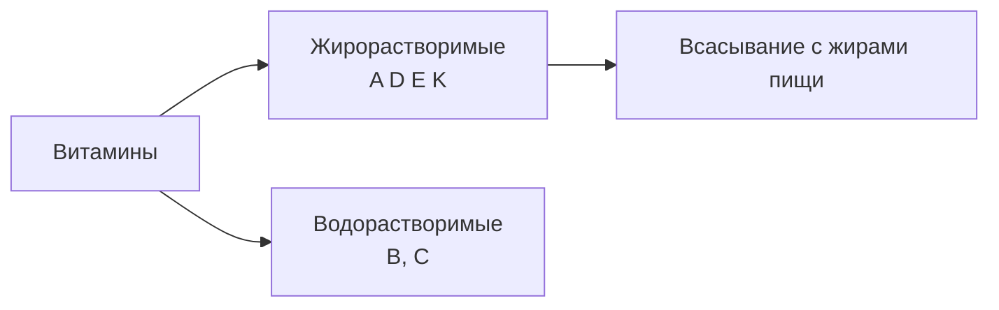

# 10.3 Витамины

> [!abstract] Тема
> Значение, классификация, жиро- и водорастворимые витамины, гипо-/ави-/гипервитаминозы. Связь: [[10.2_Виды_обмена_веществ|10.2]], [[7.6_Желудок|7.6]] (фактор Кастла).

---

## 🔵 Общие сведения

| Понятие | Содержание |
|---|---|
| **Витамины** | Биологически активные вещества в **малых количествах** для обмена и нормальной жизнедеятельности |
| **Этимология** | Лат. *vita* — жизнь + *амины* (первые витамины — амины; позже — и не-амины с той же ролью) |
| **Роль** | В основном **ферментативные** процессы; многие — **коферменты** (связываются с белком фермента) |
| **Потребность** | **Миллиграммы** в сутки |
| **Источники** | **Пища**; часть — **микрофлора кишечника**; часть синтезируется в организме |

### Сохранение витаминов в пище

- **Короткая** термическая обработка  
- **Правильное** хранение  
- Избегать контакта с **металлами** (иначе **инактивация**) — выбор посуды  

### Нарушения поступления

| Состояние | Причина | Примечание |
|---|---|---|
| **Гиповитаминоз** | **Недостаточно** | Часто **конец зимы — весна** (мало свежих овощей/фруктов) |
| **Авитаминоз** | **Полное отсутствие** в пище | Тяжёлые болезни |
| **Гипервитаминоз** | **Избыток** | **Редко**; нужна доза в **тысячи раз** выше нормы (препараты) |

---

## 🟡 Жирорастворимые витамины (A, D, E, K)

> Поступают **с жирами** пищи — без жиров **всасывание невозможно**.

### Витамин A — ретинол

| Показатель | Описание |
|---|---|
| **Функции** | Компонент **родопсина** (зрение); регенерация **эпителия** кожи и **роговицы** |
| **Недостаток** | **«Куриная слепота»** — нарушение **сумеречного** зрения → поражение кожи и роговицы |
| **Источники** | **Каротин** (провитамин): морковь, перец, шпинат; **ретинол**: печень, яйца, масло, молоко |
| **Суточно** | **2,5 мг** |

### Витамин D — кальциферол

| Показатель | Описание |
|---|---|
| **Функции** | **Антирахитический**; обмен **Ca** и **P**; развитие **костей** |
| **Недостаток** | **Рахит** (дети): размягчение, искривление костей, нарушения НС |
| **Источники** | Рыбий жир, яйца, масло, молоко; в **коже** под **УФ** солнца |
| **Лечение лёгкого дефицита** | **Солнечные ванны** |
| **Суточно** | **2,5 мкг** |

### Витамин E — токоферол

| Показатель | Описание |
|---|---|
| **Функции** | **Антистерильный** (у животных); у человека — **половая** функция; **антиоксидант** (перекись липидов мембран); **антигипоксант** |
| **Источники** | Злаки, масла, зелёные овощи |
| **Суточно** | **15 мг** |

### Витамин K — филлохиноны

| Показатель | Описание |
|---|---|
| **Функции** | Синтез факторов **свёртывания крови** |
| **Недостаток** | Нарушение **тромбообразования**, **кровотечения** |
| **Источники** | Шпинат, капуста, печень; синтез **микрофлорой** кишечника |
| **Суточно** | **1 мг** |

---

## 🟡 Водорастворимые витамины (B, C)

### Витамин C — аскорбиновая кислота

| Показатель | Описание |
|---|---|
| **Функции** | **Противоцинготный**; синтез **коллагена**; стенки сосудов, кожа, мембраны; **устойчивость к инфекциям** |
| **Недостаток — цинга** | Ослабление сосудов, **кровоизлияния**, **кровоточивость десен**, выпадение зубов, ↓ иммунитет, плохое заживление ран |
| **Источники** | Фрукты, ягоды, овощи; **шиповник**, чёрная смородина, клюква, **цитрусовые** |
| **Суточно** | **50–100 мг** |

### Витамины группы B

| Витамин | Название | Основное | Недостаток / болезнь | Источники |
|---|---|---|---|---|
| **B₁** | **Тиамин** | Обмен **углеводов и жиров** | **Бери-бери** (НС, сердце, ЖКТ) | Злаки, бобовые, печень, яйца, дрожжи |
| **B₂** | **Рибофлавин** | **Тканевое дыхание** | Нарушения зрения, ↓ рост, выпадение волос, воспаление слизистых, слабость | Злаки, бобовые, печень, яйца, молоко, дрожжи |
| **B₃** | **Пантотеновая кислота** | **Кофермент A** | Гиповитаминоз **крайне редок** | Почти все продукты |
| **B₅** | **Никотиновая кислота (РР)** | Дыхание, ОВР, белковый/жировой/УВ обмен | **Пеллагра** (кожа, ЦНС, ЖКТ) | Мясо, печень, яйца, рыба, дрожжи, злаки |
| **B₆** | **Пиридоксин** | Кофермент **белкового** обмена, **кроветворение** | Анемия, кожа, ЦНС | Большинство продуктов |
| **B₈** | **Биотин (H)** | Обмен **углеводов и жирных кислот** | Поражения **кожи** | Молоко, печень; синтез в **кишечнике** |
| **B₉** | **Фолиевая кислота (Bc)** | Пурины, **ДНК, РНК** | **Анемия** | Печень, зелень; синтез в кишечнике |
| **B₁₂** | **Цианкобаламин** | **Кроветворение** | **Пернициозная анемия** (гигантские эритроциты) | Животные продукты, особенно **печень** |

> [!important] Витамин B₁₂ и фактор Кастла
> Всасывание B₁₂ возможно только после соединения с **внутренним фактором Кастла** (железы **желудка**).
> Дефицит при: мало B₁₂ в пище **или** ↓ фактор Кастла (удаление желудка, **хронический гастрит**).

> **Суточная потребность в витаминах группы B** (суммарно по тексту): **20–25 мг**.

---

## 📋 Сводная таблица суточных норм (из главы)

| Витамин | Норма |
|---|---|
| A | 2,5 **мг** |
| D | 2,5 **мкг** |
| E | 15 **мг** |
| K | 1 **мг** |
| C | 50–100 **мг** |
| Группа B | 20–25 **мг** (общая потребность) |

---

## 📋 Краткий итог

| Тип | Витамины | Запомнить |
|---|---|---|
| **Жирорастворимые** | A, D, E, K | Нужны **жиры** для всасывания |
| **Водорастворимые** | B, C | Не депонируются так же, как жирорастворимые (гипервитаминоз реже у C/B, чаще при мегадозах A/D) |
