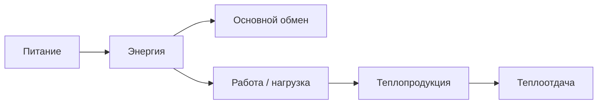

# 10.5 Обмен энергии

> [!abstract] Тема
> Основной обмен, калориметрия, энерготраты при труде, теплообмен и терморегуляция. Связь: [[10.2_Виды_обмена_веществ|10.2]], [[10.3_Витамины|10.3]].

---

## 🔵 Основной обмен

> [!note] Определение
> **Минимальный** уровень энерготрат для поддержания жизни при **полном физическом и эмоциональном покое** — энергия только для **внутренних органов** (сердце, лёгкие, почки, печень и др.) и **температуры тела**.

### Условия измерения (прямая калориметрия)

| Условие | Значение |
|---|---|
| Время | **Утро** |
| Положение | **Лежа** |
| Питание | **Натощак** |
| Мышцы | **Максимальное расслабление** |
| Температура среды | **22 °C** |
| Метод | **Калориметр** — фиксирует выделяемое **тепло** |

| Показатель | Значение |
|---|---|
| Взрослый **мужчина** | **~4,2 кДж/(кг·ч)** |
| Пример (72 кг) | **7200 кДж/сут** |
| **Женщины** | Ниже |
| **С возрастом** | **Уменьшается** |

### Непрямая калориметрия (чаще на практике)

1. Объём **лёгочной вентиляции**  
2. Поглощённый **O₂** и выделённый **CO₂**  
3. **Дыхательный коэффициент** = объём CO₂ / объём O₂ → характер **окислительных** процессов  

> Также: **таблицы** (рост, масса, возраст — прил. 2) + **формула Рида** для % отклонения от нормы.

### Формула Рида

```
О = 0,75 × (ЧП + 0,75 × ДП) − 72
```

| Обозначение | Значение |
|---|---|
| **О** | Отклонение основного обмена от нормы, **%** |
| **ЧП** | Частота **пульса** |
| **ДП** | **Пульсовое** давление (систолическое − диастолическое АД) |

> Упрощение: **номограмма Рида** (рис. 10.2) — по ЧП и ДП найти **% отклонения**, затем пересчёт по таблице.

---

## 🔵 Энерготраты и питание

| Уровень активности | Энергия/сут |
|---|---|
| **Основной обмен** (покой) | ~7200 кДж (пример 72 кг мужчина) |
| **Лёгкий** физический труд | **9200** кДж |
| **Средний** | **12 000–15 000** кДж |
| **Тяжёлый** | **16 000–18 000** кДж |

> [!important] Питание должно **соответствовать** энерготратам и **полностью их компенсировать**.



---

## 🟡 Гомойотермия: ядро и оболочка

| Термин | Содержание |
|---|---|
| **Гомойотермные** (теплокровные) | **Постоянная** температура тела (небольшие колебания) |
| **Обмен** | У теплокровных **выше**, чем у холоднокровных |

### Баланс тепла

**Теплопродукция** (организм) = **Теплоотдача** (в среду)

| Зона | Что входит |
|---|---|
| **«Ядро»** | Внутренние органы, **мышцы** — основная **теплопродукция** |
| **«Оболочка»** | **Кожа**, слизистые рта и глотки, **глазное яблоко**, дыхательные пути |

| Температура | Где |
|---|---|
| **Ядро** | Обычно **выше**, чем на поверхности |
| **Норма** (подмышка) | **36,1–37,1 °C** |

### Три звена терморегуляции

1. **Теплопродукция** в «ядре»  
2. **Теплообмен** «ядро» ↔ «оболочка» (**кровь**, **лимфа**)  
3. **Теплоотдача** «оболочки» → **внешняя среда**  

---

## 🟡 Теплопродукция

| Источник | Механизм |
|---|---|
| **Распад и окисление** органики | **~50 %** энергии → тепло **без АТФ**; часть АТФ — на температуру |
| **Мышцы** при работе | Много тепла («**печка**» — И. П. Павлов) |
| **Бурая жировая ткань** | У **новорождённых** |
| **Гладкие мышцы** внутренних органов | Сокращения → тепло |

---

## 🟡 Теплоотдача (способы)

| Способ | Описание |
|---|---|
| **Излучение** | Инфракрасные волны с поверхности тела; при **20 °C**, влажность **50 %** — **40–50 %** отдачи |
| **Конвекция** | Контакт с **движущимся** воздухом |
| **Теплопроводность** | Контакт с телами (одежда и др.) |
| **Испарение** | Пот с **кожи**, влага со **слизистых** |

> При **равенстве** температуры тела и среды первые три способа **малоэффективны** → главное — **испарение** (до **2 л/ч** пота при тяжёлой работе и жаре).

### Роль кожи и сосудов

| Условия | Сосуды кожи | Теплоотдача |
|---|---|---|
| **Жара** (высокая T среды) | **Расширение**, ↑ кровоток в кожу, ↑ пот | **↑** потеря тепла |
| **Комфорт** | ~25–26 °C | Нормальный обмен |
| **Холод** | **Сужение**, кровь к **внутренним органам**, ↓ испарение | **↓** теплоотдача |

### Охлаждение: «гусиная кожа»

- Сокращение мышцы, **поднимающей волос** → стержень волоса приподнят, немного **тепла**  
- Сжатие кожи и **поверхностных сосудов** → **↓ теплоотдача**

---

## 🟢 Терморегуляция

| Элемент | Описание |
|---|---|
| **Центр** | **Гипоталамус** (промежуточный мозг) |
| **Рецепторы** | **Терморецепторы** по телу; клетки центра различают **0,01 °C** |
| **Регуляция через** | **Эндокринную** и **вегетативную** системы |

### Увеличение теплопродукции

- ↑ **катаболических** (окислительных) процессов  
- ↑ **мышечной** активности (соматические нервы)  
- Изменение работы **сердца и сосудов** (гормоны + нервы) → теплообмен ядро–оболочка–среда  

### Уменьшение тепла (отдача)

Регулируются **конвекция**, **излучение**, **теплопроводность**, **испарение** из «оболочки».

---

## 📋 Сводная таблица

| Термин | Кратко |
|---|---|
| **Основной обмен** | Энергия в полном покое |
| **Дыхательный коэффициент** | CO₂ / O₂ |
| **Формула Рида** | % отклонения ОО от нормы по пульсу и АД |
| **Ядро / оболочка** | Продукция / отдача тепла |
| **Гипоталамус** | Центр терморегуляции |
