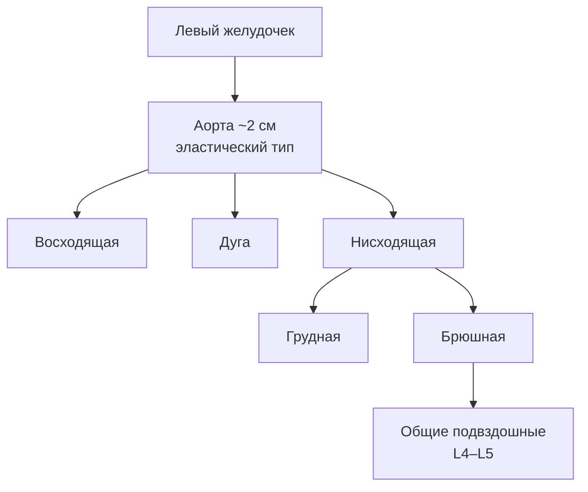
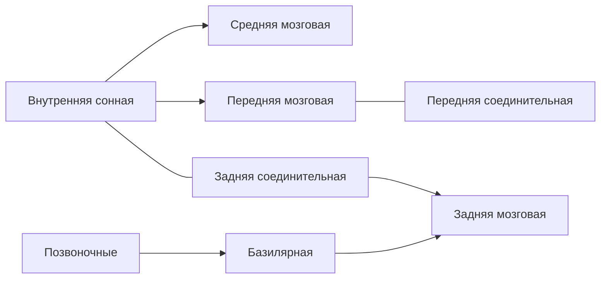

# 12.3 Артериальная система

> [!abstract] Тема
> Аорта, артерии головы, шеи, верхней и нижней конечности, висцеральные ветви, анастомозы, коллатеральное кровообращение. Связь: [[7.4_Глотка|7.4]], [[7.5_Пищевод|7.5]], [[10.5_Обмен_энергии|10.5]].

---

## 🔵 Общие сведения

| Понятие | Содержание |
|---|---|
| **Функция** | Доставка крови в **гемомикроциркуляцию** → **ткани** |
| **Большой круг** | Артерии с **сходной** у большинства людей архитектоникой (рис. 12.8) |

---

## 🔵 Аорта (*aorta*)

| Часть | Содержание |
|---|---|
| **Восходящая** (*pars ascendens*) | Сначала **позади** лёгочного ствола; **венечные** (коронарные) артерии → стенка сердца; вверх-вправо → **дуга** |
| **Дуга** (*arcus aortae*) | От **верхней** поверхности: **плечеголовной ствол**, **левая** общая сонная, **левая** подключичная |
| **Нисходящая** (*pars descendens*) | **Грудная** + **брюшная** части |

> **Плечеголовной ствол** → вправо-вверх → **правая** общая сонная + **правая** подключичная.

> **Разделение** брюшной аорты на **общие подвздошные**: уровень **IV–V поясничного** позвонка (в тексте — IV и V).

---

## 🟡 Общая сонная артерия

| Признак | Описание |
|---|---|
| **Правая** | От **плечеголовного ствола** |
| **Левая** | От **дуги аорты** → **длиннее** правой |
| **Ход** | У **V–VI** шейных позвонков; **кнаружи** от **пищевода** и **трахеи** |
| **Деление** | У **верхнего края щитовидного хряща** → **наружная** + **внутренняя** сонные |
| **Пульс / прижатие** | Прощупывается; **каротидный синус** — **хеморецепторы** (состав крови) |

### Наружная сонная (*a. carotis externa*)

До уровня **наружного слухового прохода**. **4 группы** ветвей:

| Группа | Ветви / зоны питания |
|---|---|
| **Передние** | Верхняя щитовидная (гортань, щитовидная железа, мышцы шеи); **язычная** (язык, подъязычная железа, слизистая рта); **лицевая** → **угловая** у глаза (поднижнечелюстная железа, миндалина, губы, мимика) |
| **Задние** | **Затылочная**; задняя **ушная**; **грудино-ключично-сосцевидная** |
| **Медиальная** | **Восходящая глоточная** — глотка, миндалины, **слуховая труба**, мягкое нёбо, среднее ухо |
| **Конечные** | **Поверхностная височная** (лицо, лоб, висок, темя); **верхнечелюстная** (глубокие ткани лица, зубы, **твердая** мозговая оболочка, жевательные мышцы, нос, подглазница, мягкое нёбо) |

### Внутренняя сонная (*a. carotis interna*)

- На шее **ветвей не имеет**
- **Сонный канал** височной кости → полость черепа
- **Передняя** мозговая — внутренняя поверхность полушарий
- **Средняя** мозговая — латеральная борозда; **лобная**, **височная**, **теменная** доли

---

## 🟡 Подключичная артерия (*a. subclavia*)

| Признак | Описание |
|---|---|
| **Слева** | **Длиннее** правой |
| **Ход** | Через **I ребро**, между **лестничными** мышцами, с **плечевым сплетением** |

| Ветвь | Питание |
|---|---|
| **Внутренняя грудная** | Вилочковая железа, перикард, передняя грудная стенка, молочная железа, диафрагма, передняя стенка живота |
| **Позвоночная** | Через отверстия **C1–C6** → **большое отверстие** → слияние → **базилярная** → продолговатый, мост, мозжечок, средний мозг → **задние мозговые** (затылочная, часть височной) |
| **Щитошейный ствол** | Щитовидная железа, мышцы шеи, I межреберный промежуток, часть мышц спины |

> Ветви подключичной: головной и **частично** спинной мозг, грудная клетка, живот, **гортань**, **трахея**, **пищевод**, щитовидная и **вилочковая** железы.

### Круг Виллизиева (артериальный круг большого мозга)

**Состав:** передние мозговые, передняя соединительная, внутренние сонные, задние соединительные, задние мозговые.

> **Значение:** компенсация при снижении/отсутствии кровотока в одной из артерий мозга.

---

## 🟡 Верхняя конечность (кратко)

| Артерия | Особенности |
|---|---|
| **Подмышечная** (*axillaris*) | Продолжение подключичной; грудные, грудоакромиальная, латеральная грудная, подлопаточная, артерии, **огибающие плечевую кость** |
| **Плечевая** (*brachialis*) | Кнутри от **двуглавой**; **пульс**, **АД**; → **лучевая** + **локтевая** |
| **Лучевая** (*radialis*) | Пульс в **лучевой борозде**; → **глубокая ладонная дуга** |
| **Локтевая** (*ulnaris*) | → **поверхностная ладонная дуга**; **пальцевые** артерии, анастомозы на дистальных фалангах |

---

## 🟡 Грудная и брюшная аорта

### Грудная часть

| Тип ветвей | Примеры |
|---|---|
| **Висцеральные** | Трахеальные, **бронхиальные** (лёгкое), пищеводные, перикардиальные |
| **Париетальные** | Верхние **диафрагмальные**; **задние межрёберные** (стенки груди, молочные железы, спина, **спинной мозг**) |

### Брюшная часть

| Тип | Ветви |
|---|---|
| **Париетальные (парные)** | Нижние диафрагмальные; **4 пары поясничных** |
| **Висцеральные парные** | Средняя **надпочечниковая**, **почечная**, **яичниковая/яичковая** |
| **Висцеральные непарные** | **Чревный ствол** (L1): желудочная, **печёночная**, **селезёночная** → желудок, печень, селезёнка, ДПК, поджелудочная, желчный пузырь; **верхняя** и **нижняя брыжеечные** |

| Брыжеечная | Территория |
|---|---|
| **Верхняя** | Вся **тонкая**, слепая, **червеобразный**, **восходящая** и **правая половина** поперечной ободочной |
| **Нижняя** | **Левая половина** поперечной, **нисходящая**, **сигмовидная**, **верхняя** часть прямой |

> Между верхней и нижней брыжеечными — **многочисленные анастомозы**.

---

## 🟡 Таз и нижняя конечность

| Артерия | Содержание |
|---|---|
| **Общая подвздошная** | Делится на **внутреннюю** и **наружную** |
| **Внутренняя подвздошная** | Малый таз; **пупочная**, маточная/простатическая, внутренняя половая; париетальные — подвздошно-поясничная, крестцовые, ягодичные, **запирательная** |
| **Наружная подвздошная** | Под **паховой связкой** → **бедренная** |
| **Бедренная** (*femoralis*) | Пах; **глубокая артерия бедра**; → **подколенная** |
| **Подколенная** (*poplitea*) | Задняя поверхность колена → **задняя** и **передняя** большеберцовые |
| **Задняя большеберцовая** | Задняя группа мышц; **малоберцовая**; под **внутренней лодыжкой** → **подошвенные** |
| **Передняя большеберцовая** | Передняя группа; **тыл** стопы, **тыльная** артерия стопы |

> **Подошвенные** артерии пальцев стопы развиты **сильнее** тыльных.

---

## 🟢 Анастомозы и коллатеральное кровообращение

| Тип | Описание | Пример |
|---|---|---|
| **Межсистемные** | Ветви **разных магистралей** + соустья противоположных сторон | **Круг Виллизиева**, аорта–подключичные–сонные–подвздошные |
| **Внутрисистемные** | Ветви **одного** ствола | **Чаще** (ладонные дуги, кривизны желудка) |

> **Анастомоз** — место соединения сосудов **примерно равного** диаметра.

**Коллатеральное кровообращение** — обход закупорки/повреждения по **окольным** путям. При **слабых** анастомозах (напр. **коронарные** артерии) → **инфаркт миокарда**.

---

## 🔴 Места пальцевого прижатия (рис. 12.14)

| № | Артерия | К чему прижимают |
|:---:|---|---|
| 10 | **Общая сонная** | **VI шейный** позвонок |
| 11 | **Лицевая** | — |
| 12 | **Поверхностная височная** | Кпереди от **наружного слухового** прохода |
| 9 | **Подключичная** | К **I ребру** (кровотечение подмышечной/верхней плечевой) |
| 4 | **Подмышечная** | К **головке плечевой** кости |
| 3 | **Плечевая** | Средний отдел плеча, **внутренний** край |
| 1–2 | **Лучевая / локтевая** | — |
| 8 | **Бедренная** | **Бедренная кость** |
| 7 | **Подколенная** | Бедренная кость |
| 5 | **Задняя большеберцовая** | — |
| 6 | **Тыльная** стопы | **Кости предплюсны** |
| — | **Брюшная аорта** | **Позвоночный столб** в области **пупка** → остановка кровотечения **нижележащих** сосудов |
| — | **Наружная подвздошная** | Ветвь **лобковой** кости |

---

## 📋 Сводная таблица

| Термин | Кратко |
|---|---|
| **Каротидный синус** | Хеморецепторы |
| **Виллизиев круг** | Анастомоз мозговых артерий |
| **Чревный ствол** | Желудок, печень, селезёнка |
| **Коллатеральное кровообращение** | Обход препятствия |
