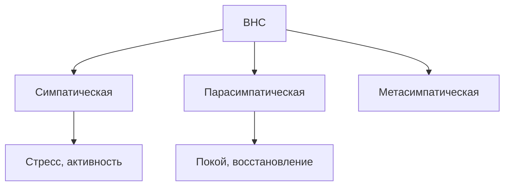

# 15.4 Вегетативная нервная система

> [!abstract] Тема
> ВНС (автономная): рефлекторные дуги, симпатический и парасимпатический отделы, сплетения, метасимпатика, табл. 15.1. Связь: [[7.3_Полость_рта_слюнные_железы|7.3]], [[7.6_Желудок|7.6]], [[10.5_Обмен_энергии|10.5]], [[12.3_Артериальная_система|12.3]].

---

## 🔵 Общие сведения

| Понятие | Содержание |
|---|---|
| **ВНС** | Иннервация **внутренних органов**, **желёз**, **сосудов**, **гладкой** мускулатуры |
| **Функция** | **Адаптационно-трофическая** |
| **Рефлексы** | Как соматические, но **обычно бессознательны** (ЧСС, секреция желёз — не произвольно) |

> [!example] Пример
> Раздражение рецепторов **желудка** → **блуждающий** нерв → ↑ секреция желёз, ↑ моторика.

### Вегетативная рефлекторная дуга — 3 нейрона

| Нейрон | Расположение |
|---|---|
| **1. Чувствительный** | Чувствительный узел **спинномозгового** или **черепного** нерва |
| **2. Ассоциативный** | Вегетативные ядра **головного** или **спинного** мозга |
| **3. Эффекторный** | **Вне ЦНС**: пара-/превертебральные (**симпатические**) или интрамуральные, краниальные (**парасимпатические**) **ганглии** |

> **Отличие от соматической дуги:** эффекторный нейрон соматики — в **ЦНС** (передние рога, ядра ЧН); вегетативный — на **периферии**.

### Сегментарная и надсегментарная регуляция

| Уровень | Структуры |
|---|---|
| **Сегментарный** | Центры рефлексов в ЦНС + импульсы по **соответствующим** нервам |
| **Надсегментарный** | **Гипоталамус**, **лимбическая** система, **ретикулярная** формация, **мозжечок**, **кора** больших полушарий |

---

## 🔴 Симпатическая нервная система

### Центральный отдел

- Ядра в **боковых рогах** спинного мозга: **C8 — L3**
- Волокна → **передние корешки** → симпатические ганглии

### Симпатический ствол (*truncus sympaticus*)

| Признак | Описание |
|---|---|
| **Строение** | Парная цепь **паравертебральных** узлов вдоль позвоночника |
| **Протяжённость** | От **основания черепа** до **копчика** → **копчиковый** узел |
| **Узлов** | **25–26** (больше, чем белых ветвей) |

| Волокна | Описание |
|---|---|
| **Белые** соединительные ветви | **Преганглионарные** из спинномозговых нервов (**1–1,5 см**); только **C8–L3** |
| В ганглии | Переключение **или** транзит **вверх/вниз** |
| **Серые** соединительные | **Постганглионарные** → в спинномозговые нервы и к органам по **артериям** |
| **Большой / малый** внутренностные (чревные) нервы | Мимо ствола → **брюшное аортальное** сплетение; транзит через **T6–T9** и **T10–T12** |

### Отделы ствола

| Отдел | Узлы | Основное |
|---|---|---|
| **Шейный** | 3 | **Верхний** — крупнейший, сонные сплетения, голова/шея; **средний** (непостоянный, C6) — сердце, щитовидная; **шейно-грудной (звёздчатый)** — I ребро, сердце, средостение, щитовидная |
| **Грудной** | 12 | Грудное аортальное сплетение; **большой** и **малый** чревные нервы |
| **Поясничный** | 5 | Брюшное аортальное сплетение; живот, **нижние конечности** |
| **Крестцовый** | 5 + копчиковый (рудимент) | **Малый таз** |

### Брюшное аортальное сплетение (*plexus aorticus abdominalis*)

> **Крупнейшее** сплетение ВНС; «**солнечное**» (*plexus solaris*).

| Узлы | Ветви по артериям |
|---|---|
| **Чревной**, **аортопочечный**, **верхний брыжеечный** | Постганглионарные волокна |
| **Сосудистые сплетения** | Чревное, селезёночное, печёночное, верхнее/нижнее брыжеечное; парные: желудочное, надпочечниковое, почечное, яичниковое/яичковое |

| Сплетение | Расположение |
|---|---|
| **Верхнее подчревное** | Перед **L5**, под бифуркацией аорты |
| **Нижнее подчревное** | Над мышцей, поднимающей задний проход, у деления **общей подвздошной** → таз |

*Рис. 15.11:* ресничный, крылонёбный, подъязычный/поднижнечелюстной, ушной узлы; чревное сплетение; тазовые внутренностные нервы.

---

## 🟢 Парасимпатическая нервная система

### Центральный отдел

- Ядра **III, VII, IX, X** пар ЧН
- **Крестцовые** парасимпатические ядра (**S2–S4**)

### Периферия

Ганглии **в стенке** или **рядом** с органом (не цепь у позвоночника).

| ЧН | Ганглий | Эффект |
|---|---|---|
| **III** (глазодвигательный) | **Ресничный** | Сужение зрачка, **аккомодация** (симпатика **расширяет** зрачок) |
| **VII** (лицевой) | **Крылонёбный** — слёзная, слизистая носа/нёба; **поднижнечелюстной**, **подъязычной** (через **барабанную струну**) — слюнные |
| **IX** (языкоглоточный) | **Ушной** — **околоушная** железа |
| **X** (блуждающий) | **Интрамуральные** узлы шеи, груди, **брюшной** полости |
| **S2–S4** | Тазовые внутренностные нервы → малый таз: половые органы, **мочевой пузырь**, **прямая кишка** |

---

## 🟡 Метасимпатическая система

| Признак | Содержание |
|---|---|
| **Где** | Сплетения и микроузлы в стенках **полых** органов с моторикой (пищевод, желудок, кишка, мочевой пузырь, желчные пути, маточные трубы) |
| **Медиаторы** | **ГАМК** или **пурины** (не только АХ) |
| **Особенность** | Могут генерировать импульсы **без ЦНС** → **перистальтика** |
| **Связь** | Координация с симпатикой и парасимпатикой |

---

## 📋 Таблица 15.1 — эффекты ВНС

| Орган | **Симпатика** | **Парасимпатика** |
|---|---|---|
| **Артерии** | **Сужение** | Обычно нет эффекта |
| **Сердце** | ↑ ЧСС и **силы** сокращений | ↓ ЧСС и силы |
| **Бронхи** | **Расширение**, ↓ секреция | **Бронхоспазм**, ↑ секреция |
| **Желудок, кишка** | ↓ секреция и моторика, **сфинктеры** сокращаются | ↑ секреция и моторика, сфинктеры **расслабляются** |
| **Пищеварительные железы** | ↓ секреция | ↑ секреция |
| **Мочеточник, мочевой пузырь** | **Расслабление** | **Сокращение** |
| **Зрачок** | **Расширение** | **Сужение** |
| **Цилиарная мышца** | Расслабление | **Сокращение** (аккомодация) |
| **Потовые железы** | ↑ секреция | **Не иннервируются** |
| **Беременная матка** | Сокращение | Выраженного эффекта нет |

> [!tip] Общая закономерность
> - **Симпатика** — **стресс**, активность, «бей или беги»  
> - **Парасимпатика** — **покой**, пищеварение, восстановление  
> - На один орган часто **противоположные** эффекты → **адекватная** реакция на среду

### Структуры без парасимпатики (по тексту)

Артерии (как правило), **пиломоторные** мышцы, мышца **расширяющая зрачок**, **потовые** железы.

---

## 📋 Сводная таблица

| Термин | Кратко |
|---|---|
| **Белая ветвь** | Преганглионарная к симпатическому стволу |
| **Серая ветвь** | Постганглионарная обратно в нерв |
| **Блуждающий (X)** | Парасимпатика груди и брюшной полости |
| **Солнечное сплетение** | Брюшное аортальное сплетение |
| **Метасимпатика** | Автономная моторика ЖКТ и др. |
