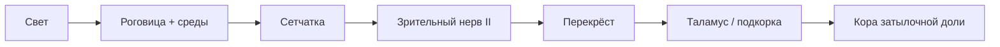
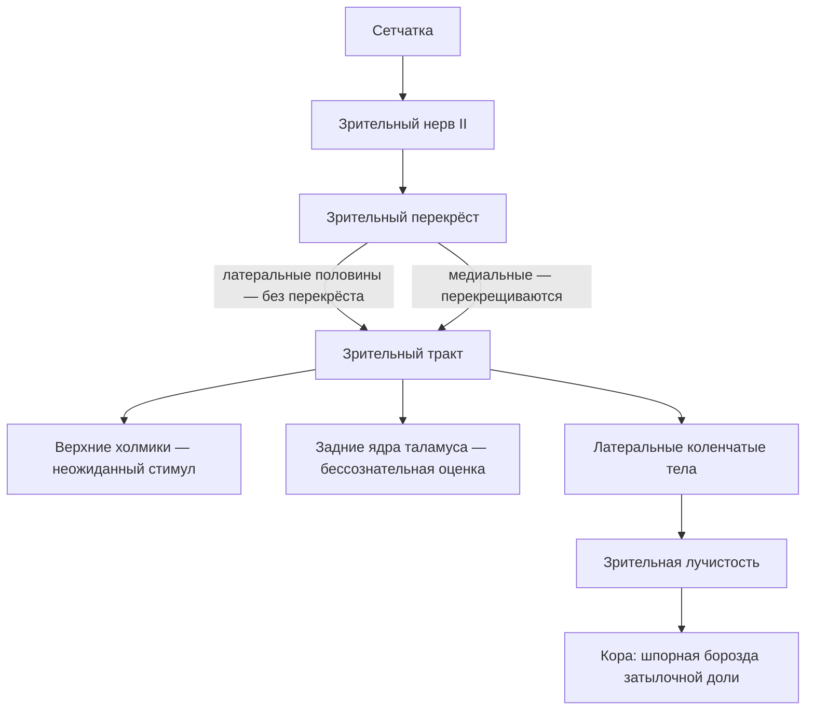

# 17.2 Орган зрения

> [!abstract] Тема
> Глазное яблоко, оболочки, среды, вспомогательные органы, зрительный путь, рефракция. Связь: [[15.4_Вегетативная_нервная_система|15.4]] (зрачок, аккомодация).

---

## 🔵 Зрительный анализатор

| Компонент | Содержание |
|---|---|
| **Орган зрения** | **Глазное яблоко** + **вспомогательные** органы |
| **Проводящий путь** | Зрительный нерв → перекрёст → тракт → лучистость → кора |
| **Центры** | Подкорковые (средний, промежуточный мозг) + **кора** затылочной доли |

> До **90 %** информации о внешнем мире — через зрение. Парный **подвижный** глаз → восприятие **объёма** (глубины).

---

## 🔵 Глазное яблоко (*bulbus oculi*)

Форма **шара** с передней выпуклостью (**роговица**). Три оболочки вокруг **ядра** (рис. 17.1).

### 1. Фиброзная оболочка (*tunica fibrosa*)

| Часть | Функции |
|---|---|
| **Роговица** (*cornea*) | **1/6** поверхности; ~**1 мм**; **42 дптр**; прозрачность, защита (**мигание**, слёзы), **преломление** |
| **Склера** (*sclera*) | **5/6**; плотная СТ, почти без сосудов; **форма**, прикрепление **глазодвигательных** мышц |

> **Помутнение** (бельмо) — ожоги, травмы, нарушение питания.  
> **Астигматизм** — неравномерная кривизна → разная фокусировка в плоскостях → **специальные линзы**.

### 2. Сосудистая оболочка (*tunica vasculosa*)

| Часть | Роль |
|---|---|
| **Радужка** (*iris*) | «Диафрагма» глаза; **зрачок**; мышцы **сужения/расширения** (освещённость); **пигмент** → цвет глаз |
| **Ресничное тело** (*corpus ciliare*) | **Водянистая влага**; **ресничная мышца** → **Циннова связка** → **аккомодация** хрусталика |
| **Собственно сосудистая** (*choroidea*) | Сосудистое сплетение в рыхлой СТ |

### 3. Сетчатка (*retina*) — чувствительная

| Клетки | Зрение |
|---|---|
| **Палочки** | Почти вся сетчатка, кроме **слепого пятна**; **чёрно-белое**, **ночное** |
| **Колбочки** | Преимущественно **жёлтое пятно**; **дневное**, **цветовое** |

Импульсы → нейроны сетчатки → **зрительный нерв (II пара)** → подкорка → **кора** затылочной доли.

### Ядро глазного яблока (среды)

| Структура | Функция |
|---|---|
| **Водянистая влага** (*humor aquosus*) | Ресничное тело; **передняя** и **задняя** камеры; питание роговицы и хрусталика; баланс оттока — при нарушении **глаукома** |
| **Хрусталик** (*lens*) | **20 дптр**; **аккомодация** |
| **Стекловидное тело** | Проведение света к сетчатке |

*Рис. 17.1:* 2 — роговица; 3–4 — камеры; 6 — склера; 7 — сосудистая; 8 — сетчатка; 9 — жёлтое пятно; 10 — зрительный нерв; 11 — слепое пятно; 12 — стекловидное тело; 15 — радужка; 16 — хрусталик.

---

## 🟡 Вспомогательные органы

### Мышцы глазного яблока (рис. 17.2)

| Мышца | Движение |
|---|---|
| **4 прямые** (верхняя, нижняя, латеральная, медиальная) | В «свою» сторону |
| **Верхняя косая** | **Вниз** и **латерально** |
| **Нижняя косая** | **Вверх** и **латерально** |

### Слёзный аппарат (рис. 17.3)

| Элемент | Описание |
|---|---|
| **Слезная железа** | Верхнелатеральный угол; **лизоцим**; смачивание, питание роговицы |
| **Слезное озеро** → **канальцы** → **слезный мешок** → **носослезный проток** | В **нижний** носовой ход |

### Глазница

| Структура | Роль |
|---|---|
| **Тенонова капсула** | Футляр вокруг яблока; **теноново (эписклеральное)** пространство → **движения** |
| **Жировое тело** | Преимущественно у **заднего** полюса |
| **Конъюнктива** | Слизистая век и передняя склеры; **роговицу не покрывает** |

### Веки, брови, ресницы

- **Веки** — защита, распределение слёз; воспаление — **блефарит**
- **Ресницы** — задержка пыли при мигании
- **Брови** — отведение пота от глаз

---

## 🟢 Проводящий путь и центры

| Уровень | Функция |
|---|---|
| **Перекрёст** | **Медиальные** волокна перекрещиваются; **латеральные** — нет |
| **Верхние холмики** среднего мозга | Реакция на **неожиданные** раздражители |
| **Таламус** (зрительный бугор) | **Бессознательная** оценка |
| **Латеральные коленчатые тела** | К **коре** по лучистости |
| **Кора** (затылочная доля) | **Сознательное** зрение; «выпрямление» **перевёрнутого** образа с сетчатки |

> Фокус в норме — на **желтое пятно**, изображение на сетчатке **перевёрнутое**; кора даёт «реальный» вид.

---

## 🟡 Рефракция (рис. 17.4)

| Состояние | Где фокус | Коррекция |
|---|---|---|
| **Эмметропия** | На **сетчатке** (норма) | — |
| **Миопия** (близорукость) | **Перед** сетчаткой | **Рассеивающая** линза |
| **Гиперметропия** (дальнозоркость) | **За** сетчаткой | **Собирающая** линза |
| **Астигматизм** | Искажённая фокусировка | **Специальная** линза (кривизна роговицы) |

---

## 📋 Сводная таблица (рис. 17.1–17.4)

| № рис. | Структура |
|---|---|
| 17.1 | Оболочки, камеры, жёлтое/слепое пятно |
| 17.2 | 6 глазодвигательных мышц |
| 17.3 | Слёзный аппарат → нос |
| 17.4 | Эмметропия, миопия, гиперметропия, астигматизм |

---

## 📋 Краткий итог

| Термин | Кратко |
|---|---|
| **Жёлтое пятно** | Колбочки, острая цветовая зоркость |
| **Слепое пятно** | Выход зрительного нерва, нет палочек |
| **Глаукома** | ↑ внутриглазное давление при нарушении оттока влаги |
| **Аккомодация** | Изменение кривизны хрусталика ресничной мышцей |
