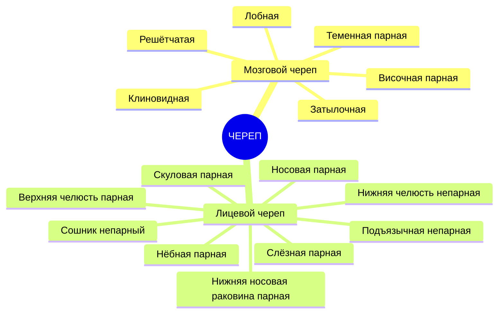
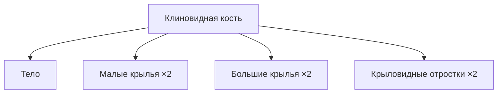
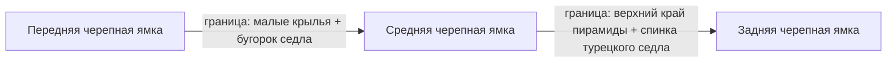

# 🦴 4.3 Скелет головы (Череп)

---

## Общая характеристика

> [!important] Функции черепа
> 1. **Вместилище и защита** головного мозга и органов чувств
> 2. **Участвует в образовании** начальных отделов пищеварительной и дыхательной систем

---

## Состав черепа



| Отдел | Парные кости | Непарные кости |
|-------|-------------|----------------|
| **Мозговой** | Теменная, Височная | Затылочная, Лобная, Решётчатая, Клиновидная |
| **Лицевой** | Верхняя челюсть, Нёбная, Скуловая, Носовая, Слёзная, Нижняя носовая раковина | Сошник, Нижняя челюсть, Подъязычная |

> [!note] Положение
> Лицевой череп расположен **кпереди и снизу** от мозгового

---

## Кости мозгового черепа

### 🔵 Затылочная кость (os occipitale)

> [!tip] Положение
> Образует **задний отдел** мозгового черепа, преимущественно его основание

**Состоит из 4 частей:**

| Часть | Расположение | Ключевые образования |
|-------|-------------|---------------------|
| **Базилярная** | Спереди от большого отверстия | Глоточный бугорок, скат (с клиновидной) |
| **Латеральные** (×2) | По бокам от отверстия | Затылочные мыщелки, яремная вырезка, канал подъязычного нерва |
| **Затылочная чешуя** | Сзади | Наружный затылочный выступ, выйные линии |

**Ключевые элементы чешуи:**
- ==Наружный затылочный выступ== — центр наружной поверхности
- ==Наружный затылочный гребень== — от выступа к краю большого отверстия
- ==Верхняя и нижняя выйные линии== — прикрепление мышц спины
- ==Крестообразное возвышение== на внутренней поверхности (внутренний выступ + гребень + борозды синусов)

**Большое отверстие** → полость черепа сообщается с позвоночным каналом

---

### 🔵 Теменная кость (os parietale) — *парная*

> [!tip] Форма
> Изогнутая четырёхугольная пластинка

**4 края:**

| Край | Соединение |
|------|-----------|
| Лобный | С чешуёй лобной кости |
| Затылочный | С чешуёй затылочной кости |
| Чешуйчатый | С чешуёй височной кости |
| Сагиттальный (верхний) | Обе теменные кости друг с другом |

**4 угла:** лобный, затылочный, клиновидный, сосцевидный

**Наружная поверхность:** ==теменной бугор==, верхняя и нижняя височные линии

**Внутренняя поверхность:** артериальные борозды, борозда верхнего сагиттального синуса, борозда сигмовидного синуса (сосцевидный угол)

---

### 🔵 Лобная кость (os frontale)

> [!tip] Роль
> Передний отдел крыши и основания черепа; участвует в образовании полости носа и глазниц

**3 части:**
- **Лобная чешуя** (~1/3 крыши черепа)
- **Носовая часть**
- **Глазничная часть** (парная)

**Чешуя — ключевые образования:**

| Образование | Описание |
|------------|---------|
| ==Надглазничный край== | Граница чешуи и глазничной части |
| Надглазничная вырезка/отверстие | Проход сосудов и нервов |
| ==Надбровная дуга== | Выше надглазничного края |
| ==Лобный бугор== | Ещё выше |
| Скуловой отросток | Латеральное продолжение края |
| Лобный гребень → борозда верхнего сагиттального синуса | Внутренняя поверхность |

**Носовая часть** → лобная пазуха (2 несимметричные половины)

---

### 🔵 Решётчатая кость (os ethmoidale)

**3 части:**

```
┌─────────────────────────────────┐
│   ПЕТУШИНЫЙ ГРЕБЕНЬ (сверху)    │
├─────────────────────────────────┤
│  ПРОДЫРЯВЛЕННАЯ ПЛАСТИНКА       │ ← горизонтально, в вырезке лобной кости
│  (решётчатая)                   │   отверстия для обонятельных нервов (I пара)
├──────────────┬──────────────────┤
│ПЕРПЕНДИ-     │ РЕШЁТЧАТЫЙ       │
│КУЛЯРНАЯ      │ ЛАБИРИНТ (парный)│
│ПЛАСТИНКА     │ ячейки + раковины│
│(перегородка  │ глазничная       │
│ носа)        │ пластинка        │
└──────────────┴──────────────────┘
```

**Лабиринт:** передние, средние и задние ячейки; медиальная поверхность — ==верхняя и средняя носовые раковины==; латеральная — **глазничная пластинка** (медиальная стенка глазницы)

---

### 🔵 Клиновидная кость (os sphenoidale)

> [!important] Положение
> В середине основания черепа. Сложная форма!

**Состав:**



**Тело:**

| Образование | Значение |
|------------|---------|
| ==Турецкое седло== | Верхняя поверхность тела |
| ==Гипофизарная ямка== | Центр седла → гипофиз |
| Спинка турецкого седла | Сзади от ямки |
| Предперекрёстная борозда | Зрительные нервы |
| Борозда сонной артерии | Внутренняя сонная артерия |
| Клиновидная пазуха | Внутри тела, сообщается с полостью носа |

**Малые крылья** → зрительный канал (II пара + глазная артерия)

**Большие крылья — 4 поверхности:** мозговая, глазничная, височная, верхнечелюстная

**Отверстия больших крыльев:**

| Отверстие | Содержимое |
|-----------|-----------|
| ==Круглое== | II ветвь тройничного нерва (V пара) |
| ==Овальное== | III ветвь тройничного нерва (V пара) |
| ==Остистое== | Средняя менингеальная артерия |

**Верхняя глазничная щель** (между малым и большим крыльями) → III, IV, VI пары, I ветвь V пары, глазничная вена

---

### 🔵 Височная кость (os temporale) — *парная*

> [!tip] Роль
> Содержит орган слуха и равновесия (лабиринт); крупные сосуды и нервы

**4 части:**

| Часть | Форма / Особенности |
|-------|-------------------|
| **Каменистая (пирамида)** | Трёхгранная пирамида; основание к сосцевидной части, вершина — вперёд и медиально |
| **Барабанная** | Тонкая пластинка; ограничивает наружное слуховое отверстие |
| **Сосцевидная** | Сосцевидный отросток, ячейки, пещера → барабанная полость |
| **Чешуйчатая** | Крыша черепа; скуловой отросток; нижнечелюстная ямка + суставной бугорок |

**Поверхности пирамиды:**

| Поверхность | Ключевые образования |
|-------------|---------------------|
| **Передняя** | Дугообразное возвышение, крыша барабанной полости, расщелины каналов каменистых нервов, борозда верхнего каменистого синуса |
| **Задняя** | Внутреннее слуховое отверстие (VII + VIII пары), борозда нижнего каменистого синуса |
| **Нижняя** | Яремная ямка, наружное отверстие сонного канала, шиловидный отросток, шилососцевидное отверстие |

**Каналы пирамиды:**

| Канал | Содержимое |
|-------|-----------|
| Сонный | Внутренняя сонная артерия |
| Лицевого нерва | VII пара; изгибы внутри, выход → шилососцевидное отверстие |
| Большого каменистого нерва | Ветвь VII пары |
| Барабанной струны | Ветвь VII пары |
| Мышечно-трубный | Полуканал слуховой трубы + полуканал мышцы |
| Барабанный каналец | Ветвь IX пары → малый каменистый нерв |

---

## Кости лицевого черепа

### 🟠 Верхняя челюсть (maxilla)

**Участвует в образовании:** стенок полости носа, глазниц, полости рта, подвисочной и крыловидно-нёбной ямок

**Тело → 4 поверхности:**

| Поверхность | Особенности |
|------------|-------------|
| **Передняя** | Подглазничное отверстие, клыковая ямка |
| **Подвисочная** | Бугор верхней челюсти |
| **Глазничная** | Нижняя стенка глазницы; подглазничная борозда → канал |
| **Носовая** | Латеральная стенка носа; верхнечелюстная расщелина → пазуха |

**4 отростка:** лобный, скуловой, альвеолярный (зубные альвеолы), нёбный

> [!note] Гайморова пазуха = верхнечелюстная пазуха (внутри тела)

---

### 🟠 Нёбная кость (os palatinum)

**2 пластинки** (под прямым углом):
- **Горизонтальная** → костное нёбо
- **Перпендикулярная** → латеральная стенка носа

**3 отростка:** пирамидальный, глазничный, клиновидный; между последними двумя — ==клиновидно-нёбная вырезка==

---

### 🟠 Прочие кости лицевого черепа

| Кость | Характеристика |
|-------|---------------|
| **Скуловая** | Соединяет верхнюю челюсть с височной → скуловая дуга; отростки: височный + лобный |
| **Носовая** (парная) | Спинка носа; с носовой вырезкой → ==грушевидное отверстие== |
| **Слёзная** | Ямка слезного мешка → носослезный канал |
| **Нижняя носовая раковина** | Самостоятельная кость в полости носа → нижний носовой ход |
| **Сошник** | Перегородка носа; верхний край → крылья на теле клиновидной; задний край → хоаны |

---

### 🟠 Нижняя челюсть (mandibula)

> [!tip] Единственная подвижная кость черепа

**Состав:** тело + правая и левая ветви

**Тело (подковообразное):**

| Поверхность | Образования |
|------------|-------------|
| **Наружная** | ==Подбородочный выступ==, подбородочное отверстие (сосуды + нерв) |
| **Внутренняя** | Подбородочная ость, подъязычная ямка, челюстно-подъязычная линия, поднижнечелюстная ямка |

**Ветвь:**
- Угол нижней челюсти → жевательная бугристость (снаружи) + крыловидная бугристость (внутри)
- Отверстие нижней челюсти → канал → подбородочное отверстие
- Вверху: ==венечный отросток== + ==мыщелковый отросток== (головка → шейка), между ними — вырезка
- Крыловидная ямка на шейке → латеральная крыловидная мышца

---

### 🟠 Подъязычная кость (os hyoideum)

> [!note] Не соприкасается с костями черепа — связана связками и мышцами

Форма подковы: **тело** + **большие рога** (вверх и назад) + **малые рога** (короче, вверх-назад-латерально)

---

## Череп в целом

### Свод (крыша) черепа

**Образован:** чешуя лобной, большие крылья клиновидной, теменные, чешуя височных, чешуя затылочной

**Швы:**

| Шов | Между костями |
|-----|--------------|
| ==Венечный== | Лобная ↔ теменные |
| ==Ламбдовидный== | Теменные ↔ затылочная |
| ==Сагиттальный== | Теменные ↔ теменные |
| ==Чешуйчатый== | Теменная ↔ клиновидная + височная |

---

### Наружное основание черепа

**Образовано:** клиновидная + височные + затылочная

**Ключевые отверстия:**

| Отверстие | Содержимое |
|-----------|-----------|
| ==Большое== | Сообщение черепа с позвоночным каналом |
| Яремное | Внутренняя яремная вена, IX, X, XI пары |
| Сонный канал (наружное отв.) | Внутренняя сонная артерия |
| Шилососцевидное | Выход VII пары (лицевой нерв) |
| Канал подъязычного нерва | XII пара |
| ==Рваное отверстие== | На стыке пирамиды, клиновидной и затылочной |
| Овальное | III ветвь V пары |
| Остистое | Средняя менингеальная артерия |

---

### Внутреннее основание черепа — 3 ямки



**Передняя ямка:**
- Кости: глазничная часть лобной + решётчатая пластинка + малые крылья клиновидной
- Содержит: лобные доли
- Отверстия: решётчатые → I пара (обонятельные); зрительный канал → II пара + глазная артерия

**Средняя ямка:**
- Кости: тело и большие крылья клиновидной + передняя поверхность пирамид + чешуя височных
- Центр → гипофизарная ямка
- Отверстия:

| Отверстие | Содержимое |
|-----------|-----------|
| Верхняя глазничная щель | III, IV, VI пары + I ветвь V пары + верхняя глазная вена |
| Круглое | II ветвь V пары |
| Овальное | III ветвь V пары |
| Остистое | Средняя менингеальная артерия |

**Задняя ямка:**
- Основа: затылочная кость + задние поверхности пирамид + сосцевидные части
- Центр → большое отверстие; впереди → скат (продолговатый мозг + мост)

| Отверстие | Содержимое |
|-----------|-----------|
| Яремное | Внутренняя яремная вена, IX, X, XI пары |
| Канал подъязычного нерва | XII пара |
| Внутреннее слуховое отверстие | VII + VIII пары |

---

## Лицевой череп: полости и ямки

### 👁 Глазница

> [!tip] Форма: четырёхгранная пирамида (основание вперёд, вершина — назад и медиально)

**4 стенки:**

| Стенка | Образована |
|--------|-----------|
| **Верхняя** | Глазничная часть лобной + малое крыло клиновидной |
| **Медиальная** | Лобный отросток верхней челюсти + слёзная + глазничная пластинка решётчатой + тело клиновидной |
| **Нижняя** | Глазничная поверхность верхней челюсти + глазничный отросток нёбной + скуловая |
| **Латеральная** | Большое крыло клиновидной + лобный отросток скуловой + скуловой отросток лобной |

**Щели:** верхняя глазничная → средняя черепная ямка; нижняя глазничная → подвисочная и крыловидно-нёбная ямки

---

### 👃 Полость носа

**Сообщения:**
- Сзади → носоглотка через **хоаны** (парные)
- Спереди → **грушевидное отверстие**

**4 стенки:**

| Стенка | Образована |
|--------|-----------|
| **Верхняя** | Носовые кости + носовая часть лобной + решётчатая пластинка + тело клиновидной |
| **Нижняя** | Нёбные отростки верхних челюстей + горизонтальные пластинки нёбных костей |
| **Латеральная** | 6 костей: носовая поверхность и лобный отросток верхней челюсти, слёзная, лабиринт решётчатой, перпендикулярная пластинка нёбной, медиальная пластинка крыловидного отростка, нижняя носовая раковина |
| **Перегородка** | Перпендикулярная пластинка решётчатой + сошник + хрящ |

**3 носовых хода:**

| Ход | Положение | Открываются |
|-----|-----------|-------------|
| **Верхний** | Между верхней и средней раковинами | Задние ячейки решётчатой, клиновидная пазуха |
| **Средний** | Между средней и нижней раковинами | Передние и средние ячейки, лобная и верхнечелюстная пазухи |
| **Нижний** | Под нижней раковиной | Носослезный канал |

---

### 🏛 Ямки (на границе мозгового и лицевого черепа)

**Крыловидно-нёбная ямка — 5 сообщений:**

| Направление | Через |
|------------|-------|
| С глазницей | Нижняя глазничная щель |
| С полостью носа | Клиновидно-нёбное отверстие |
| С полостью рта | Большой нёбный канал |
| Со средней черепной ямкой | Круглое отверстие |
| С наружным основанием черепа | Крыловидный канал |

---

## Череп новорожденного

> [!warning] Особенности
> Окостенение **не завершено** → участки перепончатого черепа = **роднички**

**Роднички:**

| Родничок | Положение | Зарастание |
|---------|-----------|-----------|
| ==Передний (большой, лобный)== | Лобная ↔ теменные | На ==2-м году== жизни |
| ==Задний (малый, затылочный)== | Теменные ↔ затылочная | На ==2-м месяце== после рождения |
| Клиновидный (×2) | Боковые поверхности | К моменту рождения или 1-2 нед. |
| Сосцевидный (×2) | Боковые поверхности | К моменту рождения или 1-2 нед. |

**Особенности черепа новорождённого:**
- Лицевой отдел **недоразвит**
- Многие кости **фрагментированы**
- Зубы **отсутствуют**
- Отростки и бугры **не сформированы** (мышцы ещё не действуют)
- Клиновидная, лобная и решётчатая пазухи **отсутствуют**
- Верхнечелюстная пазуха — небольшое углубление
- На основании черепа — прослойки хряща
