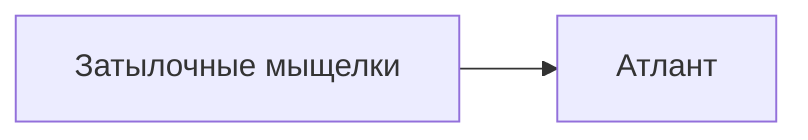
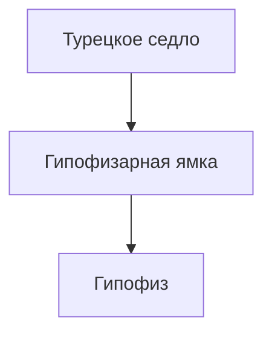
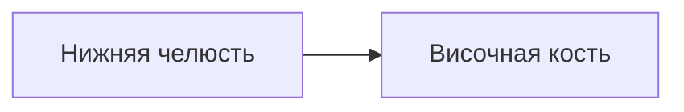
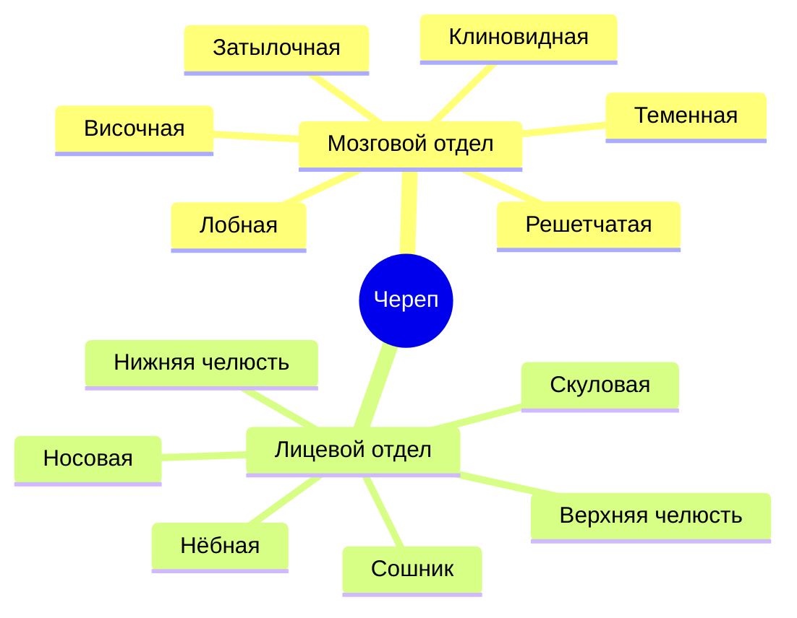

# Тест по теме: «Скелет головы. Череп»

> [!info]
> **Формат:** 20 вопросов  
> **Тема:** Кости мозгового и лицевого черепа, основание черепа, глазница, полость носа, череп новорождённого.

---

# 1. Общая характеристика черепа

> [!question] Вопрос 1
> Какие две основные функции выполняет череп?

- [ ] Только защитную
- [ ] Опорную и двигательную
- [ ] Защитную и участие в образовании начальных отделов пищеварительной и дыхательной систем
- [ ] Только участие в движении головы

> [!success]- Ответ
> **Правильный ответ:** защитную и участие в образовании начальных отделов пищеварительной и дыхательной систем.

---

> [!question] Вопрос 2
> Какие кости относятся к мозговому черепу?

| Вариант | Ответ |
|---|---|
| А | Затылочная, лобная, теменная, височная |
| Б | Верхняя челюсть, скуловая, носовая |
| В | Нижняя челюсть и подъязычная кость |
| Г | Только теменная и височная |

> [!success]- Ответ
> **Правильный ответ:** А.

---

# 2. Затылочная кость

> [!question] Вопрос 3
> Как называется отверстие, через которое полость черепа сообщается с позвоночным каналом?

- [ ] Рваное отверстие
- [ ] Овальное отверстие
- [ ] Большое затылочное отверстие
- [ ] Остистое отверстие

> [!success]- Ответ
> **Правильный ответ:** большое затылочное отверстие.

---

> [!question] Вопрос 4
> С чем сочленяются затылочные мыщелки?

- [ ] С телом осевого позвонка
- [ ] С верхними суставными ямками атланта
- [ ] С височной костью
- [ ] С клиновидной костью

> [!success]- Ответ
> **Правильный ответ:** с верхними суставными ямками атланта.

---

# 3. Теменная и лобная кости

> [!question] Вопрос 5
> Как называется шов между двумя теменными костями?

- [ ] Венечный
- [ ] Ламбдовидный
- [ ] Чешуйчатый
- [ ] Сагиттальный

> [!success]- Ответ
> **Правильный ответ:** сагиттальный шов.

---

> [!question] Вопрос 6
> Что расположено на наружной поверхности теменной кости?

| Структура | Есть/Нет |
|---|---|
| Теменной бугор | ✅ |
| Турецкое седло | ❌ |
| Гипофизарная ямка | ❌ |
| Подъязычная ямка | ❌ |

> [!success]- Ответ
> **Правильный ответ:** теменной бугор.

---

> [!question] Вопрос 7
> Где находится надглазничное отверстие?

- [ ] На затылочной кости
- [ ] На надглазничном крае лобной кости
- [ ] На верхней челюсти
- [ ] На височной кости

> [!success]- Ответ
> **Правильный ответ:** на надглазничном крае лобной кости.

---

# 4. Решетчатая и клиновидная кости

> [!question] Вопрос 8
> Через отверстия решетчатой пластинки проходят:

- [ ] Лицевые нервы
- [ ] Обонятельные нервы
- [ ] Подъязычные нервы
- [ ] Блуждающие нервы

> [!success]- Ответ
> **Правильный ответ:** обонятельные нервы.

---

> [!question] Вопрос 9
> Где расположен гипофиз?

- [ ] В решетчатом лабиринте
- [ ] В гипофизарной ямке
- [ ] В большом затылочном отверстии
- [ ] В яремной ямке

> [!success]- Ответ
> **Правильный ответ:** в гипофизарной ямке.

---

> [!question] Вопрос 10
> Какие отверстия находятся в большом крыле клиновидной кости?

| Отверстие | Наличие |
|---|---|
| Круглое | ✅ |
| Овальное | ✅ |
| Остистое | ✅ |
| Подъязычное | ❌ |

> [!success]- Ответ
> **Правильный ответ:** круглое, овальное и остистое.

---

# 5. Височная кость

> [!question] Вопрос 11
> Как называется часть височной кости, содержащая орган слуха и равновесия?

- [ ] Чешуя
- [ ] Сосцевидная часть
- [ ] Каменистая часть (пирамида)
- [ ] Барабанная часть

> [!success]- Ответ
> **Правильный ответ:** каменистая часть.

---

> [!question] Вопрос 12
> Через какой канал проходит внутренняя сонная артерия?

- [ ] Канал лицевого нерва
- [ ] Сонный канал
- [ ] Крыловидный канал
- [ ] Барабанный каналец

> [!success]- Ответ
> **Правильный ответ:** сонный канал.

---

# 6. Кости лицевого черепа

> [!question] Вопрос 13
> Какая пазуха находится внутри верхней челюсти?

- [ ] Лобная
- [ ] Клиновидная
- [ ] Верхнечелюстная (гайморова)
- [ ] Решетчатая

> [!success]- Ответ
> **Правильный ответ:** верхнечелюстная пазуха.

---

> [!question] Вопрос 14
> Какие отростки имеет верхняя челюсть?

| Отросток | Есть |
|---|---|
| Лобный | ✅ |
| Скуловой | ✅ |
| Альвеолярный | ✅ |
| Нёбный | ✅ |

> [!success]- Ответ
> **Правильный ответ:** все перечисленные.

---

> [!question] Вопрос 15
> Какая кость образует перегородку носа вместе с решетчатой костью?

- [ ] Нёбная кость
- [ ] Сошник
- [ ] Скуловая кость
- [ ] Слезная кость

> [!success]- Ответ
> **Правильный ответ:** сошник.

---

> [!question] Вопрос 16
> С какой костью соединяется нижняя челюсть?

- [ ] С лобной
- [ ] С затылочной
- [ ] С височной
- [ ] С теменной

> [!success]- Ответ
> **Правильный ответ:** с височной костью.

---

# 7. Основание черепа

> [!question] Вопрос 17
> Через какое отверстие проходят IX, X и XI пары черепных нервов?

- [ ] Остистое отверстие
- [ ] Круглое отверстие
- [ ] Яремное отверстие
- [ ] Подглазничное отверстие

> [!success]- Ответ
> **Правильный ответ:** яремное отверстие.

---

> [!question] Вопрос 18
> Что располагается в средней черепной ямке?

- [ ] Мозжечок
- [ ] Лобные доли
- [ ] Гипофиз
- [ ] Продолговатый мозг

> [!success]- Ответ
> **Правильный ответ:** гипофиз.

---

# 8. Глазница и полость носа

> [!question] Вопрос 19
> Через какую щель глазница сообщается со средней черепной ямкой?

- [ ] Нижняя глазничная щель
- [ ] Верхняя глазничная щель
- [ ] Крыловидная щель
- [ ] Рваное отверстие

> [!success]- Ответ
> **Правильный ответ:** верхняя глазничная щель.

---

# 9. Череп новорождённого

> [!question] Вопрос 20
> Какой родничок является самым большим?

| Родничок | Размер |
|---|---|
| Передний | ⭐ Самый большой |
| Задний | Маленький |
| Клиновидный | Маленький |
| Сосцевидный | Маленький |

> [!success]- Ответ
> **Правильный ответ:** передний (лобный) родничок.

---

# 📌 Мини-схема по черепу

> [!tip]
> Для самопроверки сначала отвечай без раскрытия блока `Ответ`.
