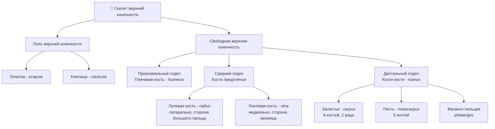
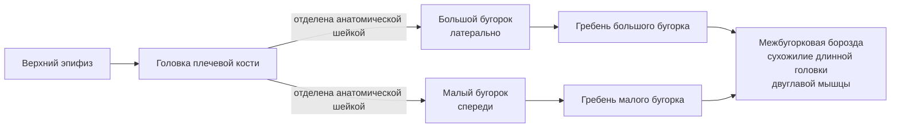
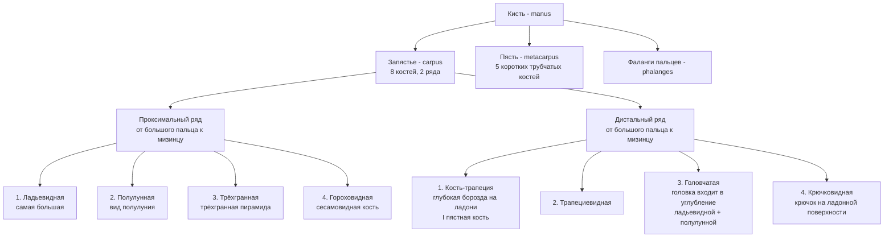

# 4.4 Скелет верхней конечности

> [!abstract] Общая структура
> Скелет верхней конечности делится на два отдела:
> 1. **Кости пояса верхней конечности** — ключица + лопатка
> 2. **Кости свободной верхней конечности** — плечо, предплечье, кисть

---

## Общая схема

> [!warning] Анатомическая стойка
> Расположение костей предплечья рассматривается в **анатомической стойке**: тело вертикально, ладонь обращена **кпереди**, I палец отведён **латерально**.

---

## 🔵 Пояс верхней конечности

### Лопатка — *scapula*

> [!info] Общее
> Плоская кость **треугольной формы**, расположена на задней поверхности грудной клетки на уровне **II–VII рёбер**.

| Элемент | Описание |
|---|---|
| **Углы** | Нижний, верхний, латеральный |
| **Края** | Медиальный (к позвоночнику), латеральный (к подмышечной ямке), верхний |
| **Поверхности** | Передняя (рёберная) и задняя |

**Передняя поверхность** → прилежит к рёбрам → образует **подлопаточную ямку**

**Задняя поверхность** → разделена гребнем — **остью лопатки** — на две ямки:

| Ямка | Расположение | Содержимое |
|---|---|---|
| **Надостная** | Выше ости | Надостная мышца |
| **Подостная** | Ниже ости | Подостная мышца |

> [!note] Ключевые отростки лопатки
> - **Акромион** (акромиальный отросток) — конец ости лопатки; имеет суставную поверхность для ключицы
> - **Клювовидный отросток** — возвышается над суставной впадиной
> - **Суставная впадина** — в латеральном углу; сочленяется с плечевой костью

---

### Ключица — *clavicula*

> [!info] Общее
> Трубчатая **S-образно изогнутая** кость.

| Часть | Особенности |
|---|---|
| **Тело** | Средняя часть |
| **Грудинный конец** | Утолщён; сочленяется с **рукояткой грудины** |
| **Акромиальный конец** | Уплощён; сочленяется с **акромионом лопатки** |

**На нижней поверхности:**
- У грудинного конца → **вдавление рёберно-ключичной связки** (к хрящу I ребра)
- У акромиального конца → **конусовидный бугорок** + **трапециевидная линия** (прикрепление связки от клювовидного отростка)

---

## 🔴 Кости свободной верхней конечности

### Плечевая кость — *humerus*

> [!info] Общее
> Длинная трубчатая кость. Состоит из **диафиза (тела)** и двух **эпифизов**.

#### Верхний (проксимальный) эпифиз

> [!danger] Хирургическая шейка
> Суженное место **ниже бугорков** — отделяет эпифиз от тела. **Наиболее частое место переломов** плечевой кости.

#### Тело (диафиз)

| Образование | Расположение | Значение |
|---|---|---|
| **Дельтовидная бугристость** | Верхняя треть, дистальнее гребня большого бугорка | Прикрепление дельтовидной мышцы |
| **Борозда лучевого нерва** | Задняя поверхность | Начало — медиальная поверхность → огибает сзади → граница средней и нижней трети диафиза |

#### Нижний (дистальный) эпифиз — **мыщелок**

| Структура | Сочленение |
|---|---|
| **Блок плечевой кости** | С локтевой костью |
| **Головка мыщелка** | С лучевой костью |
| **Венечная ямка** (спереди, над блоком) | Венечный отросток локтевой кости (при сгибании) |
| **Лучевая ямка** (над головкой мыщелка) | Головка лучевой кости |
| **Локтевая ямка** (сзади, над блоком) | Локтевой отросток локтевой кости |
| **Медиальный надмыщелок** | Борозда локтевого нерва (по задней поверхности) |
| **Латеральный надмыщелок** | — |

> [!tip] Надмыщелки
> Медиальный надмыщелок **развит сильнее**. По его задней поверхности проходит **борозда локтевого нерва**.

---

### Кости предплечья

> [!info] Общее
> Обе кости — **длинные трубчатые**. Тела имеют **трёхгранную форму**: 3 поверхности + 3 края.

| Поверхность / Край | Лучевая кость | Локтевая кость |
|---|---|---|
| Передняя | Кпереди | Кпереди |
| Задняя | Кзади | Кзади |
| Третья | **Латеральная** (наружу) | **Медиальная** (внутрь) |
| Межкостный край | Медиально (к локтевой) | Латерально (к лучевой) |

---

#### Локтевая кость — *ulna* (медиально, сторона мизинца)

| Часть | Образование | Описание |
|---|---|---|
| **Проксимальный эпифиз** | Блоковидная вырезка | Сочленяется с блоком плечевой кости |
| | Локтевой отросток | Сверху и сзади (более массивный) |
| | Венечный отросток | Снизу и спереди |
| | Лучевая вырезка | На латеральной стороне венечного отростка — для головки лучевой |
| | Бугристость локтевой кости | Ниже венечного отростка, спереди |
| **Дистальный эпифиз** | Головка | Тоньше проксимального; суставная окружность для лучевой кости |
| | Шиловидный отросток | От медиального края головки |

---

#### Лучевая кость — *radius* (латерально, сторона большого пальца)

| Часть | Образование | Описание |
|---|---|---|
| **Проксимальный эпифиз** | Головка лучевой кости | Суставная ямка — для головки мыщелка плечевой кости |
| | Суставная окружность | По краю головки |
| | Шейка | Ниже головки |
| | Бугристость лучевой кости | Ниже шейки, спереди — прикрепление **двуглавой мышцы плеча** |
| **Дистальный эпифиз** | Локтевая вырезка | С медиальной стороны — для головки локтевой кости |
| | Шиловидный отросток | С противоположной стороны, книзу |
| | Запястная суставная поверхность | На нижней поверхности — для костей запястья |

---

### Кости кисти — *manus*

---

#### Кости пясти — *ossa metacarpi*

> 5 **коротких трубчатых** костей. Каждая: **основание + тело + головка**

| Часть | Описание |
|---|---|
| **Основание** | Соединяется с костями запястья; II–V имеют суставные площадки между собой |
| **Тело** | Неправильная призматическая форма; тоньше эпифизов → межкостные промежутки |
| **Головка II–V** | Шаровидная → с проксимальными фалангами |
| **Головка I** | Блоковидная |

---

#### Фаланги пальцев — *phalanges*

> Короткие трубчатые кости. Каждая: **основание + тело + головка**

| Палец | Фаланги |
|---|---|
| **I (большой)** | 2 фаланги: проксимальная + дистальная |
| **II–V** | 3 фаланги: проксимальная + средняя + дистальная |

> [!note] Особенности фаланг
> - **Проксимальные** — самые длинные
> - **Дистальные (ногтевые)** — самые короткие; дистальный эпифиз расширен → **бугристость дистальной фаланги**
> - Самые длинные фаланги — у **среднего пальца**
> - Тела проксимальных и средних фаланг: с тыльной стороны **выпуклы**, с ладонной — **слабо вогнуты**

---

## 📋 Сводная таблица: суставные соединения

| Кость 1 | Кость 2 | Сустав / Соединение |
|---|---|---|
| Ключица (грудинный конец) | Рукоятка грудины | Грудино-ключичный сустав |
| Ключица (акромиальный конец) | Акромион лопатки | Акромиально-ключичный сустав |
| Суставная впадина лопатки | Головка плечевой кости | Плечевой сустав |
| Блок плечевой кости | Блоковидная вырезка локтевой | Локтевой сустав |
| Головка мыщелка плечевой | Ямка головки лучевой | Локтевой сустав |
| Головка локтевой кости | Локтевая вырезка лучевой | Дистальный лучелоктевой сустав |
| Запястная пов-сть лучевой | Кости проксимального ряда запястья | Лучезапястный сустав |
| Головки пястных костей | Проксимальные фаланги | Пястно-фаланговые суставы |
| Фаланги | Фаланги | Межфаланговые суставы |
