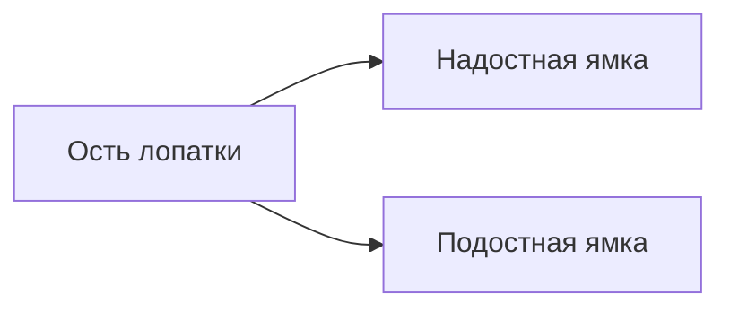
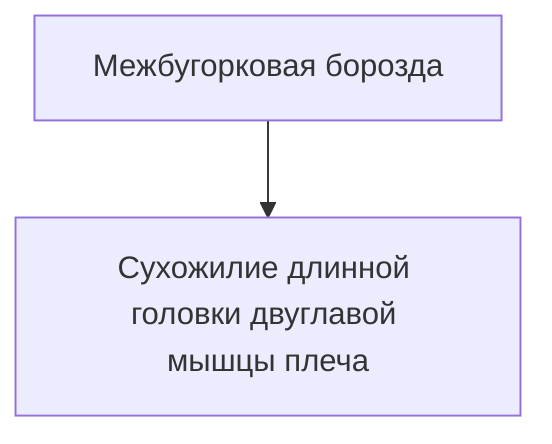
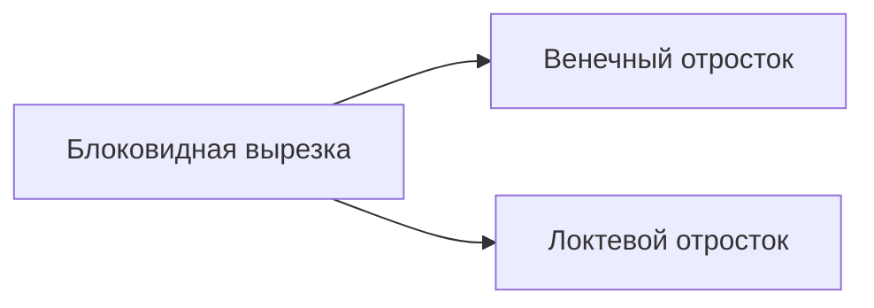
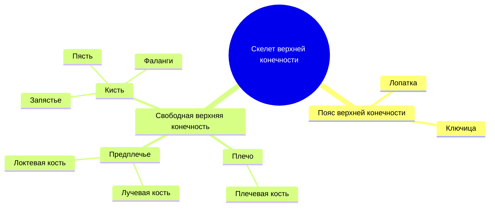

# Тест по теме: «Скелет верхней конечности»

> [!info]
> **Формат:** 20 вопросов  
> **Тема:** Пояс верхней конечности, плечо, предплечье, кисть.

---

# 1. Общая характеристика

> [!question] Вопрос 1
> Из каких частей состоит скелет верхней конечности?

- [ ] Только из костей кисти
- [ ] Из пояса верхней конечности и свободной верхней конечности
- [ ] Только из плечевой кости и предплечья
- [ ] Из позвоночника и плечевого пояса

> [!success]- Ответ
> **Правильный ответ:** из пояса верхней конечности и свободной верхней конечности.

---

> [!question] Вопрос 2
> Какие кости образуют пояс верхней конечности?

| Вариант | Ответ |
|---|---|
| А | Лопатка и ключица |
| Б | Лопатка и плечевая кость |
| В | Лучевая и локтевая кости |
| Г | Грудина и ключица |

> [!success]- Ответ
> **Правильный ответ:** А.

---

# 2. Лопатка

> [!question] Вопрос 3
> На уровне каких ребер расположена лопатка?

- [ ] I–V ребер
- [ ] II–VII ребер
- [ ] III–VIII ребер
- [ ] IV–IX ребер

> [!success]- Ответ
> **Правильный ответ:** II–VII ребер.

---

> [!question] Вопрос 4
> Какая структура разделяет заднюю поверхность лопатки на две ямки?

- [ ] Акромион
- [ ] Клювовидный отросток
- [ ] Ость лопатки
- [ ] Суставная впадина

> [!success]- Ответ
> **Правильный ответ:** ость лопатки.

---

> [!question] Вопрос 5
> С какой костью сочленяется суставная впадина лопатки?

- [ ] С локтевой костью
- [ ] С плечевой костью
- [ ] С ключицей
- [ ] С грудиной

> [!success]- Ответ
> **Правильный ответ:** с плечевой костью.

---

# 3. Ключица

> [!question] Вопрос 6
> Какую форму имеет ключица?

- [ ] Прямую
- [ ] S-образную
- [ ] Треугольную
- [ ] Кольцевидную

> [!success]- Ответ
> **Правильный ответ:** S-образную.

---

> [!question] Вопрос 7
> С чем сочленяется грудинный конец ключицы?

- [ ] С лопаткой
- [ ] С акромионом
- [ ] С рукояткой грудины
- [ ] С плечевой костью

> [!success]- Ответ
> **Правильный ответ:** с рукояткой грудины.

---

> [!question] Вопрос 8
> Какие образования находятся на нижней поверхности акромиального конца ключицы?

| Образование | Наличие |
|---|---|
| Конусовидный бугорок | ✅ |
| Трапециевидная линия | ✅ |
| Локтевая ямка | ❌ |
| Венечная вырезка | ❌ |

> [!success]- Ответ
> **Правильный ответ:** конусовидный бугорок и трапециевидная линия.

---

# 4. Плечевая кость

> [!question] Вопрос 9
> Как называется суженное место ниже бугорков плечевой кости?

- [ ] Анатомическая шейка
- [ ] Хирургическая шейка
- [ ] Межбугорковая борозда
- [ ] Лучевая ямка

> [!success]- Ответ
> **Правильный ответ:** хирургическая шейка.

---

> [!question] Вопрос 10
> Что проходит в межбугорковой борозде плечевой кости?

- [ ] Лучевой нерв
- [ ] Локтевой нерв
- [ ] Сухожилие длинной головки двуглавой мышцы плеча
- [ ] Плечевая артерия

> [!success]- Ответ
> **Правильный ответ:** сухожилие длинной головки двуглавой мышцы плеча.

---

> [!question] Вопрос 11
> Где располагается борозда лучевого нерва?

- [ ] На передней поверхности плечевой кости
- [ ] На задней поверхности плечевой кости
- [ ] На локтевой кости
- [ ] На ключице

> [!success]- Ответ
> **Правильный ответ:** на задней поверхности плечевой кости.

---

> [!question] Вопрос 12
> Из каких частей состоит мыщелок плечевой кости?

| Часть | Сочленение |
|---|---|
| Блок плечевой кости | С локтевой костью |
| Головка мыщелка | С лучевой костью |

> [!success]- Ответ
> **Правильный ответ:** блок плечевой кости и головка мыщелка.

---

# 5. Кости предплечья

> [!question] Вопрос 13
> Какая кость предплечья расположена медиально?

- [ ] Лучевая
- [ ] Локтевая
- [ ] Плечевая
- [ ] Ладьевидная

> [!success]- Ответ
> **Правильный ответ:** локтевая кость.

---

> [!question] Вопрос 14
> Какие отростки ограничивают блоковидную вырезку локтевой кости?

- [ ] Шиловидный и венечный
- [ ] Венечный и локтевой
- [ ] Акромион и клювовидный
- [ ] Головчатый и крючковидный

> [!success]- Ответ
> **Правильный ответ:** венечный и локтевой.

---

> [!question] Вопрос 15
> Что находится на проксимальном эпифизе лучевой кости?

- [ ] Суставная ямка головки лучевой кости
- [ ] Локтевая ямка
- [ ] Венечная вырезка
- [ ] Подостная ямка

> [!success]- Ответ
> **Правильный ответ:** суставная ямка головки лучевой кости.

---

> [!question] Вопрос 16
> Где располагается бугристость лучевой кости?

- [ ] На дистальном эпифизе
- [ ] На шейке локтевой кости
- [ ] Дистальнее шейки лучевой кости
- [ ] На головке плечевой кости

> [!success]- Ответ
> **Правильный ответ:** дистальнее шейки лучевой кости.

---

# 6. Кости кисти

> [!question] Вопрос 17
> Сколько костей входит в состав запястья?

- [ ] 5
- [ ] 6
- [ ] 8
- [ ] 10

> [!success]- Ответ
> **Правильный ответ:** 8.

---

> [!question] Вопрос 18
> Какая кость запястья является сесамовидной?

- [ ] Полулунная
- [ ] Гороховидная
- [ ] Ладьевидная
- [ ] Крючковидная

> [!success]- Ответ
> **Правильный ответ:** гороховидная кость.

---

> [!question] Вопрос 19
> Какая кость дистального ряда запястья имеет крючок?

- [ ] Головчатая
- [ ] Трапециевидная
- [ ] Крючковидная
- [ ] Полулунная

> [!success]- Ответ
> **Правильный ответ:** крючковидная кость.

---

> [!question] Вопрос 20
> Сколько фаланг имеет большой палец кисти?

| Палец | Количество фаланг |
|---|---|
| Большой палец | 2 |
| Остальные пальцы | 3 |

> [!success]- Ответ
> **Правильный ответ:** 2 фаланги.

---

# 📌 Итоговая схема

> [!tip]
> Для подготовки к зачёту сначала отвечай самостоятельно, а затем открывай блоки с ответами.

