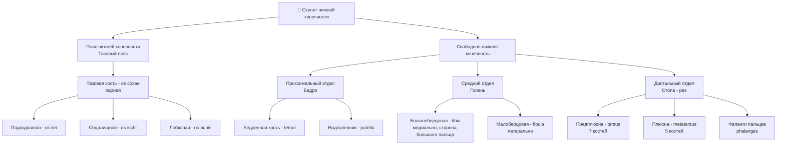
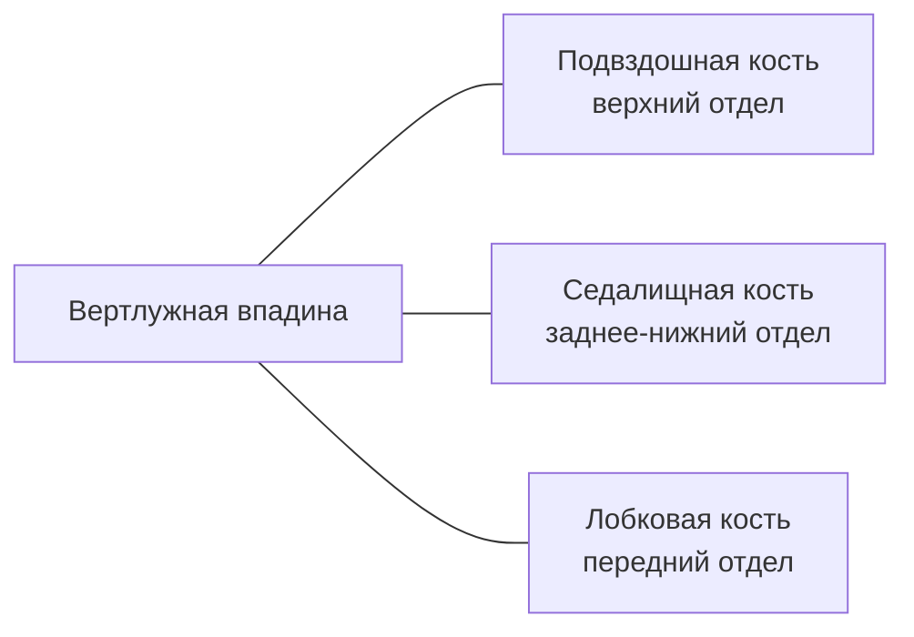
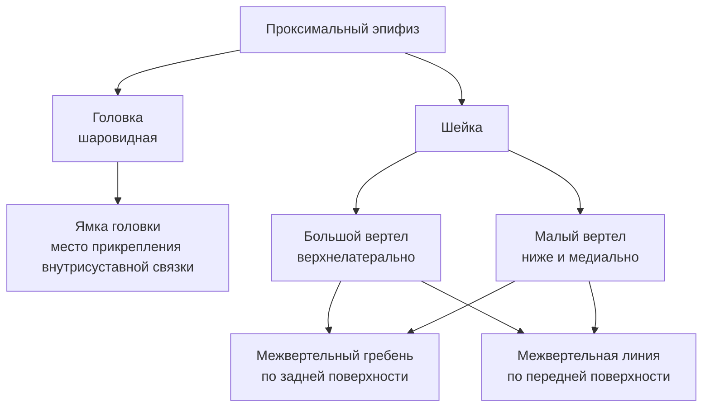
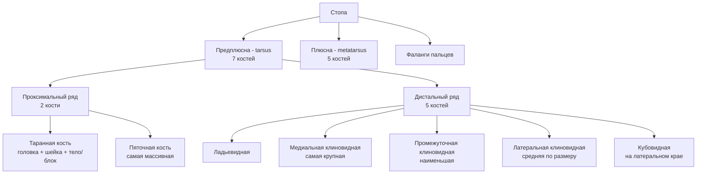

# 4.5 Скелет нижней конечности

> [!abstract] Общая структура
> Скелет нижней конечности делится на два отдела:
> 1. **Кости пояса нижней конечности** — тазовый пояс (парная тазовая кость)
> 2. **Кости свободной нижней конечности** — бедро, голень, стопа

---

## Общая схема

---

## 🔵 Пояс нижней конечности — Тазовая кость (*os coxae*)

> [!info] Общее
> У взрослого — **единая кость** из трёх сросшихся. В детстве разделены хрящом. Все три кости соединяются в области **вертлужной впадины** (снаружи тазовой кости).

---

### Подвздошная кость — *os ilei*

> Верхний, **расширенный** отдел тазовой кости. Состоит из **тела** и **крыла**.

| Часть | Элемент | Описание |
|---|---|---|
| **Тело** | — | Нижняя утолщённая часть; участвует в образовании вертлужной впадины |
| **Крыло** | Подвздошный гребень | Верхний утолщённый край крыла |
| | Передняя верхняя подвздошная ость | Передний конец гребня |
| | Задняя верхняя подвздошная ость | Задний конец гребня |
| | Передняя нижняя подвздошная ость | Ниже передней верхней (через вырезку) |
| | Задняя нижняя подвздошная ость | Ниже задней верхней (через вырезку) |

**Наружная поверхность крыла** → три ягодичные линии (места начала мышц):
- Задняя, нижняя, передняя ягодичные линии

**Внутренняя поверхность крыла:**
- **Подвздошная ямка** — вогнутая поверхность
- **Ушковидная поверхность** — кзади от ямки; сочленяется с крестцом
- **Подвздошная бугристость** — выше и кзади от ушковидной; прикрепление мощных связок
- **Дугообразная линия** — граница между телом и крылом (на внутренней поверхности)

---

### Седалищная кость — *os ischii*

> Состоит из **тела** и **ветви**.

| Элемент | Описание |
|---|---|
| **Тело** | Участвует в образовании вертлужной впадины |
| **Ветвь** | Соединяется с нижней ветвью лобковой кости → ограничивает **запирательное отверстие** |
| **Седалищный бугор** | Место соединения тела с ветвью; массивный выступ |
| **Седалищная ость** | Заострённый выступ выше седалищного бугра |
| **Большая седалищная вырезка** | Выше седалищной ости |
| **Малая седалищная вырезка** | Ниже седалищной ости |

---

### Лобковая кость — *os pubis*

> Состоит из **тела** и двух **ветвей**: верхней и нижней.

| Элемент | Описание |
|---|---|
| **Тело** | Входит в состав вертлужной впадины |
| **Симфизиальная поверхность** | Шероховатая, овальная; в месте соединения ветвей → лобковое соединение |
| **Лобковый гребень** | Продолжение дугообразной линии подвздошной кости |
| **Лобковый бугорок** | Конец лобкового гребня |
| **Подвздошно-лобковое возвышение** | Место срастания подвздошной и лобковой костей |

> [!note] Пограничная линия
> **Дугообразная линия** (подвздошная) + **гребень лобковой кости** = **пограничная линия**, разделяющая **большой** и **малый таз**.

---

### Вертлужная впадина

| Часть | Описание |
|---|---|
| **Ямка вертлужной впадины** | Центральная часть (не покрыта хрящом) |
| **Полулунная суставная поверхность** | По периферии — для сочленения с головкой бедренной кости |
| **Вырезка вертлужной впадины** | В нижней части, между концами полулунной поверхности |

---

## 🔴 Кости свободной нижней конечности

### Бедренная кость — *femur*

> [!info] Самая длинная кость скелета. Длинная трубчатая.

#### Проксимальный эпифиз

#### Тело (диафиз)

| Поверхность / Образование | Описание |
|---|---|
| Спереди и с боков | Гладкое |
| **Шероховатая линия** (сзади) | Латеральная губа + медиальная губа |
| **Гребенчатая линия** | Продолжение медиальной губы у проксимального эпифиза |
| **Ягодичная бугристость** | Продолжение латеральной губы у проксимального эпифиза |
| **Подколенная поверхность** | Треугольник между расходящимися губами у дистального эпифиза |

#### Дистальный эпифиз

| Элемент | Описание |
|---|---|
| **Латеральный мыщелок** | + латеральный надмыщелок (сбоку) |
| **Медиальный мыщелок** | + медиальный надмыщелок (сбоку) |
| **Межмыщелковая ямка** | Между мыщелками (сзади) |
| **Надколенниковая поверхность** | Спереди — слияние суставных поверхностей мыщелков; прилежит надколенник |

---

### Надколенник — *patella*

> [!tip] Особенности
> - Самая большая **сесамовидная** кость
> - Сросшаяся с сухожилием **четырёхглавой мышцы бедра**

| Часть | Описание |
|---|---|
| **Основание** | Верхний расширенный край |
| **Верхушка** | Нижний заострённый край |
| **Передняя поверхность** | Наружная |
| **Задняя поверхность** | Покрыта хрящом; обращена в полость коленного сустава |

---

### Кости голени

> [!info] Обе кости — **длинные трубчатые**. Тела трёхгранные: 3 поверхности + 3 края.

---

#### Большеберцовая кость — *tibia* (медиально)

**Проксимальный эпифиз:**

| Элемент | Описание |
|---|---|
| **Латеральный мыщелок** | — |
| **Медиальный мыщелок** | — |
| **Верхняя суставная поверхность** | Обращена к бедренной кости |
| **Межмыщелковое возвышение** | В центре верхней суставной поверхности |
| **Малоберцовая суставная поверхность** | На латеральном мыщелке — для головки малоберцовой кости |

**Тело:**

| Край / Поверхность | Описание |
|---|---|
| **Передний край** | Наиболее острый; пальпируется под кожей; разделяет латеральную и медиальную поверхности |
| **Межкостный край** | Латеральный, обращён к малоберцовой кости |
| **Медиальный край** | — |
| **Бугристость б/б кости** | Верхняя часть переднего края; прикрепление сухожилия **четырёхглавой мышцы бедра** |
| **Линия камбаловидной мышцы** | На задней поверхности, у проксимального эпифиза |

**Дистальный эпифиз:**

| Элемент | Описание |
|---|---|
| **Нижняя суставная поверхность** | Сочленяется с **таранной костью** |
| **Малоберцовая вырезка** | С латеральной стороны — для малоберцовой кости |
| **Медиальная лодыжка** | Заострённый книзу выступ на медиальной стороне |

---

#### Малоберцовая кость — *fibula* (латерально)

| Часть | Элемент | Описание |
|---|---|---|
| **Проксимальный эпифиз** | Головка | С заострённой верхушкой |
| | Суставная поверхность головки | На внутренней стороне; для сочленения с большеберцовой костью |
| **Тело** | 3 края | Передний, задний, межкостный (наиболее острый) |
| **Дистальный эпифиз** | Латеральная лодыжка | — |
| | Суставная поверхность лодыжки | На внутренней стороне; для таранной кости |
| | Борозда | Позади суставной поверхности; сухожилия мышц |

---

### Кости стопы — *pes*

---

#### Кости предплюсны — *ossa tarsi*

**Проксимальный ряд:**

| Кость | Ключевые особенности |
|---|---|
| **Таранная** | Головка (→ ладьевидная), шейка, тело с **блоком** (3 суставные поверхности: верх → большеберцовая; бока → лодыжки; низ → пяточная) |
| **Пяточная** | Самая массивная; **пяточный бугор** сзади (прикрепление **Ахиллова сухожилия**); верх → таранная; перед → кубовидная |

**Дистальный ряд:**

| Кость | Ключевые особенности |
|---|---|
| **Ладьевидная** | Вогнутая сторона → таранная; выпуклая → три клиновидные; латерально → кубовидная |
| **Медиальная клиновидная** | Самая крупная из клиновидных |
| **Промежуточная клиновидная** | Наименьшая |
| **Латеральная клиновидная** | Средняя по величине |
| **Кубовидная** | Латеральный край стопы: сзади → пяточная; спереди → IV, V плюсневые; внутри → лат. клиновидная + ладьевидная |

---

#### Кости плюсны — *ossa metatarsi*

> 5 **коротких трубчатых** костей: **основание + тело + головка**

| Особенность | Описание |
|---|---|
| **I плюсневая** | Самая короткая и **массивная**; головка блоковидная |
| **II плюсневая** | Самая **длинная** |
| **Головки II–V** | Шаровидные |
| **Тела** | Изогнуты в сагиттальной плоскости, выпуклостью к тылу |
| **Основания** | Сочленяются с дистальным рядом предплюсны |

---

#### Фаланги пальцев стопы

> По количеству и названиям аналогичны кисти, но **короче и массивнее**

| Палец | Фаланги | Особенности |
|---|---|---|
| **I** | Проксимальная + дистальная | Фаланги **толще**, чем у остальных |
| **II–V** | Проксимальная + средняя + дистальная | — |
| **IV–V** | — | Особенно **короткие** фаланги |
| **Мизинец** | — | Средняя и дистальная фаланги нередко **срастаются** |

> [!note] Сесамовидные кости стопы
> Расположены постоянно в области **плюснефаланговых суставов** большого пальца и мизинца, а также в **межфаланговом суставе** большого пальца.

---

## 🟢 Своды стопы

> [!info] Зачем нужны своды?
> Кости плюсны и предплюсны **не лежат в одной плоскости** → образуют своды, выпуклостью **кверху** → амортизация при нагрузке и ходьбе, защита сосудов и тканей.

### Точки опоры стопы

| Зона | Точка опоры |
|---|---|
| Сзади | **Пяточный бугор** |
| Спереди | **Головки плюсневых костей** |
| Пальцы | Лишь касаются опоры |

---

### Продольные своды (5 штук)

> Каждый идёт от **пяточного бугра** к **головке соответствующей плюсневой кости**

| Своды | Функция | Контакт с опорой |
|---|---|---|
| **I–III** (медиальные) | **Рессорные** | При нагрузке **не касаются** опоры |
| **IV–V** (латеральные) | **Опорные** | Прилежат к площади опоры |

> [!tip] Медиальный край стопы
> В норме стопа касается опоры только **латеральным краем**. Медиальный край имеет чёткую **арочную форму**.

---

### Поперечные своды (2 штуки)

> Расположены во **фронтальной плоскости**, выпуклостью **кверху**

| Свод | Расположение | Точки опоры |
|---|---|---|
| **Предплюсневый** | В области костей предплюсны | — |
| **Плюсневый** | В области головок плюсневых костей | Только головки **I и V** плюсневых костей |

---

## 📋 Сводная таблица: суставные соединения нижней конечности

| Кость 1 | Кость 2 | Сустав / Соединение |
|---|---|---|
| Тазовая кость | Крестец | Крестцово-подвздошный сустав |
| Вертлужная впадина | Головка бедренной кости | Тазобедренный сустав |
| Лобковые кости (обе) | Симфизиальные поверхности | Лобковый симфиз |
| Мыщелки бедренной кости | Верхняя суставная поверхность б/б кости | Коленный сустав |
| Надколенниковая поверхность | Надколенник | Коленный сустав |
| Головка малоберцовой | Малоберцовая поверхность б/б кости | Проксимальный межберцовый сустав |
| Малоберцовая вырезка б/б кости | Латеральная лодыжка малоберцовой | Дистальный межберцовый сустав |
| Нижняя суставная пов-сть б/б кости | Блок таранной кости | Голеностопный сустав |
| Лодыжки (обе) | Боковые поверхности таранной | Голеностопный сустав |
| Таранная кость | Пяточная кость | Подтаранный сустав |
| Таранная кость | Ладьевидная кость | Таранно-ладьевидный сустав |
| Пяточная кость | Кубовидная кость | Пяточно-кубовидный сустав |
| Ладьевидная | Три клиновидных | Предплюсневые суставы |
| Основания плюсневых костей | Дистальный ряд предплюсны | Предплюсне-плюсневые суставы |
| Головки плюсневых костей | Проксимальные фаланги | Плюснефаланговые суставы |
| Фаланги | Фаланги | Межфаланговые суставы |
