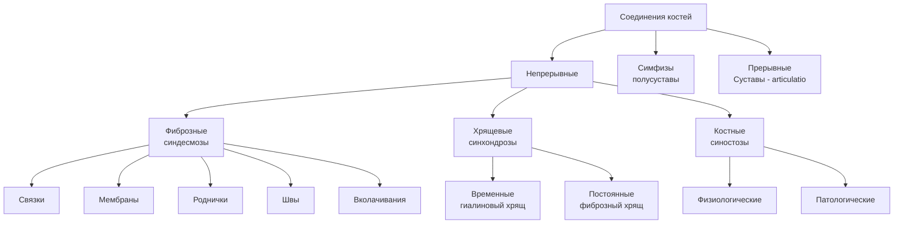
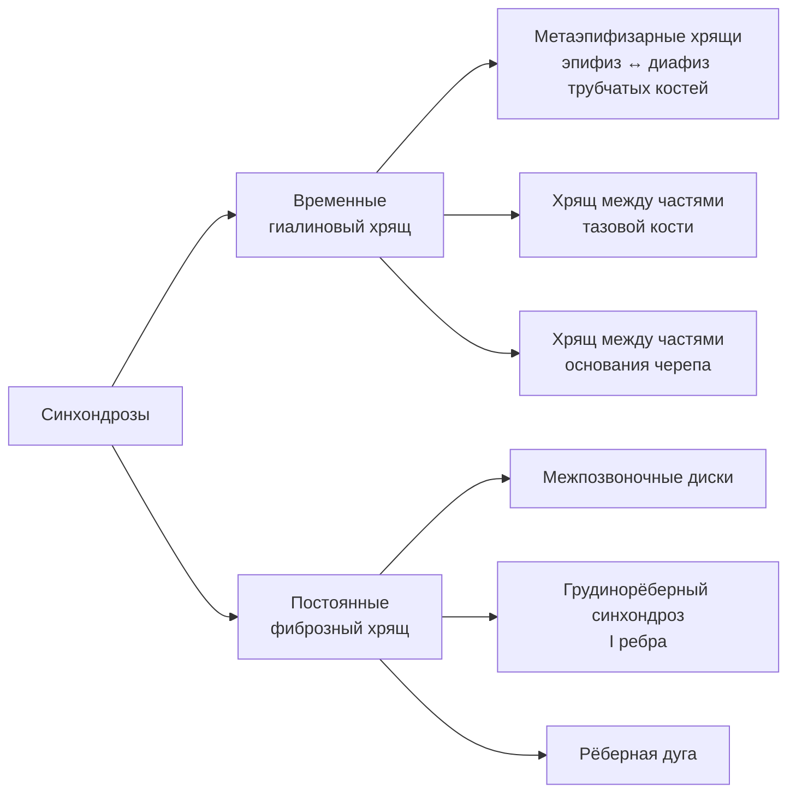
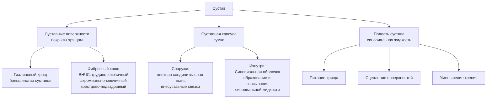
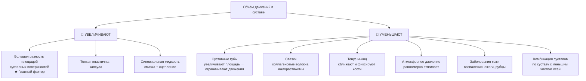

# 5.1 Общая артросиндесмология

> [!abstract] Определение
> **Артросиндесмология** — наука о соединениях костей (дословно: «учение о суставах и связках»).

---

## Общая схема соединений костей

---

## 🔵 Непрерывные соединения

### 1. Фиброзные соединения (синдесмозы)

> Соединения с помощью **соединительной ткани**

| Вид | Описание | Функция |
|---|---|---|
| **Связки** | Пучки коллагеновых и эластических волокон | Фиксация костей |
| **Мембраны** | Межкостная перепонка | Заполняет промежутки между костями; разделяет мышцы-антагонисты |
| **Роднички** | Перепончатые соединения костей черепа | У плода, новорождённых и детей 1-го года жизни; зона роста + амортизация |
| **Швы** | Тонкие прослойки ткани с коллагеновыми волокнами | Между костями черепа; зона роста + амортизация |
| **Вколачивания** | Корни зубов + альвеолярные ячейки → **периодонт** | Фиксация, амортизация зуба, питание тканей |

---

### 2. Хрящевые соединения (синхондрозы)

> Представлены **гиалиновым** или **фиброзным** хрящом

> [!note] Судьба временных синхондрозов
> Существуют до определённого возраста → затем замещаются **костной тканью** (синостоз)

---

### 3. Костные соединения (синостозы)

| Вид | Что окостеневает | Причина |
|---|---|---|
| **Физиологические** | Временные синхондрозы, роднички, швы | Нормальное развитие |
| **Патологические** | Синдесмозы, синхондрозы, суставы | Болезнь Бехтерева, остеохондроз и др. |

---

## 🟡 Симфизы (полусуставы)

> [!info] Промежуточный вид между непрерывными и прерывными соединениями

**Строение:** хрящ между двумя костями с **небольшой полостью** (без синовиальной выстилки)

| Пример симфиза | Расположение |
|---|---|
| **Лобковый симфиз** | Между лобковыми костями |
| — | Тела V поясничного и I крестцового позвонков |
| — | Между крестцом и копчиком |

---

## 🔴 Прерывные соединения — Суставы (*articulatio*)

> [!info] Определение
> **Сустав** — прерывное, полостное соединение, образованное суставными поверхностями, покрытыми хрящом, заключёнными в суставную **капсулу** с **синовиальной жидкостью** внутри.

---

### Основные элементы сустава

> [!tip] Функции суставного хряща
> - Препятствует **срастанию** костей
> - Предупреждает **разрушение** костей (выдерживает нагрузки лучше, чем кость)
> - Обеспечивает **скольжение** суставных поверхностей

---

### Вспомогательные элементы сустава

> [!note] Вспомогательные элементы располагаются **только в полости сустава**

| Элемент | Описание | Где встречается |
|---|---|---|
| **Внутрисуставные связки** | Покрыты синовиальной мембраной; связывают суставные поверхности | Коленный, сустав головки ребра, тазобедренный |
| **Суставной диск** | Фиброзный хрящ в виде пластинки → делит сустав на **2 этажа** полностью | Грудино-ключичный, ВНЧС |
| **Мениски** | Фиброзный хрящ в форме **полулуния**; краями сращены с капсулой → делит сустав **частично** | Коленный |
| **Суставная губа** | Кольцеобразный фиброзный хрящ по краю суставной ямки; один край → капсула, другой → суставная поверхность | Плечевой, тазобедренный |
| **Синовиальные складки** | Богатые сосудами соединительнотканные образования, покрытые синовиальной оболочкой | — |
| **Жировые складки** | Синовиальные складки с большим количеством жировой клетчатки | Крыловидные складки (коленный); жировое тело вертлужной впадины (тазобедренный) |
| **Сесамовидные кости** | Вставочные кости; одна поверхность покрыта гиалиновым хрящом → в полость сустава | Надколенник (самая большая); суставы кисти, стопы |
| **Синовиальные сумки** | Небольшие полости с синовиальной жидкостью; часто сообщаются с полостью сустава | Смазывают рядом расположенные сухожилия |

---

## Классификация суставов

### По числу осей и форме суставных поверхностей

| Осность | Форма сустава | Ось | Движения | Число видов |
|---|---|---|---|---|
| **Одноосные** | Цилиндрический | Вертикальная | Вращение | 1 |
| | Блоковидный | Фронтальная | Сгибание, разгибание | 2 |
| | Улитковый (разновидность блоковидного) | Фронтальная | Сгибание, разгибание | 2 |
| **Двухосные** | Эллипсовидный | Фронтальная + сагиттальная | Сгибание, разгибание, отведение, приведение, круговое | 5 |
| | Седловидный | Фронтальная + сагиттальная | То же | 5 |
| | Мыщелковый | Фронтальная + вертикальная | Сгибание, разгибание, вращение | 3 |
| **Многоосные** | Шаровидный | Все три | Сгибание, разгибание, отведение, приведение, круговое, вращение | 6 |
| | Чашеобразный (разновидность шаровидного) | Все три | То же | 6 |
| | Плоский | Все три (малый объём) | Практически **неподвижен** | — |

> [!warning] Плоский сустав
> Поверхность шара с очень большим радиусом кривизны ≈ плоскость. Суставные поверхности **почти равны** → сустав **малоподвижен или неподвижен**. Пример: крестцово-подвздошный.

---

### По количеству суставных поверхностей

| Вид | Описание | Пример |
|---|---|---|
| **Простой** | Только **две** суставные поверхности (могут быть образованы несколькими костями) | Межфаланговые; лучезапястный (3 кости → единая поверхность) |
| **Сложный** | Несколько суставных поверхностей в **одной капсуле** | Локтевой (единственный однозначно сложный) |

> [!note] Коленный сустав
> Ряд авторов относит к сложным. В данном учебнике считается **простым** — мениски и надколенник являются вспомогательными элементами.

---

### По функции

| Вид | Описание | Примеры |
|---|---|---|
| **Комбинированные** | Анатомически **разобщены** (разные капсулы), но функционируют **только вместе** | Межпозвоночные, атлантозатылочные, ВНЧС |
| **Некомбинированные** | Функционируют **самостоятельно** | — |

> [!tip] Правило комбинированных суставов
> При комбинации суставов с **разными формами** поверхностей движения определяются по суставу с **меньшим объёмом движений**.
>
> 📌 Пример: латеральный атлантоосевой (плоский, многоосный) + срединный атлантоосевой (цилиндрический, одноосный) → функционируют как **единый одноосный цилиндрический**.

---

## Факторы, определяющие объём движений в суставе

> [!danger] Клиническое значение синовиальной жидкости
> При **артрозо-артритах** (обменно-дистрофические заболевания) нарушается выделение синовиальной жидкости → **боль, хруст, уменьшение объёма движений**.

---

## 📋 Сводная таблица: виды соединений костей

| Вид | Подвид | Подвижность | Примеры |
|---|---|---|---|
| **Непрерывные** | Синдесмозы (фиброзные) | Малоподвижны | Швы черепа, роднички, связки |
| | Синхондрозы (хрящевые) | Малоподвижны | МП диски, рёберные хрящи |
| | Синостозы (костные) | Неподвижны | Кости черепа у взрослых |
| **Симфизы** | — | Минимальная | Лобковый симфиз |
| **Прерывные** | Суставы (синовиальные) | Подвижны | Все крупные суставы |
