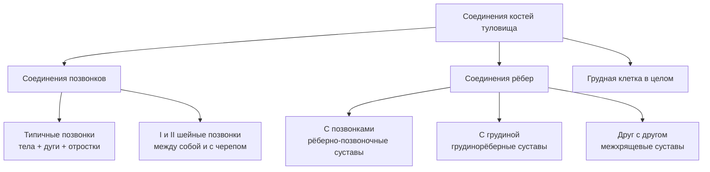
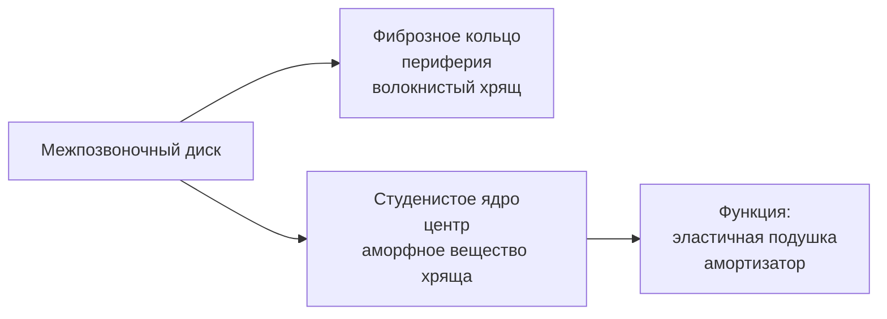
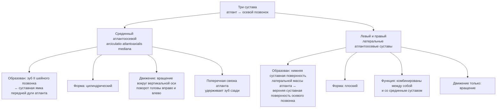
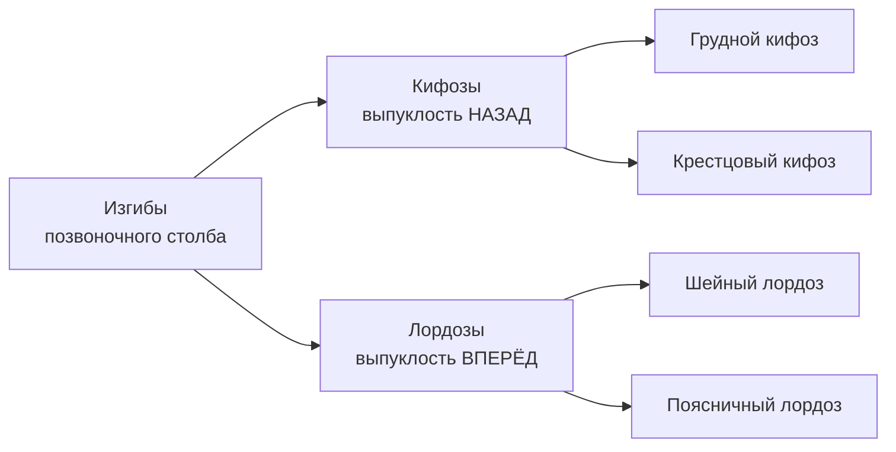
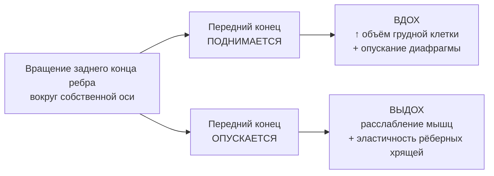

# 5.2 Соединения костей туловища

> [!abstract] Состав
> К соединениям костей туловища относят:
> 1. Соединения **позвонков** (типичных + I и II шейных + с черепом)
> 2. Соединения **рёбер** (с позвонками, грудиной, друг с другом)
> 3. **Грудная клетка** в целом

---

## Общая схема

---

## 🔵 Соединения типичных позвонков

### Соединения тел позвонков

> **Межпозвоночные диски** — *disci intervertebrales*

**Продольные связки тел позвонков:**

| Связка | Расположение | Протяжённость |
|---|---|---|
| **Передняя продольная** | По передней поверхности тел | От основания черепа → до I крестцового позвонка |
| **Задняя продольная** | По задней поверхности тел | От ската затылочной кости → до крестцового канала |

---

### Соединения дуг и отростков позвонков

| Элемент | Что соединяет | Вид соединения |
|---|---|---|
| **Жёлтые связки** | Между дугами соседних позвонков | Непрерывное; оставляют свободными межпозвоночные отверстия |
| **Межостистые связки** | Между остистыми отростками (короткие) | Непрерывное |
| **Надостистая связка** | По вершинам всех остистых отростков (непарная) | Непрерывное; продолжение межостистых |
| **Межпоперечные связки** | Между поперечными отростками | Непрерывное; **в шейном отделе отсутствуют** |
| **Межпозвоночные суставы** | Нижние суставные отростки вышележащего ↔ верхние отростки нижележащего | **Единственное прерывное** соединение |

> [!info] Межпозвоночные суставы
> - Суставные поверхности **плоские**, покрыты гиалиновым хрящом
> - По функции: **многоосные, комбинированные**
> - Возможные движения: наклоны вперёд/назад, в стороны, круговое, торзионное (скручивание), пружинящее

---

### Подвижность отделов позвоночного столба

| Отдел | Подвижность | Причина |
|---|---|---|
| **Шейный** | Наибольшая | Большая высота межпозвоночных дисков |
| **Поясничный** | Наибольшая | Большая высота межпозвоночных дисков |
| **Грудной** | Наименьшая | Малая высота дисков + остистые отростки наклонены книзу + фронтальное расположение суставных поверхностей |

---

### Особые соединения

| Соединение | Позвонки | Особенность |
|---|---|---|
| V поясничный ↔ крестец | Те же типичные | Аналогично свободным позвонкам |
| V крестцовый ↔ I копчиковый | — | МП диск с небольшой полостью внутри → **симфиз**; укреплён крестцово-копчиковыми связками |

---

## 🔵 Соединения I и II шейных позвонков с черепом

### Атлантозатылочный сустав — *articulatio atlantooccipitalis*

> [!info] Строение
> - **Парный** сустав
> - Образован: мыщелки затылочной кости ↔ верхние суставные поверхности I шейного позвонка (атланта)
> - Хрящ: гиалиновый; капсула свободная

| Характеристика | Значение |
|---|---|
| Форма | **Эллипсовидный** |
| Осность | **Двухосный** |
| Функция | **Комбинированный** (анатомически разобщён, функционирует вместе) |

**Движения:**

| Ось | Движение |
|---|---|
| Фронтальная | Кивательные: наклоны головы **вперёд и назад** |
| Сагиттальная | Наклоны головы **вправо и влево** |
| Переход с оси на ось | **Круговое** (периферическое) движение |

> [!note] Мембраны
> Между затылочной костью и атлантом — **передняя и задняя атлантозатылочные мембраны** (от краёв большого отверстия → к передней и задней дугам атланта).

---

### Суставы между I (атлант) и II (осевой) шейными позвонками

**Связки атлантоосевых суставов:**

| Связка | Описание |
|---|---|
| **Крыловидные связки** | От верхушки зуба → к затылочным мыщелкам |
| **Связка верхушки зуба** | От верхушки зуба → к переднему краю большого отверстия |
| **Передняя продольная связка** | От затылочной кости → по телу осевого позвонка → вниз до крестца |
| **Задняя продольная связка** | Аналогично |
| **Крестообразная связка** | Продольные связки + поперечная связка атланта |

> [!warning] Правило комбинированных суставов
> Латеральный атлантоосевой сустав — **плоский (многоосный)**, но скомбинирован со срединным (цилиндрическим, одноосным) → функционируют как **единый одноосный вращательный**.

---

## 🟡 Позвоночный столб в целом

> [!info] Функции позвоночника
> Поддерживает голову · гибкая ось туловища · участвует в образовании стенок грудной, брюшной полостей и таза · опора тела · **защита спинного мозга** в позвоночном канале

---

### Физиологические изгибы (в сагиттальной плоскости)

> [!note] Мыс
> В месте соединения V поясничного ↔ I крестцового позвонков — значительный выступ — **мыс**.

**Формирование изгибов после рождения:**

| Возраст | Событие | Изгиб |
|---|---|---|
| Новорождённый | Позвоночник — дуга выпуклостью **назад** | — |
| **2–3 месяца** | Начинает держать голову | Шейный **лордоз** |
| **5–6 месяцев** | Начинает сидеть | Грудной **кифоз** |
| **9–12 месяцев** | Начинает ходить | Поясничный **лордоз** + увеличение грудного и крестцового кифозов |

> [!danger] Сколиоз
> Отклонение позвоночного столба от срединной плоскости **во фронтальной плоскости**. В норме изгибов во фронтальной плоскости **нет**.

**Движения позвоночного столба:**
- Наклоны вперёд и назад (сгибание / разгибание)
- Наклоны в стороны
- Торзионные движения (скручивание)
- Круговое (коническое) движение
- Пружинящее движение

---

## 🔴 Соединения рёбер

### С позвонками — рёберно-позвоночные суставы

| Сустав | Образован | Форма | Движение |
|---|---|---|---|
| **Сустав головки ребра** (*articulatio capitis costae*) | Рёберные ямки тел грудных позвонков ↔ головка ребра | Седловидный или шаровидный | Вращательное (комбинированный) |
| **Рёберно-поперечный** (*articulatio costotransversaria*) | Бугорок ребра ↔ рёберная ямка поперечного отростка | Цилиндрический | Вращательное (комбинированный) |

> [!tip] Комбинация
> Сустав головки ребра + рёберно-поперечный сустав — **комбинированные** → функционируют только как **вращательные**.
> Капсула сустава головки ребра укреплена **лучистой связкой** (пучки веерообразно → к МП диску и телам позвонков).

---

### С грудиной

| Ребро | Вид соединения | Сустав |
|---|---|---|
| **I** | Постоянный **синхондроз** | Хрящ непосредственно срастается с грудиной |
| **II–VII** | **Грудинорёберные суставы** (*articulationes sternocostales*) | Передние концы рёберных хрящей ↔ рёберные вырезки грудины |
| **VIII–X** (ложные) | **Рёберная дуга** | Хрящи соединяются друг с другом; иногда межхрящевые суставы; ограничивают **подгрудинный угол** |
| **XI–XII** | — | Короткие хрящевые концы заканчиваются в мускулатуре брюшной стенки |

**Мембраны:**

| Мембрана | Расположение |
|---|---|
| **Наружная межрёберная** | Передние отделы межрёберных промежутков |
| **Внутренняя межрёберная** | Задние отделы межрёберных промежутков |

---

### Функция рёберных суставов в дыхании

> [!info] Механизм
> Сустав головки ребра + рёберно-поперечный + грудинорёберные суставы → **комбинированный одноосный вращательный**.

---

## 🟢 Грудная клетка в целом — *thorax*

> [!info] Состав
> 12 грудных позвонков + 12 пар рёбер + грудина + их соединения.
> Содержит: **сердце, лёгкие, трахею, пищевод** и др.

**Форма** — усечённый конус, основание обращено **книзу**.
Передне-задний размер **< поперечного**.

### Стенки грудной клетки

| Стенка | Образована |
|---|---|
| **Передняя** (самая короткая) | Грудина + рёберные хрящи |
| **Боковые** (наиболее длинные) | Тела 12 рёбер |
| **Задняя** | Грудной отдел позвоночника + рёбра |

### Апертуры грудной клетки

| Апертура | Границы | Что проходит / закрывает |
|---|---|---|
| **Верхняя** (более узкая) | Рукоятка грудины + I пара рёбер + тело I грудного позвонка | Сосуды, нервы, трахея, пищевод |
| **Нижняя** (широкая) | Тело XII грудного позвонка + XII пара рёбер + концы XI рёбер + рёберные дуги + мечевидный отросток | Закрыта **диафрагмой** |

> [!note] Межрёберные промежутки
> Пространства между смежными рёбрами. Заполнены **межрёберными мышцами, связками и мембранами**.

### Формы грудной клетки по типу телосложения

| Форма | Тип телосложения |
|---|---|
| **Коническая** | Мезоморфный |
| **Цилиндрическая** | Долихоморфный |
| **Плоская** | Брахиморфный |

---

## 📋 Сводная таблица суставов туловища

| Сустав | Форма | Осность | Комбинирован с | Движения |
|---|---|---|---|---|
| **Атлантозатылочный** | Эллипсовидный | Двухосный | Парный с противоположным | Кивание, наклоны в стороны, круговое |
| **Срединный атлантоосевой** | Цилиндрический | Одноосный | Латеральными атлантоосевыми | Вращение вокруг вертикальной оси |
| **Латеральные атлантоосевые** | Плоский | Многоосный → фактически одноосный | Срединным атлантоосевым | Только вращение |
| **Межпозвоночные** | Плоский | Многоосный | Между собой (все) | Наклоны, круговое, торзионное, пружинящее |
| **Сустав головки ребра** | Седловидный / шаровидный | — | Рёберно-поперечным | Только вращение |
| **Рёберно-поперечный** | Цилиндрический | Одноосный | Суставом головки ребра | Только вращение |
| **Грудинорёберные** | — | — | Рёберно-позвоночными | Подъём / опускание рёбер (дыхание) |
