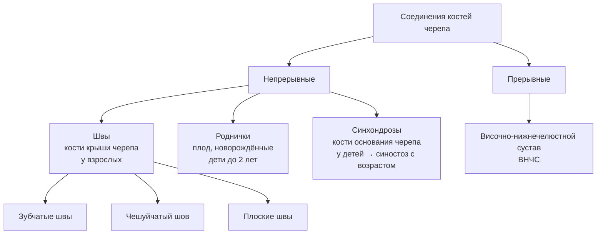
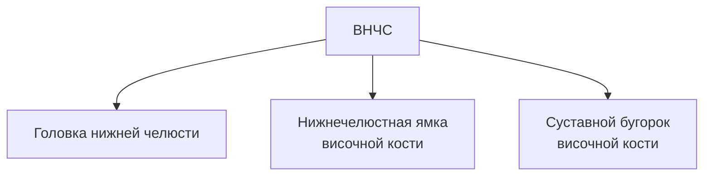

# 5.3 Соединения костей черепа

> [!abstract] Общее
> Кости черепа соединяются преимущественно **непрерывными** соединениями.
> **Единственное прерывное** соединение — **височно-нижнечелюстной сустав**.

---

## Общая схема

---

## 🔵 Непрерывные соединения

### Швы черепа

> [!info] Возраст
> У **взрослого** кости крыши черепа соединяются **швами**.
> У **плода, новорождённых и детей первых 2 лет** — также **роднички**.

| Вид шва | Где расположен | Какие кости |
|---|---|---|
| **Зубчатые** | Сагиттальный шов | Между **теменными** костями |
| | Венечный шов | Теменные ↔ **лобная** |
| | Ламбдовидный шов | Теменные ↔ **затылочная** |
| **Чешуйчатый** | — | Чешуя **височной** кости ↔ теменная кость + большое крыло клиновидной |
| **Плоские (гармонические)** | Лицевой череп | Кости лицевого черепа между собой |

> [!note] Названия швов
> Складываются из названий соединяющихся костей:
> лобно-скуловой, скуловерхнечелюстной и т.д.

---

### Синхондрозы основания черепа

> [!note]
> Характерны для **детей**. С возрастом хрящ замещается **костной тканью** → синостоз.

---

## 🔴 Височно-нижнечелюстной сустав (ВНЧС)

*articulatio temporomandibularis*

> [!info] Строение
> - Форма: **мыщелковый**
> - Функция: **комбинированный** (правый + левый функционируют вместе)
> - Суставные поверхности покрыты **волокнистым хрящом**

### Образован тремя структурами:

---

### Особенности строения

| Элемент | Описание |
|---|---|
| **Суставной диск** | Обеспечивает конгруэнтность суставных поверхностей; делит полость на **верхний и нижний этажи** (капсула по всей поверхности срослась с диском) |
| **Капсула** | Передний отдел — **более тонкий** |
| **Латеральная связка** | Укрепляет капсулу **снаружи** |

---

### Движения в ВНЧС

| Ось | Движение | Механизм |
|---|---|---|
| **Фронтальная** | Опускание нижней челюсти | Головка скользит вперёд; при максимальном открывании → выходит на **суставной бугорок** |
| **Фронтальная** | Поднимание нижней челюсти | Обратное движение |
| **Фронтальная** (смещение оси) | Выдвижение нижней челюсти **вперёд** и возврат | Мыщелковые отростки + диски скользят вперёд на бугорки **в обоих суставах** |
| **Вертикальная** | Вращение (жевательные движения) | В суставе со **стороны движения** — вращение в ямке; в **противоположном** — головка с диском выходит на бугорок |

> [!danger] Вывих нижней челюсти
> При **чрезмерном** опускании нижней челюсти головка перемещается **кпереди от суставного бугорка** → вывих.

---

## 📋 Сводная таблица соединений черепа

| Соединение | Вид | Где | Особенности |
|---|---|---|---|
| **Зубчатые швы** | Непрерывное (фиброзное) | Сагиттальный, венечный, ламбдовидный | Крыша черепа взрослых |
| **Чешуйчатый шов** | Непрерывное (фиброзное) | Височная ↔ теменная + клиновидная | — |
| **Плоские швы** | Непрерывное (фиброзное) | Лицевой череп | Гармонические |
| **Роднички** | Непрерывное (фиброзное) | Крыша черепа | Плод, новорождённые, дети до 2 лет |
| **Синхондрозы** | Непрерывное (хрящевое) | Основание черепа | У детей → синостоз с возрастом |
| **ВНЧС** | Прерывное (сустав) | Головка н/ч ↔ ямка и бугорок височной | Мыщелковый, комбинированный, диск, 2 этажа |
