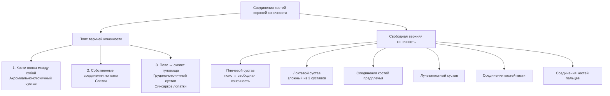
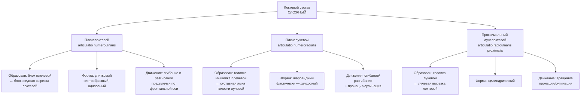
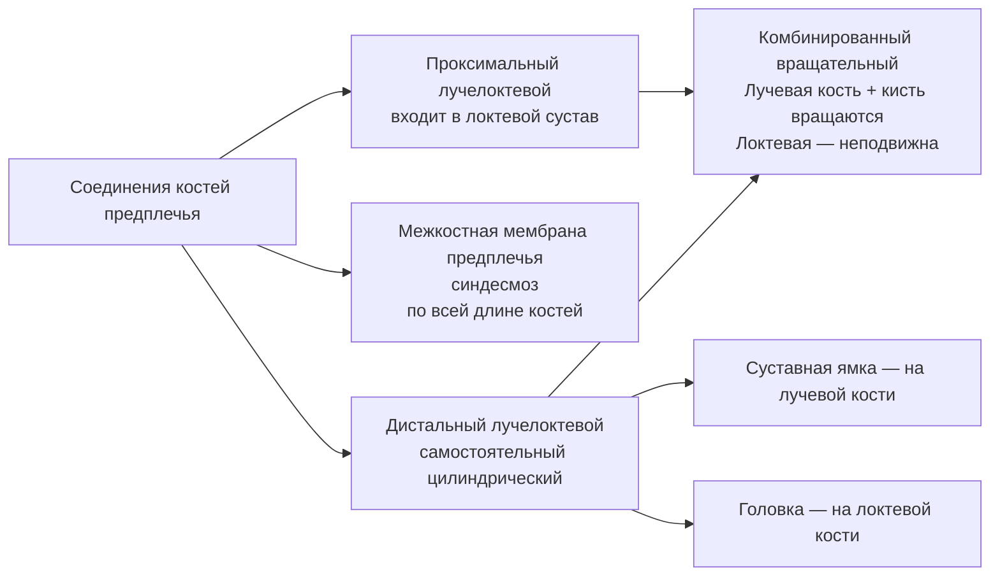

# 5.4 Соединения костей верхней конечности

> [!abstract] Общая структура
> Соединения делятся на две группы:
> 1. **Соединения костей пояса** верхней конечности
> 2. **Соединения свободной** верхней конечности

---

## Общая схема

---

## 🔵 Соединения костей пояса верхней конечности

### 1. Кости пояса между собой

#### Акромиально-ключичный сустав — *articulatio acromioclavicularis*

| Характеристика | Описание |
|---|---|
| **Образован** | Акромион ↔ ключица |
| **Капсула** | Тугая; укреплена акромиально-ключичной связкой |
| **Дополнительная фиксация** | Клювовидно-ключичная связка |
| **Подвижность** | Практически **неподвижен** |

---

### 2. Собственные соединения лопатки (связки)

| Связка | Расположение | Функция |
|---|---|---|
| **Клювовидно-акромиальная** | От вершины акромиона → к клювовидному отростку | Образует **«свод плечевого сустава»**: защита сверху + ограничение движений плечевой кости |
| **Верхняя поперечная связка лопатки** | Натянута над вырезкой лопатки | Фиксация |

---

### 3. Пояс ↔ скелет туловища

#### Грудино-ключичный сустав — *articulatio sternoclavicularis*

| Характеристика | Описание |
|---|---|
| **Образован** | Грудинный конец ключицы ↔ ключичная вырезка рукоятки грудины |
| **Хрящ** | **Волокнистый** |
| **Форма** | **Седловидная** |
| **Вспомогательный элемент** | **Внутрисуставной диск** |

**Движения:**

| Ось | Движение |
|---|---|
| Сагиттальная | Ключица **вверх и вниз** |
| Вертикальная | Ключица **вперёд и назад** |
| Переход с оси на ось | **Круговое** движение |

**Связки капсулы:** передняя и задняя грудино-ключичные + межключичная + рёберно-ключичная

> [!note] Синсаркоз лопатки
> Лопатка соединяется с грудной клеткой **при помощи мышц** — особый вид соединения, называемый **синсаркозом**.

---

## 🔴 Соединения свободной верхней конечности

### Плечевой сустав — *articulatio humeri*

| Характеристика | Описание |
|---|---|
| **Образован** | Головка плечевой кости ↔ суставная впадина лопатки |
| **Вспомогательный элемент** | **Суставная губа** (дополняет суставную впадину) |
| **Форма** | **Шаровидный** |
| **Осность** | **Многоосный** |
| **Подвижность** | Самый подвижный из всех прерывных соединений |

**Прикрепление капсулы:**
- На лопатке — по краю суставной губы
- На плечевой кости — вдоль анатомической шейки (**оба бугорка вне полости сустава**)

**Связки:**

| Связка | Расположение |
|---|---|
| **Клювовидно-плечевая** | От клювовидного отростка → вплетается в капсулу сверху и сзади |
| **Суставно-плечевые** | В толще суставной капсулы |

**Движения:**

| Ось | Движение |
|---|---|
| Фронтальная | Сгибание и разгибание |
| Сагиттальная | Отведение и приведение |
| Вертикальная | Вращение внутрь и наружу |
| Переход с оси на ось | Круговое движение |

> [!note] Через полость плечевого сустава проходит сухожилие **длинной головки двуглавой мышцы плеча**.

---

### Локтевой сустав — *articulatio cubiti*

> [!info] Сложный сустав
> Образован тремя костями (плечевая, локтевая, лучевая) → три простых сустава в **одной капсуле** и **одной полости**.

**Связки локтевого сустава:**

| Связка | Расположение |
|---|---|
| **Лучевая коллатеральная** | Боковой отдел капсулы |
| **Локтевая коллатеральная** | Боковой отдел капсулы |
| **Кольцевая связка лучевой кости** | Охватывает головку лучевой кости |

> [!tip] Клиническое значение
> Ось блока плечевой кости проходит **косо** к длиннику плеча → при сгибании дистальный отдел предплечья отклоняется **медиально** → кисть ложится на грудь. Это функционально выгодное положение → **необходимо воспроизводить при иммобилизации** переломов верхней конечности.

---

### Соединения костей предплечья

> [!note] Межкостная мембрана предплечья
> Соединяет обе кости предплечья, **не препятствуя** движениям в лучелоктевых суставах. Также препятствует боковым движениям в плечелучевом суставе.

---

### Лучезапястный сустав — *articulatio radiocarpalis*

| Характеристика | Описание |
|---|---|
| **Образован** | Запястная поверхность лучевой кости + **треугольный диск** (с медиальной стороны) ↔ проксимальный ряд костей запястья **кроме гороховидной** |
| **Форма** | **Эллипсовидный** |
| **Роль диска** | Отделяет головку локтевой кости от костей запястья → **локтевая кость не участвует** в образовании сустава |

**Движения:**

| Ось | Движение |
|---|---|
| Фронтальная | Сгибание и разгибание |
| Сагиттальная | Отведение и приведение |
| Переход с оси на ось | Круговое (коническое) движение |

**Связки:** лучевая и локтевая коллатеральные + ладонная и тыльная лучезапястные

---

### Соединения костей кисти

> [!info] Сустав кисти
> Лучезапястный + среднезапястный суставы функционально составляют **единый комбинированный сустав кисти** (*articulatio manus*). Проксимальный ряд костей запястья играет роль **костного диска**.

| Сустав | Образован | Форма | Подвижность |
|---|---|---|---|
| **Среднезапястный** | Проксимальный ряд (без гороховидной) ↔ дистальный ряд | S-образная суставная щель | **Малоподвижный** |
| **Межзапястные** | Обращённые поверхности костей одного ряда | Плоские | Практически **неподвижны** (межкостные связки) |
| **Запястно-пястные II–V** | Дистальный ряд запястья ↔ основания II–V пястных | Плоские | **Малоподвижные** |
| **Запястно-пястный I пальца** | Кость-трапеция ↔ I пястная кость | **Седловидный** | **Двухосный**, подвижный |

> [!note] Твёрдая основа кисти
> Все четыре кости дистального ряда запястья + II–V пястные кости прочно соединены → **механически жёсткая основа кисти**.

**Движения в запястно-пястном суставе I пальца:**

| Ось | Движение |
|---|---|
| Фронтальная | Сгибание (→ **противопоставление** остальным пальцам) и разгибание |
| Сагиттальная | Отведение и приведение к указательному пальцу |
| Переход с оси на ось | Круговое движение |

---

### Соединения костей пальцев

#### Пястно-фаланговые суставы — *articulationes metacarpophalangeae*

| Характеристика | II–V пальцы | I палец |
|---|---|---|
| **Образован** | Головки пястных костей ↔ ямки оснований проксимальных фаланг | То же |
| **Форма** | **Шаровидный** | **Блоковидный** |
| **Сесамовидные кости** | — | 2 (латеральная + медиальная) в ладонной части капсулы |

**Связки:** коллатеральные (с боков) + ладонные (спереди, более прочные) + **глубокая поперечная пястная** (соединяет головки II–V, препятствует расхождению)

**Движения (II–IV):**

| Ось | Движение |
|---|---|
| Фронтальная | Сгибание и разгибание |
| Сагиттальная | Отведение пальцев |
| Переход | Круговое движение |

> [!warning] Вращение в пястно-фаланговых суставах **не реализуется** — отсутствуют мышцы-вращатели.

**Движения (I палец):** только сгибание и разгибание вокруг фронтальной оси.

---

#### Межфаланговые суставы — *articulationes interphalangeae*

| Характеристика | Описание |
|---|---|
| **Расположение** | Проксимальная ↔ средняя; средняя ↔ дистальная фаланги II–V; проксимальная ↔ дистальная I пальца |
| **Форма** | **Блоковидный** |
| **Связки** | Ладонная + коллатеральные (исключают боковые движения) |
| **Движения** | Только **сгибание и разгибание** вокруг фронтальной оси |

---

## 📋 Сводная таблица суставов верхней конечности

| Сустав | Форма | Осность | Основные движения |
|---|---|---|---|
| **Акромиально-ключичный** | — | — | Практически неподвижен |
| **Грудино-ключичный** | Седловидный | Двухосный | Вверх/вниз, вперёд/назад, круговое |
| **Плечевой** | Шаровидный | Многоосный | Сгибание/разгибание, отведение/приведение, вращение, круговое |
| **Плечелоктевой** | Улитковый | Одноосный | Сгибание/разгибание |
| **Плечелучевой** | Шаровидный (факт. двухосный) | — | Сгибание/разгибание + пронация/супинация |
| **Лучелоктевые (оба)** | Цилиндрический | Одноосный | Пронация/супинация (комбинированные) |
| **Лучезапястный** | Эллипсовидный | Двухосный | Сгибание/разгибание, отведение/приведение, круговое |
| **Среднезапястный** | S-образный | — | Малоподвижный |
| **Запястно-пястный I** | Седловидный | Двухосный | Сгибание/разгибание (противопоставление), отведение/приведение, круговое |
| **Запястно-пястные II–V** | Плоский | — | Малоподвижные |
| **Пястно-фаланговые II–V** | Шаровидный | Двухосный | Сгибание/разгибание, отведение, круговое |
| **Пястно-фаланговый I** | Блоковидный | Одноосный | Сгибание/разгибание |
| **Межфаланговые** | Блоковидный | Одноосный | Сгибание/разгибание |
