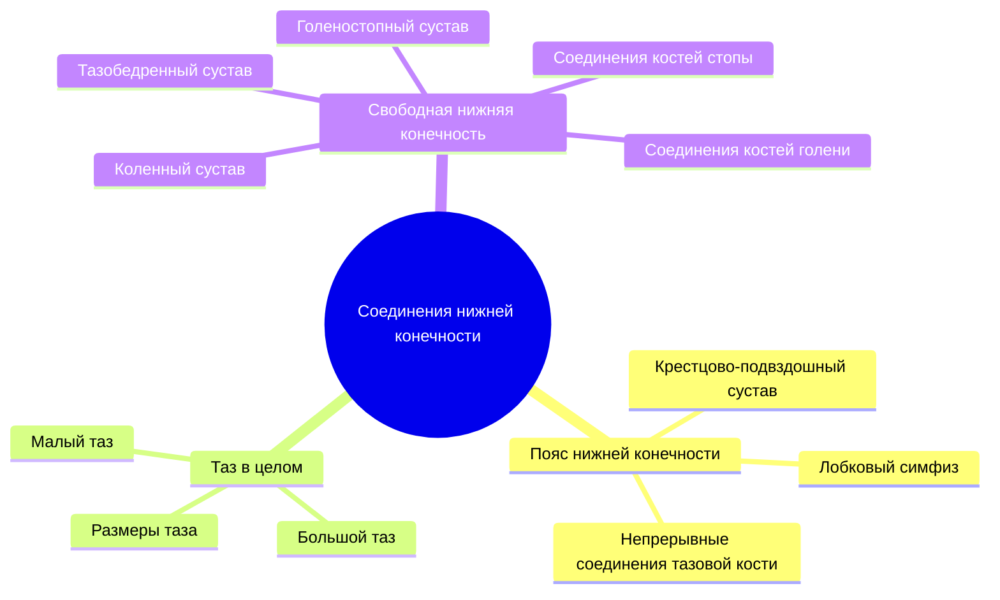
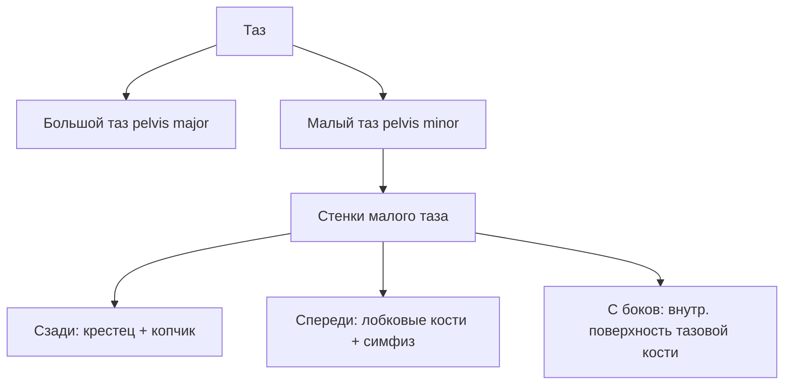
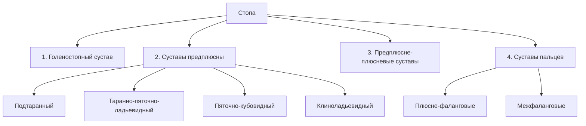

# 🦵 5.5 Соединения костей нижней конечности

---

## Общая схема

---

## Соединения костей пояса нижней конечности

### 🔵 Крестцово-подвздошный сустав (articulatio sacroiliaca)

| Параметр | Характеристика |
|----------|---------------|
| **Суставные поверхности** | Ушковидные поверхности крестца и подвздошной кости |
| **Покрытие хрящом** | Волокнистый хрящ |
| **Форма** | Плоский |
| **Укрепление** | Мощные крестцово-подвздошные связки |
| **Движения** | ==Отсутствуют== |

---

### 🔵 Лобковый симфиз (symphysis pubica)

> [!important] Полусустав
> Расположен в срединной плоскости; внутри хряща — щелевидная полость (развивается на 1–2-м году жизни)

**Укреплён двумя связками:**
- **Сверху** → верхняя лобковая связка
- **Снизу** → нижняя лобковая связка

> [!note] Движения возможны только у женщин во время родов

---

### 🔵 Непрерывные соединения тазовой кости

| Связка | Что соединяет |
|--------|--------------|
| **Подвздошно-поясничная** | Поперечные отростки 2 нижних поясничных позвонков → гребень подвздошной кости |
| **Крестцово-бугорная** | Седалищный бугор → латеральный край крестца и копчика |
| **Крестцово-остистая** | Седалищная ость → латеральный край крестца |
| **Запирательная мембрана** | Закрывает запирательное отверстие (кроме небольшого канала у борозды) |

---

## Таз в целом (pelvis)

> [!tip] Функция
> Соединение туловища со свободным отделом нижних конечностей

**Пограничная линия** (отделяет большой таз от малого): от мыса → по дугообразной линии → по лобковому гребню → к лобковому бугорку → по верхнему краю симфиза

**Седалищные отверстия на боковой стенке:**

| Отверстие | Ограничено |
|-----------|-----------|
| **Большое седалищное** | Крестцово-остистая связка + большая седалищная вырезка |
| **Малое седалищное** | Крестцово-остистая + крестцово-бугорная связки + малая седалищная вырезка |

> [!note] Через оба отверстия из полости таза в ягодичную область проходят сосуды и нервы

---

### Половые отличия таза

| Признак | Женщина | Мужчина |
|---------|---------|---------|
| Таз | Ниже и шире | Выше и уже |
| Вход в таз | Округлый / эллипс | «Карточное сердце» |
| Мыс | Меньше выступает | Больше выступает |
| Симфиз | Шире и короче | Уже и длиннее |
| Полость малого таза | Обширнее | Более узкая |
| Крестец | Шире и короче | Уже и длиннее |
| **Подлобковый угол** | ==90–100°== | ==70–75°== |
| Угол наклона таза | ==55–60°== | ==50–55°== |

---

### Размеры малого таза (акушерство)

> [!important] Конъюгата — срединный переднезадний размер малого таза

**Конъюгаты входа:**

| Название | Расстояние | Размер |
|----------|-----------|--------|
| **Анатомическая конъюгата** | Мыс → верхний край симфиза | ==11,5 см== |
| **Истинная (гинекологическая) конъюгата** | Мыс → наиболее выступающая кзади точка симфиза | ==10,5–11,0 см== |
| **Диагональная конъюгата** | Мыс → нижний край симфиза (измеряется при влагалищном исследовании) | ==12,5–13,0 см== |

> [!tip] Формула
> Истинная конъюгата = Диагональная конъюгата − **2 см**

**Поперечные и косые размеры входа:**

| Размер | Расстояние | Величина |
|--------|-----------|---------|
| Поперечный диаметр входа | Между наиболее отстоящими точками пограничной линии | ==13,5 см== |
| Косой диаметр входа | Крестцово-подвздошное сочленение → подвздошно-лобковое возвышение | ==13,0 см== |

**Выход малого таза:**

| Размер | Расстояние | Величина |
|--------|-----------|---------|
| **Конъюгата выхода** | Верхушка копчика → нижний край симфиза | ==9 см== (в родах +2–2,5 см) |
| Поперечный размер выхода | Между внутренними поверхностями седалищных бугров | ==11 см== |

**Размеры большого таза:**

| Параметр | Обозначение | Величина |
|----------|------------|---------|
| Между передними верхними остями подвздошных костей | distantia interspinosa | ==25–27 см== |
| Между наиболее удалёнными точками гребней | distantia intercristalis | ==27–29 см== |
| Между большими вертелами бедренных костей | distantia intertrochanterica | ==31–32 см== |
| Наружная конъюгата (симфиз → ост. отросток V поясн. позв.) | — | ==20 см== |

> [!note] Проводная ось таза — кривая, соединяющая середины всех конъюгат; идёт параллельно передней поверхности крестца → путь головки плода в родах

---

## Соединения свободной нижней конечности

### 🟠 Тазобедренный сустав (articulatio coxae)

| Параметр | Характеристика |
|----------|---------------|
| **Суставные поверхности** | Вертлужная впадина тазовой кости + головка бедренной кости |
| **Форма** | Шаровидный (ореховидный / чашеобразный) |
| **Капсула** | По краю вертлужной губы → по медиальному краю шейки бедра |

> [!important] Большая часть шейки бедра лежит **вне** полости сустава → перелом латеральной части = внесуставной (лучший прогноз)

**Связки:**

| Связка | Расположение / функция |
|--------|----------------------|
| **Круговая зона** | В толще капсулы; охватывает шейку бедра посередине |
| **Подвздошно-бедренная** | Продольная, в капсуле |
| **Лобково-бедренная** | Продольная, в капсуле |
| **Седалищно-бедренная** | Продольная, в капсуле |

**Вспомогательные элементы:**
- ==Вертлужная губа== — дополняет полулунную суставную поверхность
- ==Поперечная связка вертлужной впадины== — над вырезкой впадины
- ==Связка головки бедра== — содержит кровеносные сосуды, питающие головку

**Движения:**

| Ось | Движение |
|-----|---------|
| Фронтальная | Сгибание и разгибание |
| Сагиттальная | Отведение и приведение |
| Вертикальная | Вращение |
| Фронтальная + сагиттальная | Круговое движение |

---

### 🟠 Коленный сустав (articulatio genus)

> [!important] Наиболее крупный сустав тела человека

**3 кости:** бедренная + большеберцовая + надколенник

**Суставные поверхности:** латеральный и медиальный мыщелки бедра + верхняя суставная поверхность большеберцовой кости + поверхность надколенника

**Форма:** ==мыщелковый==

**Укрепляющие связки капсулы:**

| Связка | Расположение |
|--------|-------------|
| Малоберцовая коллатеральная | Латеральная сторона |
| Большеберцовая коллатеральная | Медиальная сторона |
| Связка надколенника | Сухожилие четырёхглавой мышцы ниже надколенника |

**Вспомогательные элементы:**

| Элемент | Характеристика |
|---------|---------------|
| **Медиальный мениск** | Узкий, полулунной формы |
| **Латеральный мениск** | Более широкий, овальный |
| **Поперечная связка колена** | Соединяет мениски между собой |
| ==Передняя крестообразная связка== | Прочно соединяет бедро и большеберцовую кость (крест X) |
| ==Задняя крестообразная связка== | То же |
| Крыловидные складки | Жировая клетчатка; ниже надколенника с обеих сторон |
| Поднадколенниковая синовиальная складка | От верхушки надколенника → передний отдел большеберцовой кости |

> [!tip] Роль менисков
> Частично устраняют неконгруэнтность суставных поверхностей и выполняют **амортизационную** роль

**Синовиальные сумки:**
1. ==Наднадколенниковая== — между бедром и сухожилием четырёхглавой мышцы; **сообщается** с полостью сустава
2. Глубокая поднадколенниковая — между связкой надколенника и большеберцовой костью
3. Подкожная и подсухожильная преднадколенниковые — в клетчатке на передней поверхности
4. Мышечные сумки у места прикрепления мышц

**Движения:**

| Ось | Движение | Условие |
|-----|---------|---------|
| Фронтальная | Сгибание и разгибание | Всегда |
| Вертикальная | Вращение голени (небольшой объём) | Только в согнутом положении |

---

### 🟠 Соединения костей голени

| Соединение | Вид | Кости | Характеристика |
|-----------|-----|-------|---------------|
| **Межберцовый сустав** (articulatio tibiofibularis) | Прерывное (проксимально) | Проксимальные концы | Плоский, малоподвижный |
| **Межберцовый синдесмоз** | Непрерывное (дистально) | Малоберцовая вырезка б/б-кости + лат. лодыжка | Короткие связки |
| **Межкостная мембрана** | Непрерывное | Обе кости голени на всём протяжении | Прочная фиброзная пластинка |

---

### 🟠 Голеностопный (надтаранный) сустав (articulatio talocruralis)

| Параметр | Характеристика |
|----------|---------------|
| **Кости** | Обе кости голени + таранная кость |
| **Форма** | ==Блоковидный== |
| **Блок таранной кости** | С боков охвачен латеральной и медиальной лодыжками |

**Связки:**

| Сторона | Связка |
|---------|--------|
| **Медиальная** | Медиальная (дельтовидная) связка |
| **Латеральная** | Передняя таранно-малоберцовая + задняя таранно-малоберцовая + пяточно-малоберцовая |

**Движения:** вокруг фронтальной оси — подошвенное сгибание и тыльное сгибание (разгибание)

> [!note] При максимальном подошвенном сгибании (блок сзади уже) → возможны небольшие боковые качательные движения

---

## Соединения костей стопы

### Суставы предплюсны

| Сустав | Кости | Форма | Движения |
|--------|-------|-------|---------|
| **Подтаранный** | Таранная + пяточная | Цилиндрический | Незначительные вокруг сагиттальной оси |
| **Таранно-пяточно-ладьевидный** | Одноимённые кости | Шаровидный | Комбинированные с голеностопным |
| **Пяточно-кубовидный** | Пяточная + кубовидная | Седловидный | Малоподвижен |
| **Клиноладьевидный** | Ладьевидная + клиновидные | — | Практически неподвижен |

> [!important] Функциональное единство
> Голеностопный + подтаранный + таранно-пяточно-ладьевидный суставы функционируют **совместно** → единый сустав стопы; ==таранная кость== играет роль **костного диска**

> [!tip] Хирургия
> **Шопаров сустав** = пяточно-кубовидный + таранно-ладьевидный → линия вычленения стопы при тяжёлых повреждениях

---

### Предплюсне-плюсневые суставы (articulationes tarsometatarsales)

Три плоских сустава:

| Сустав | Кости |
|--------|-------|
| 1-й | Медиальная клиновидная ↔ I плюсневая |
| 2-й | Промежуточная + латеральная клиновидные ↔ II + III плюсневые |
| 3-й | Кубовидная ↔ IV + V плюсневые |

> [!tip] **Сустав Лисфранка** = все три сустава вместе → вычленение дистальной части стопы

---

### Плюсне-фаланговые суставы (articulationes metatarsophalangeae)

| Параметр | Характеристика |
|----------|---------------|
| **Образованы** | Головки плюсневых костей + ямки оснований проксимальных фаланг |
| **Укрепление** | Коллатеральные, подошвенные связки; глубокая поперечная плюсневая связка |
| **I сустав** | Содержит 2 сесамовидные косточки → функционирует как ==блоковидный== |
| **II–V суставы** | Функционируют как ==эллипсовидные== |

**Движения в II–V суставах:** сгибание/разгибание (фронтальная ось) + отведение/приведение (сагиттальная ось) + небольшое круговое движение

> [!note] **Глубокая поперечная плюсневая связка** (I–V плюсневые кости) → ключевая роль в формировании **поперечного плюсневого свода**

---

### Межфаланговые суставы (articulationes interphalangeae)

| Параметр | Характеристика |
|----------|---------------|
| **Форма** | Блоковидные |
| **Укрепление** | Коллатеральные и подошвенные связки |
| **Положение в покое** | Проксимальные фаланги — тыльное сгибание; средние — подошвенное сгибание |

---

## Своды стопы и их фиксация

| Свод | Количество | Фиксатор |
|------|-----------|---------|
| **Продольные** | 5 | ==Длинная подошвенная связка== (пяточный бугор → основания плюсневых костей) |
| **Поперечные** | 2 | ==Глубокая поперечная плюсневая связка== |

> [!important] Связки — «пассивные» фиксаторы сводов стопы
