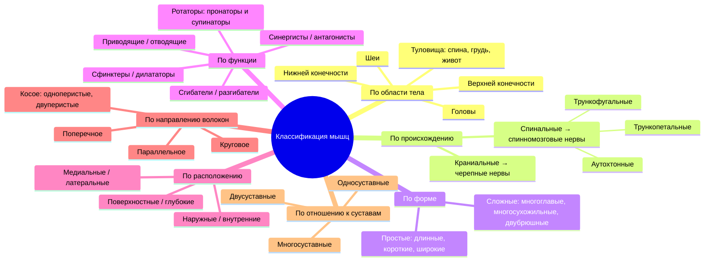
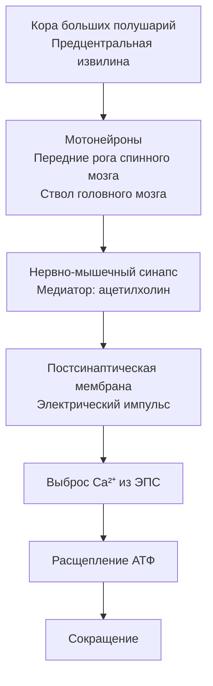

# 💪 6.1 Общая миология

---

## Что такое миология?

> [!important] Определение
> **Миология** — наука о развитии, строении и функции скелетных мышц

**Практическое значение:** массаж, внутримышечные и внутривенные инъекции, наложение электродов при диагностических и физиотерапевтических процедурах

---

## Общие сведения о скелетных мышцах

| Параметр | Данные |
|----------|--------|
| Тип ткани | Поперечнополосатая скелетная мышечная ткань |
| Характер сокращения | ==Произвольный== (сознательный) |
| Всего мышц | **639** (317 парных + 5 непарных) |
| Масса у мужчин | ~40% общей массы тела |
| Масса у женщин | ~35% общей массы тела |
| Масса у новорождённых | ≤20% |
| Масса у тяжелоатлетов | ==50–60%== |
| Масса у пожилых | 25–30% |

> [!note] При постоянной физической нагрузке относительная масса мышц **увеличивается**

---

## Скелетная мышца как орган

> [!tip] Определение
> Орган с характерной формой и строением, типичной архитектоникой сосудов и нервов, построенный из поперечнополосатой мышечной ткани, покрытый собственной **фасцией**, обладающий способностью к сокращению

---

## Классификация мышц



### Функциональные группы — подробнее

| Группа | Определение | Пример |
|--------|------------|--------|
| **Синергисты** | Выполняют одинаковую функцию, усиливают друг друга | Плечевая + двуглавая мышца плеча |
| **Антагонисты** | Выполняют противоположные функции | Двуглавая (сгибает локоть) ↔ Трёхглавая (разгибает локоть) |

---

## Строение мышцы

### Макроструктура

```
┌────────────────────────────────────────┐
│           СКЕЛЕТНАЯ МЫШЦА              │
│  ┌──────────────────────────────────┐  │
│  │  Начало        БРЮШКО     Конец  │  │
│  │  (сухожилие)  (головки)  (сухож.)│  │
│  └──────────────────────────────────┘  │
│  Широкое плоское сухожилие = АПОНЕВРОЗ │
└────────────────────────────────────────┘
```

### Микроструктура — иерархия пучков

| Уровень | Образование | Оболочка |
|---------|------------|---------|
| 1 | Мышечное волокно (сарколемма + ядра + ==миофибриллы==) | — |
| 2 | Первичный пучок (пучок 1-го порядка) | ==Эндомизий== |
| 3 | Пучок 2-го порядка (3–5 первичных пучков) | ==Перимизий== |
| 4 | Пучок 3-го порядка → мышца | ==Эпимизий== |

### Ультраструктура волокна

- **Миофибрилла** состоит из 1500–2000 **протофибрилл**
- Протофибриллы построены из белков:
  - ==Миозин== — толстые нити, **тёмные диски** (двойное лучепреломление)
  - ==Актин== — тонкие нити, **светлые диски**

> [!tip] Механизм сокращения
> Актиновые нити **втягиваются** в промежутки между миозиновыми → изменяют конфигурацию → сцепляются. Энергия → расщепление **АТФ** в митохондриях

**Функциональная единица мышцы — ==мион==** = совокупность мышечных волокон, иннервируемых одним двигательным нервным волокном

---

## Вспомогательный аппарат мышц

### Фасции

| Вид | Расположение / Особенности |
|-----|--------------------------|
| **Поверхностная** | За подкожной жировой клетчаткой; связана с кожей соединительнотканными тяжами |
| **Собственная** | Покрывает мышцы; образует футляры для отдельных мышц или групп |
| **Внутренняя** | Выстилает полости тела (внутришейная, внутригрудная, внутрибрюшная) |

**Типы футляров собственной фасции:**

| Тип | Стенки |
|-----|--------|
| Фиброзный | Со всех сторон — только фасция |
| Костно-фиброзный | С одной стороны — фасция, с другой — надкостница кости |

> [!important] Пирогов, 1840
> Фиброзные и костно-фиброзные футляры — **герметичные** вместилища → можно прогнозировать пути распространения крови и гноя при ранениях; используются для **футлярной анестезии по Вишневскому**

### Прочие структуры

| Структура | Функция / Особенности |
|-----------|----------------------|
| **Фиброзные и костно-фиброзные каналы** | Вместилища для сухожилий, сосудов и нервов (лучезапястный, голеностопный суставы, фаланги) |
| **Синовиальные влагалища** | Цилиндр с двойной стенкой вокруг сухожилия; париетальный и висцеральный листки + синовиальная жидкость (смазка); воспаление → ==тендовагинит== |
| **Синовиальные сумки** | Полости между фасциальными листками; уменьшают трение у сухожилий; воспаление + жидкость → ==бурсит== |
| **Сесамовидные кости** | Развиваются в толще сухожилий; чаще у пальцев; самая большая — ==надколенник== |

---

## Факторы, определяющие силу мышцы

> [!important] 5 факторов

1. ==Физиологический поперечник== — сумма площадей сечения всех волокон (≠ анатомическому поперечнику, который включает и сосуды, нервы, соединительную ткань)
2. Величина **площади опоры** на костях, хрящах или фасциях
3. Степень **нервного возбуждения**
4. **Адекватность кровоснабжения**
5. Состояние **кожи и подкожной жировой клетчатки**

---

## Работа и физиология мышц

### Сокращение

- При максимальном сокращении мышца укорачивается на ==50%== от первоначальной длины
- Мышцы прикрепляются **с двух сторон от сустава** и при сокращении вызывают в нём движение
- Координация: сгибатели сокращаются → разгибатели расслабляются (роль — нервная система)

### Нервная регуляция



### Режимы сокращения

| Режим | Частота импульсов | Характеристика |
|-------|-----------------|----------------|
| **Мышечный тонус** | 10–20 имп/с | Поддержание позы |
| **Тетанус** | ==40–50 имп/с== | Суммация одиночных сокращений |

### Типы мышечных волокон

| Параметр | Красные волокна | Белые волокна |
|----------|----------------|--------------|
| Диаметр | Тонкие | Крупные |
| Миофибриллы | Относительно тонкие | Крупные и сильные |
| Окислительные процессы | Высокая активность | Низкая активность |
| Устойчивость к утомлению | Высокая | Низкая |
| Тип сокращения | ==Тоническое== | ==Динамическое== |
| Пример мышц | Мышцы спины (поддержание позы) | Мышцы конечностей (быстрые движения) |

### Утомление

> [!note] Определение
> Временное понижение работоспособности в результате работы, исчезающее после отдыха

**Последовательность утомления:**
1. ==Центральная нервная система== (первой)
2. Нервно-мышечный синапс
3. Мышца (последней)

**Причины на уровне мышцы:**
- Накопление фосфорной и молочной кислот → снижение возбудимости мембраны
- Истощение гликогена → нарушение синтеза АТФ

> [!tip] Феномен Сеченова
> Временное восстановление работоспособности утомлённой руки достигается включением в работу мышц **другой руки или ног** → доказательство, что утомление развивается прежде всего в **нервных центрах**

**При тренировке:** ↑ работоспособность, ↑ толщина волокон, ↑ гликоген, ↑ использование кислорода, ↓ время восстановления

---

## Функции скелетных мышц

| Функция | Описание |
|---------|---------|
| ==Двигательная== (локомоторная и трудовая) | Преобразование химической энергии в механическую |
| ==Теплопродуцирующая== | Выделение тепла при сокращении («печка» по Павлову) |
| ==Познавательная== | Содержат **проприоцепторы** — определяют положение тела в пространстве, тонус, степень сокращения; особенно важны при утрате зрения или слуха |
| ==Насосная== (вспомогательная) | Кровоснабжение в работе возрастает в **20–30 раз**; «присасывающий эффект» → облегчение венозного и лимфатического оттока |
| ==Формообразующая== | Конфигурация тела зависит от расположения и развития мышц |
| ==Мимическая (экспрессивная)== | Мышцы, прикреплённые к коже, → выражение лица → психоэмоциональное состояние человека |
