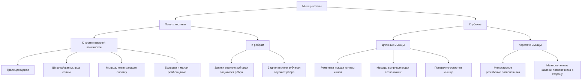
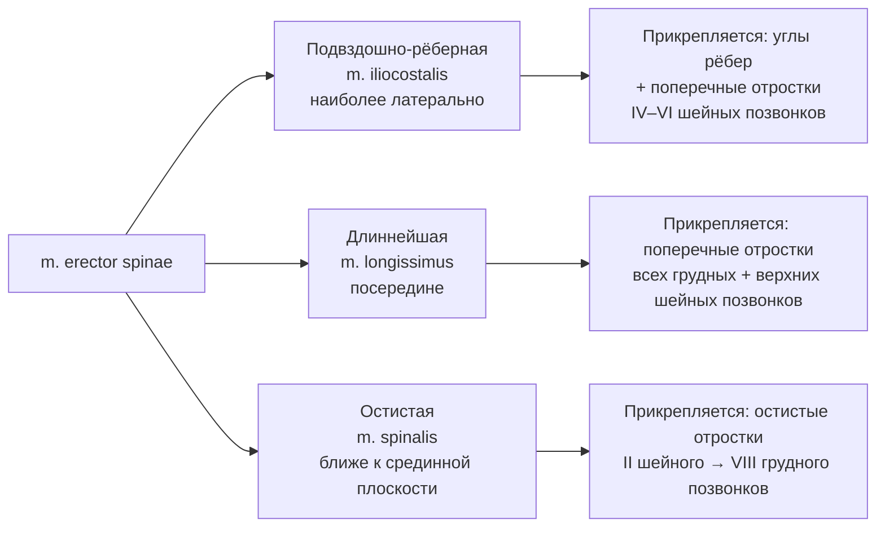

# 6.2 Мышцы, фасции и топография спины

> [!abstract] Границы области спины
> - **Сверху** — горизонтальная линия через наружный затылочный выступ
> - **Снизу** — подвздошные гребни, крестец и копчик
> - **Латерально** — задняя подмышечная линия (с обеих сторон)

---

## Классификация мышц спины

---

## 🔵 Поверхностные мышцы спины

### Мышцы, прикрепляющиеся к костям верхней конечности

| Мышца | Начало | Прикрепление | Функция |
|---|---|---|---|
| **Трапециевидная** (*m. trapezius*) | Наружный затылочный выступ, выйная связка, остистые отростки VII шейного + все грудные позвонки | Акромиальный конец ключицы, акромион, ость лопатки | Верхние пучки → **поднимают** лопатку; нижние → **опускают**; все вместе → **приближают** лопатку к позвоночнику; двустороннее → **запрокидывают** голову назад |
| **Широчайшая мышца спины** (*m. latissimus dorsi*) | Остистые отростки 6 нижних грудных + все поясничные позвонки; задняя треть подвздошного гребня; 4 нижних ребра | Гребень малого бугорка плечевой кости | **Опускает** поднятую руку; вращает плечо **внутрь**; при фиксированных руках — **приближает туловище** к ним |
| **Мышца, поднимающая лопатку** (*m. levator scapulae*) | Поперечные отростки 4 верхних шейных позвонков | Верхний угол лопатки | **Поднимает** лопатку |
| **Малая ромбовидная** (*m. rhomboideus minor*) | Остистые отростки VII шейного + I грудного позвонков | Медиальный край лопатки **выше** ости | **Приближают** лопатки к позвоночнику |
| **Большая ромбовидная** (*m. rhomboideus major*) | Остистые отростки II–IV грудных позвонков | Медиальный край лопатки **ниже** ости | То же |

> [!note] Ромбовидные мышцы
> Расположены **под трапециевидной** мышцей. Нередко **срастаются** и образуют единую мышцу.

---

### Мышцы, прикрепляющиеся к рёбрам

| Мышца | Расположение | Функция |
|---|---|---|
| **Задняя верхняя зубчатая** (*m. serratus posterior superior*) | Под ромбовидными мышцами | **Поднимает** рёбра |
| **Задняя нижняя зубчатая** (*m. serratus posterior inferior*) | Под широчайшей мышцей спины | **Опускает** рёбра |

---

## 🔴 Глубокие мышцы спины

### Длинные мышцы

#### Ременная мышца головы и шеи — *m. splenius capitis et cervicis*

| Характеристика | Описание |
|---|---|
| **Расположение** | Под поверхностными мышцами |
| **Начало** | Остистые отростки III–VII шейных + 6 верхних грудных позвонков |
| **Прикрепление (шеи)** | Поперечные отростки 2 верхних шейных позвонков |
| **Прикрепление (головы)** | Сосцевидный отросток височной кости |
| **Функция** | Одностороннее → поворот головы и позвоночника **в сторону сокращения**; двустороннее → **запрокидывание** головы назад |

---

#### Мышца, выпрямляющая позвоночник — *m. erector spinae*

> [!info] Расположение
> С **обеих сторон** от позвоночного столба. Начало: дорсальная поверхность крестца + остистые отростки поясничных позвонков + подвздошный гребень.

Состоит из **трёх частей** (рядом, латерально → медиально):

**Функция (общая):** разгибает позвоночник, запрокидывает голову назад, поворачивает в сторону сокращения.

---

#### Поперечно-остистая мышца — *m. transversospinalis*

> Расположена **кнутри** от мышцы, выпрямляющей позвоночник.
> **Начало:** поперечные отростки → вверх → **Прикрепление:** остистые отростки.

| Часть | Перебрасывается через | Функция |
|---|---|---|
| **Полуостистая** | 4–6 позвонков | Разгибание позвоночника |
| **Многораздельная** | 2–4 позвонка | Разгибание позвоночника |
| **Мышцы-вращатели** | Соседние позвонки | Вращение в **противоположную** сторону |

> [!tip] Функция поперечно-остистой
> - Разгибает позвоночник
> - При **одностороннем** сокращении — вращает в **сторону, противоположную** сокращению

---

### Короткие мышцы

| Мышца | Что соединяет | Функция |
|---|---|---|
| **Межостистые** (*mm. interspinales*) | Остистые отростки смежных позвонков | Участвуют в **разгибании** позвоночника |
| **Межпоперечные** (*mm. intertransversarii*) | Поперечные отростки соседних позвонков | Обеспечивают **наклоны** позвоночника в сторону |

---

## 🟢 Фасции спины

| Фасция | Описание |
|---|---|
| **Поверхностная** | Расположена за подкожной жировой клетчаткой; хорошо выражена |
| **Собственная (поверхностный листок)** | Покрывает поверхностные мышцы; развит **слабо** |
| **Собственная (глубокий листок)** | Покрывает глубокие мышцы; особенно развит в области мышцы, выпрямляющей позвоночник → называется **грудопоясничной фасцией** |

---

## 📋 Сводная таблица: функции мышц спины

| Движение | Мышцы |
|---|---|
| **Разгибание позвоночника** | Мышца, выпрямляющая позвоночник; поперечно-остистая; межостистые |
| **Наклоны в сторону** | Межпоперечные; мышца, выпрямляющая позвоночник (одностороннее) |
| **Вращение позвоночника** | Ременная (в сторону сокращения); поперечно-остистая (в противоположную) |
| **Поднятие лопатки** | Мышца, поднимающая лопатку; трапециевидная (верхние пучки) |
| **Опускание лопатки** | Трапециевидная (нижние пучки) |
| **Приближение лопатки к позвоночнику** | Ромбовидные; трапециевидная (все пучки) |
| **Запрокидывание головы назад** | Трапециевидная (двустороннее); ременная (двустороннее); мышца, выпрямляющая позвоночник |
| **Поднятие рёбер** | Задняя верхняя зубчатая |
| **Опускание рёбер** | Задняя нижняя зубчатая |
