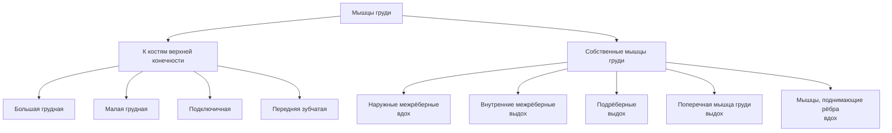
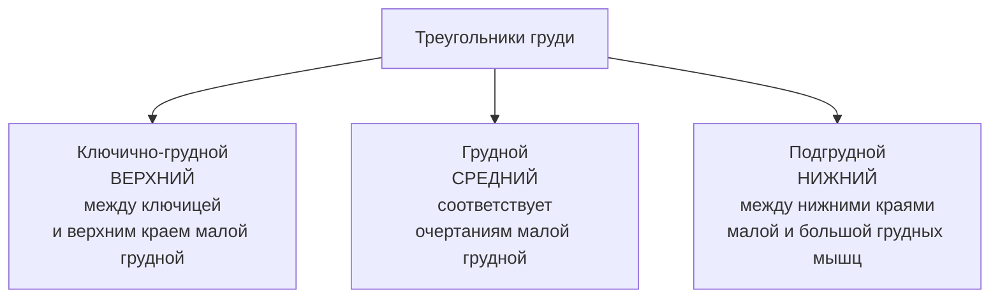

# 6.3 Мышцы, фасции и топография груди

> [!abstract] Границы области груди
> - **Сверху** — ключица + яремная вырезка рукоятки грудины
> - **Снизу** — горизонтальная линия через основание мечевидного отростка
> - **Латерально** — задняя подмышечная линия

---

## Вертикальные линии груди

> Используются для определения границ внутренних органов на наружной поверхности грудной клетки

| Линия | Латинское название | Расположение |
|---|---|---|
| **Передняя срединная** | *linea mediana anterior* | По середине грудины |
| **Грудинная** | *linea sternalis* | По краю грудины |
| **Окологрудинная** | *linea parasternalis* | Посередине между грудинной и среднеключичной |
| **Среднеключичная** | *linea medioclavicularis* | Через середину ключицы |
| **Передняя подмышечная** | *linea axillaris anterior* | По передней кожной складке подмышечной ямки |
| **Средняя подмышечная** | *linea axillaris media* | Из центра подмышечной ямки |
| **Задняя подмышечная** | *linea axillaris posterior* | По задней кожной складке подмышечной ямки |
| **Лопаточная** | *linea scapularis* | Через нижний угол лопатки |
| **Околопозвоночная** | *linea paravertebralis* | Параллельно позвоночнику через бугорки рёбер |
| **Задняя срединная** | *linea mediana posterior* | По остистым отросткам позвонков |

---

## Классификация мышц груди

---

## 🔵 Мышцы, прикрепляющиеся к костям верхней конечности

| Мышца | Начало | Прикрепление | Функция |
|---|---|---|---|
| **Большая грудная** (*m. pectoralis major*) | Ключичная часть → медиальная половина ключицы; грудинорёберная → грудина + хрящи 5 верхних рёбер; брюшная → передняя стенка влагалища прямой мышцы живота | Гребень большого бугорка плечевой кости | Приводит и вращает плечо **внутрь**; поднятую руку **опускает**, опущенную — тянет **вперёд и медиально**; при фиксированной руке — **поднимает рёбра** |
| **Малая грудная** (*m. pectoralis minor*) | III–V рёбра | Клювовидный отросток лопатки | **Опускает** плечевой пояс; при фиксированной лопатке — **поднимает рёбра** |
| **Подключичная** (*m. subclavius*) | Хрящ I ребра | Нижняя поверхность акромиального конца ключицы | Тянет ключицу **вниз и вперёд** |
| **Передняя зубчатая** (*m. serratus anterior*) | Зубцами от 8–9 верхних рёбер | Медиальный край лопатки + нижний угол лопатки | Тянет лопатку **вперёд и латерально**; вращает лопатку; при фиксированной лопатке — **поднимает рёбра** |

---

## 🔴 Собственные мышцы груди

| Мышца | Начало | Прикрепление | Направление пучков | Функция |
|---|---|---|---|---|
| **Наружные межрёберные** (*mm. intercostales externi*) | Нижний край ребра | Верхний край нижележащего ребра | Косо **вниз и вперёд** | **Поднимают** рёбра → **вдох** |
| **Внутренние межрёберные** (*mm. intercostales interni*) | Верхний край ребра | Нижний край вышележащего ребра | Косо **вверх и вперёд** | **Опускают** рёбра → **выдох** |
| **Подрёберные** (*mm. subcostales*) | Нижний отдел грудной клетки | Минуют 1–2 ребра | Как внутренние межрёберные | **Опускают** рёбра |
| **Поперечная мышца груди** (*m. transversus thoracis*) | Мечевидный отросток + нижняя часть тела грудины | II–VI рёбра | — | **Опускает** рёбра |
| **Мышцы, поднимающие рёбра** (*mm. levatores costarum*) | Поперечные отростки грудных позвонков | Углы рёбер | — | **Поднимают** рёбра → **вдох** |

> [!tip] Вдох vs Выдох
> - **Вдох:** наружные межрёберные + мышцы, поднимающие рёбра + (большая и малая грудные, передняя зубчатая — при фиксированной руке/лопатке)
> - **Выдох:** внутренние межрёберные + подрёберные + поперечная мышца груди

---

## 🟢 Фасции груди

| Фасция | Описание |
|---|---|
| **Поверхностная** | Под подкожной жировой клетчаткой; у женщин образует **футляр для молочной железы** (перегородки делят на дольки) |
| **Собственная (поверхностная пластинка)** | Формирует футляр для **большой грудной** мышцы |
| **Собственная (глубокая пластинка)** | Костно-фиброзный футляр для **подключичной** + фиброзный для **малой грудной**; между ними — особо плотная **ключично-грудная фасция**; по нижнему краю большой грудной → сливается с поверхностной → **подмышечная фасция** (покрывает переднюю зубчатую) |
| **Собственная (грудная пластинка)** | Покрывает наружную поверхность рёбер, грудины и наружных межрёберных мышц |
| **Внутригрудная** | Выстилает **внутреннюю** поверхность грудной клетки (грудную полость) |

---

## 🟡 Топография груди

### Треугольники груди

### Субпекторальные пространства

| Пространство | Расположение | Содержимое |
|---|---|---|
| **Поверхностное субпекторальное** | Между большой и малой грудными мышцами | Жировая и соединительнотканная клетчатка |
| **Глубокое субпекторальное** | Под малой грудной мышцей | Жировая и соединительнотканная клетчатка |

---

## 📋 Сводная таблица: функции мышц груди

| Движение / Функция | Мышцы |
|---|---|
| **Вдох** | Наружные межрёберные, мышцы поднимающие рёбра |
| **Выдох** | Внутренние межрёберные, подрёберные, поперечная мышца груди |
| **Приведение и вращение плеча внутрь** | Большая грудная |
| **Опускание плечевого пояса** | Малая грудная |
| **Тяга ключицы вниз и вперёд** | Подключичная |
| **Тяга лопатки вперёд и латерально** | Передняя зубчатая |
| **Вращение лопатки** | Передняя зубчатая |
