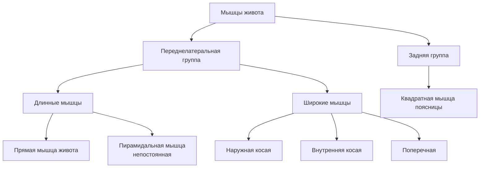
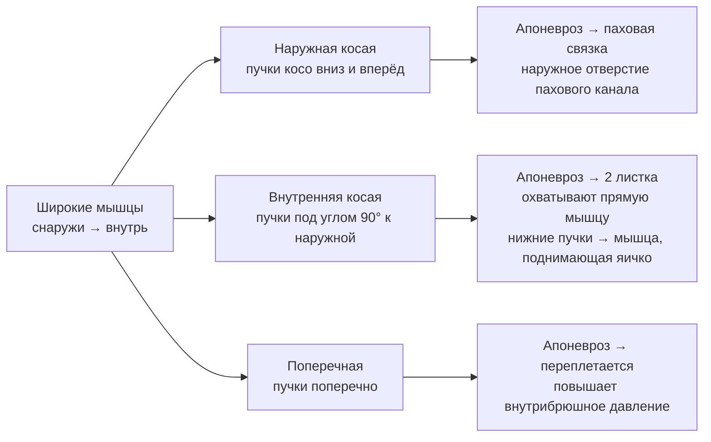
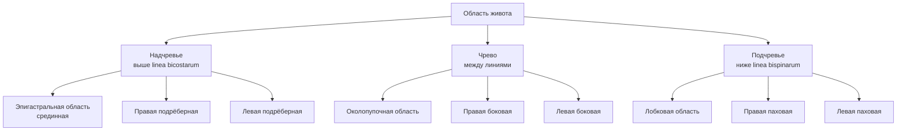

# 6.4 Мышцы, фасции и топография живота

> [!abstract] Границы области живота
> - **Сверху** — нижняя граница области груди
> - **Снизу** — подвздошный гребень + проекция паховой связки + верхний край лобкового симфиза
> - **Латерально** — задняя подмышечная линия

---

## Классификация мышц живота

---

## 🔵 Переднелатеральная группа

### Длинные мышцы

#### Прямая мышца живота — *m. rectus abdominis*

| Характеристика | Описание |
|---|---|
| **Расположение** | В собственном **влагалище** (образовано апоневрозами широких мышц) |
| **Начало** | V–VII рёбра + мечевидный отросток |
| **Прикрепление** | Верхний край лобкового симфиза |
| **Строение** | Разделена **3–4 сухожильными перемычками** на 4–5 сегментов; перемычки прочно срастаются с **передней стенкой** влагалища |
| **Функция** | Опускание рёбер и **сгибание туловища**; поднятие таза; участие в наклоне туловища |

#### Пирамидальная мышца — *m. pyramidalis*

> [!note] Непостоянная мышца
> Начало: верхняя ветвь лобковой кости → Прикрепление: нижний отдел **белой линии живота**
> **Функция:** напрягает белую линию живота

---

### Широкие мышцы

| Мышца | Начало | Прикрепление | Направление пучков | Функция |
|---|---|---|---|---|
| **Наружная косая** (*m. obliquus externus abdominis*) | 8 нижних рёбер | Апоневроз → срединная линия; задние пучки → подвздошный гребень | Косо **вниз и вперёд** | Двустороннее → сгибание позвоночника + опускание рёбер; одностороннее → поворот туловища **в ту же сторону** |
| **Внутренняя косая** (*m. obliquus internus abdominis*) | Подвздошный гребень + латеральная половина паховой связки | XII, XI, X рёбра; апоневроз → влагалище прямой мышцы | Косо **вверх**, под углом 90° к наружной | Двустороннее → сгибание позвоночника + опускание рёбер; одностороннее → поворот туловища **в ту же сторону** |
| **Поперечная** (*m. transversus abdominis*) | 6 нижних рёбер + подвздошный гребень + латеральная треть паховой связки | Апоневроз → белая линия | **Поперечно** | Повышение **внутрибрюшного давления** → нормальное положение органов |

> [!tip] Брюшной пресс
> Мышцы живота переднелатеральной группы образуют **брюшной пресс**:
> - Защитная и опорная функции для органов брюшной полости
> - Участие в мочеиспускании и дефекации

---

### Паховая (Пупартова) связка — *ligamentum inguinale*

> [!info]
> Утолщённый и загнутый в виде **желобка** нижний край апоневроза наружной косой мышцы живота.
> Простирается от **передней верхней ости подвздошной кости** → до **лобкового бугорка**.

В лобковой области апоневроз расходится на:
- **Латеральная ножка** → к лобковому бугорку → поднимается вверх → **загнутая связка**
- **Медиальная ножка** → к симфизу
- Между ножками — **межножковые волокна** собственной фасции

---

## 🔵 Задняя группа

#### Квадратная мышца поясницы — *m. quadratus lumborum*

| Характеристика | Описание |
|---|---|
| **Расположение** | Задняя стенка полости живота |
| **Начало** | Подвздошный гребень + поперечные отростки нижних поясничных позвонков |
| **Прикрепление** | XII ребро + поперечные отростки верхних поясничных позвонков |
| **Функция** | Удерживает позвоночник **в вертикальном положении**; одностороннее → наклон позвоночника **в сторону** |

---

## 🟢 Фасции живота

| Фасция | Описание |
|---|---|
| **Поверхностная** | Под подкожной жировой клетчаткой |
| **Собственная (поверхностная пластинка)** | Охватывает **наружную косую**; в паховой области → межножковые волокна → фасция мышцы, поднимающей яичко |
| **Собственная (средняя пластинка)** | Охватывает **внутреннюю косую** с обеих сторон |
| **Собственная (глубокая пластинка)** | Покрывает **поперечную** мышцу снаружи |
| **Внутрибрюшная** | Выстилает **изнутри** стенки живота; части имеют собственные названия ↓ |

**Части внутрибрюшной фасции:**

| Часть | Что покрывает |
|---|---|
| **Поперечная фасция** | Внутренняя поверхность поперечной мышцы живота |
| **Диафрагмальная фасция** | Нижняя поверхность диафрагмы |
| **Поясничная фасция** | Квадратная мышца поясницы |
| **Подвздошная фасция** | Подвздошная мышца |
| **Тазовая фасция** | Стенки малого таза |

---

## 🟡 Топография живота

### Деление на отделы

**Горизонтальные линии:**
- *Linea bicostarum* — соединяет передние концы **X рёбер**
- *Linea bispinarum* — соединяет **передние верхние ости** подвздошных костей

**Вертикальные линии:** по латеральным краям прямых мышц живота — **параректальные линии**

---

### Слабые места брюшной стенки

> [!danger] Места образования грыж
> В пределах «слабых мест» часто образуются **грыжи** — мешковидные выпячивания стенки, которые могут содержать внутренние органы.

| Слабое место | Расположение |
|---|---|
| **Паховый канал** | Над паховой связкой |
| **Пупочное кольцо** | В области пупка |
| **Белая линия** | Участок **выше пупка** |
| **Задняя стенка влагалища прямой мышцы** | **Ниже пупка** |

---

### Влагалище прямой мышцы живота

> *vagina m. recti abdominis* — прочный фиброзный футляр из апоневрозов широких мышц; имеет **переднюю и заднюю стенки**.

| Уровень | Передняя стенка | Задняя стенка |
|---|---|---|
| **Выше пупка** | Апоневроз наружной косой + передняя пластинка апоневроза внутренней косой | Задняя пластинка апоневроза внутренней косой + апоневроз поперечной + поперечная фасция + брюшина |
| **Ниже пупка** (на 2–5 см) | Апоневрозы **всех трёх** широких мышц, сросшихся между собой | Только поперечная фасция + брюшина |

---

### Белая линия живота — *linea alba*

> Образуется сращением и перекрёстом апоневрозов широких мышц **обеих сторон**.

| Параметр | Выше пупка | Ниже пупка |
|---|---|---|
| **Ширина** | 1–2 см | 3–4 мм |
| **Толщина** | Тоньше | Толще (увеличивается сверху вниз) |

---

### Паховый канал — *canalis inguinalis*

> [!info] Общее
> Щелевидное пространство над паховой связкой. Длина — **4–5 см**.
> У **мужчин** — семенной канатик; у **женщин** — круглая связка матки.

**Стенки пахового канала:**

| Стенка | Образована |
|---|---|
| **Передняя** | Апоневроз наружной косой мышцы живота |
| **Задняя** | Поперечная фасция + брюшина |
| **Верхняя** | Нижние пучки внутренней косой + поперечной мышц |
| **Нижняя** | Желоб паховой связки |

**Отверстия:**

| Отверстие | Описание | Границы |
|---|---|---|
| **Наружное (поверхностное паховое кольцо)** | Щель в апоневрозе наружной косой | Снизу — латеральная ножка; сверху — медиальная ножка; латерально — межножковые волокна; медиально — загнутая связка |
| **Глубокое паховое кольцо** | Со стороны брюшной полости — воронкообразное углубление | Закрыто брюшиной |

---

## 📋 Сводная таблица: функции мышц живота

| Движение / Функция | Мышцы |
|---|---|
| **Сгибание позвоночника** | Прямая, косые (двустороннее) |
| **Поворот туловища** | Наружная и внутренняя косые (одностороннее — в сторону сокращения) |
| **Поднятие таза** | Прямая мышца живота |
| **Повышение внутрибрюшного давления** | Поперечная мышца живота (брюшной пресс) |
| **Наклон позвоночника в сторону** | Квадратная мышца поясницы (одностороннее) |
| **Удержание позвоночника вертикально** | Квадратная мышца поясницы |
| **Натяжение белой линии** | Пирамидальная мышца |
