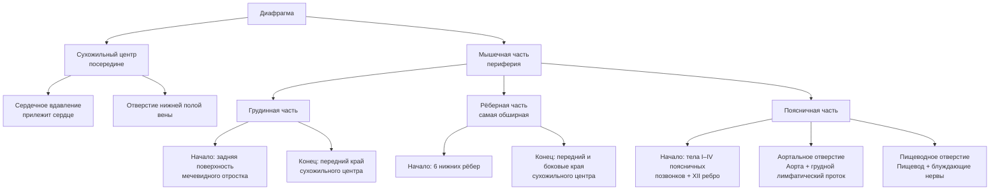

# 6.5 Диафрагма

> [!abstract] Общее
> **Диафрагма** (*diaphragma, m. phrenicus*) — непарная мышца, закрывающая **нижнюю апертуру грудной клетки**.
> Сверху и снизу покрыта фасциями (внутригрудной и внутрибрюшной) и серозными оболочками (плеврой и брюшиной).

---

## Общая схема строения

---

## 🔵 Отверстия диафрагмы

| Отверстие | Уровень | Что проходит | Особенности |
|---|---|---|---|
| **Нижней полой вены** | В сухожильном центре | Нижняя полая вена | В пределах сухожильного центра |
| **Аортальное** | Уровень **XII грудного** позвонка | Аорта + грудной лимфатический проток | Ограничено **сухожильными** пучками → размер при дыхании **не изменяется**, аорта не сдавливается |
| **Пищеводное** | Уровень **X грудного** позвонка | Пищевод + блуждающие нервы | Ограничено **мышечными** пучками → может перерастягиваться → одна из причин **грыж пищеводного отверстия** |

---

## 🔴 Слабые места диафрагмы

> [!danger] Диафрагмальные грыжи
> В слабых местах грудная и брюшная полости разобщены **только фасциями и серозными оболочками** → возможно образование **диафрагмальных грыж**.

| Треугольник | Где расположен | Образован |
|---|---|---|
| **Грудино-рёберный** | Парный | Между грудинной и рёберными частями |
| **Пояснично-рёберный** | Парный | Между поясничной и рёберной частями |

---

## 🟡 Купол диафрагмы

> [!info] Асимметрия купола
> Диафрагма образует **неравномерно изогнутый купол** (выпуклостью вверх):
> - **Правый** купол — достигает уровня хряща **V ребра**
> - **Левый** купол — достигает уровня хряща **VI ребра**

> [!note] Клиническое значение
> Печень и желудок расположены **под куполом диафрагмы** → полость живота превосходит границы области живота.
> Объём грудной клетки значительно **меньше**, чем кажется при наружном осмотре.

---

## 🟢 Функция диафрагмы

> **Диафрагма — главная дыхательная мышца.**

### Типы дыхания

| Тип | Кто преобладает | Механизм |
|---|---|---|
| **Брюшной** | Мужчины и дети | Обусловлен сокращением **диафрагмы** |
| **Грудной** | Женщины | Обусловлен расширением грудной клетки — сокращение **межрёберных, лестничных** и других мышц |

---

## 📋 Сводная таблица: части диафрагмы

| Часть | Начало | Конец | Особенности |
|---|---|---|---|
| **Грудинная** | Задняя поверхность мечевидного отростка | Передний край сухожильного центра | Наименьшая |
| **Рёберная** | 6 нижних рёбер | Передний и боковые края сухожильного центра | Самая **обширная** |
| **Поясничная** | Тела I–IV поясничных позвонков + XII ребро | Сухожильный центр | Содержит аортальное и пищеводное отверстия |
