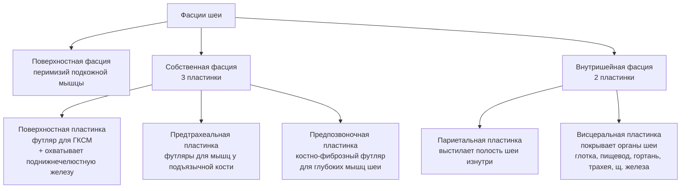
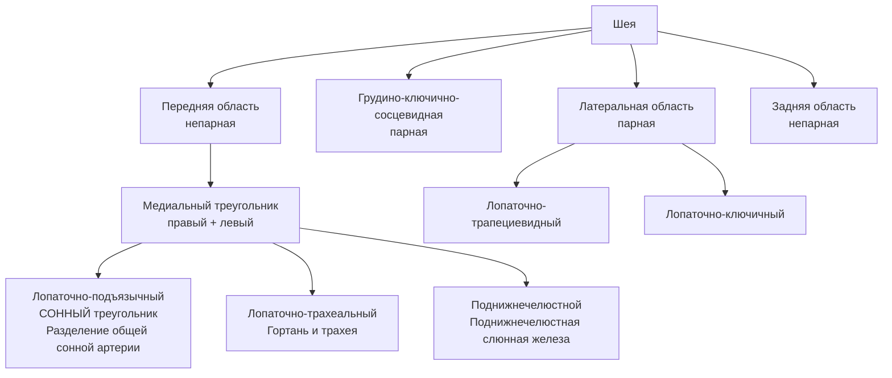

# 6.6 Мышцы, фасции и топография шеи

> [!abstract] Границы шеи
> - **Снизу** — яремная вырезка грудины + верхние поверхности ключиц
> - **Сверху** — нижняя челюсть

**Области шеи:** передняя · грудино-ключично-сосцевидная · латеральная · задняя

---

## Классификация мышц шеи

```mermaid
graph TD
    A[Мышцы шеи] --> B[Спереди от гортани\nи крупных сосудов]
    A --> C[Глубокие мышцы]
    A --> D[Подзатылочные мышцы]

    B --> B1[Поверхностные]
    B --> B2[К подъязычной кости\nниже неё]
    B --> B3[К подъязычной кости\nвыше неё]

    B1 --> b1a[Подкожная мышца шеи\nplatysma]
    B1 --> b1b[Грудино-ключично-сосцевидная]

    B2 --> b2a[Лопаточно-подъязычная]
    B2 --> b2b[Грудино-подъязычная]
    B2 --> b2c[Грудино-щитовидная]
    B2 --> b2d[Щитоподъязычная]

    B3 --> b3a[Двубрюшная]
    B3 --> b3b[Шилоподъязычная]
    B3 --> b3c[Челюстно-подъязычная]
    B3 --> b3d[Подбородочно-подъязычная]

    C --> C1[Латеральная группа\nЛестничные мышцы]
    C --> C2[Медиальная группа]

    C1 --> c1a[Передняя лестничная → I ребро]
    C1 --> c1b[Средняя лестничная → I ребро]
    C1 --> c1c[Задняя лестничная → II ребро]

    C2 --> c2a[Длинная мышца шеи]
    C2 --> c2b[Длинная мышца головы]
    C2 --> c2c[Передняя прямая мышца головы]
    C2 --> c2d[Латеральная прямая мышца головы]
```

---

## 🔵 Поверхностные мышцы

| Мышца | Начало | Прикрепление | Функция |
|---|---|---|---|
| **Подкожная мышца шеи** (*platysma*) | Собственная фасция груди | Край нижней челюсти + мимические мышцы | Оттягивает кожу шеи; облегчает **отток крови** по поверхностным венам |
| **Грудино-ключично-сосцевидная** (*m. sternocleidomastoideus*) | Медиальная головка → рукоятка грудины; латеральная → грудинный конец ключицы | Сосцевидный отросток височной кости | Одностороннее → наклоняет голову **в свою сторону** + поворачивает **в противоположную**; двустороннее → **кивательные** движения |

> [!note] Грудино-ключично-сосцевидный треугольник
> Образуется между **обеими головками** мышцы и ключицей.

---

## 🔵 Мышцы ниже подъязычной кости

> [!tip] Общая функция
> Все мышцы ниже подъязычной кости → **опускают подъязычную кость**

| Мышца | Начало | Прикрепление |
|---|---|---|
| **Лопаточно-подъязычная** (*m. omohyoideus*) | Нижнее брюшко → верхний край лопатки | Верхнее брюшко → нижний край тела подъязычной кости |
| **Грудино-подъязычная** (*m. sternohyoideus*) | Задняя поверхность рукоятки грудины | Нижний край тела подъязычной кости |
| **Грудино-щитовидная** (*m. sternothyroideus*) | Задняя поверхность рукоятки грудины (под грудино-подъязычной) | Косая линия щитовидного хряща гортани |
| **Щитоподъязычная** (*m. thyrohyoideus*) | Косая линия щитовидного хряща (продолжение грудино-щитовидной) | Большой рог подъязычной кости |

---

## 🔵 Мышцы выше подъязычной кости

| Мышца | Начало | Прикрепление | Функция |
|---|---|---|---|
| **Двубрюшная** (*m. digastricus*) | Переднее брюшко → подъязычная ямка нижней челюсти; заднее → сосцевидная вырезка височной кости | Сухожилие → тело подъязычной кости рядом с большим рогом | **Опускает** нижнюю челюсть; **поднимает** подъязычную кость |
| **Шилоподъязычная** (*m. stylohyoideus*) | Основание шиловидного отростка | Место соединения тела подъязычной кости с большим рогом | **Поднимает** подъязычную кость |
| **Челюстно-подъязычная** (*m. mylohyoideus*) | Одноимённая линия нижней челюсти (образует **дно ротовой полости**) | Задние пучки → тело подъязычной кости; средние → шов с мышцей другой стороны | **Поднимает** подъязычную кость; **опускает** нижнюю челюсть |
| **Подбородочно-подъязычная** (*m. geniohyoideus*) | Подбородочная ость | Передняя поверхность тела подъязычной кости | **Поднимает** подъязычную кость; **опускает** нижнюю челюсть |

---

## 🔴 Глубокие мышцы шеи

### Латеральная группа — лестничные мышцы

> Расположены по бокам от шейного отдела позвоночника.
> **Начало:** поперечные отростки шейных позвонков.

| Мышца | Прикрепление |
|---|---|
| **Передняя лестничная** (*m. scalenus anterior*) | I ребро |
| **Средняя лестничная** (*m. scalenus medius*) | I ребро |
| **Задняя лестничная** (*m. scalenus posterior*) | Наружная поверхность **II ребра** |

**Функция:** поднимают I и II рёбра; наклоняют и поворачивают шейный отдел позвоночника в сторону; двустороннее → наклоняют кпереди.

---

### Медиальная группа

| Мышца | Начало | Прикрепление | Функция |
|---|---|---|---|
| **Длинная мышца шеи** (*m. longus colli*) | Тела всех шейных + 3 верхних грудных позвонков | Соединяет их между собой | Наклоняет шею **вперёд и в сторону** |
| **Длинная мышца головы** (*m. longus capitis*) | Поперечные отростки III–VI шейных позвонков | Базилярная часть затылочной кости | Вращает голову; двустороннее → наклоняет **кпереди** |
| **Передняя прямая мышца головы** (*m. rectus capitis anterior*) | Передняя дуга атланта | Базилярная часть затылочной кости | Наклоняет голову **вперёд** |
| **Латеральная прямая мышца головы** (*m. rectus capitis lateralis*) | Поперечный отросток атланта | Латеральная часть затылочной кости | Наклоняет голову **в сторону** |

---

## 🔴 Подзатылочные мышцы

> [!info]
> Группа из **4 мышц** (2 прямые + 2 косые). Действуют на атлантозатылочные и атлантоосевые суставы.
> **Функция:** наклон головы **назад** + поворот **в сторону**.

---

## 🟢 Фасции шеи

---

## 🟡 Топография шеи

### Треугольники шеи

### Границы медиального треугольника

| Треугольник | Границы | Содержимое |
|---|---|---|
| **Лопаточно-подъязычный (сонный)** | Передний край ГКСМ + верхнее брюшко лопаточно-подъязычной + заднее брюшко двубрюшной | Разделение **общей сонной артерии** на наружную и внутреннюю |
| **Лопаточно-трахеальный** | Срединная линия + передний край ГКСМ + верхнее брюшко лопаточно-подъязычной | **Гортань и трахея** |
| **Поднижнечелюстной** | Нижний край нижней челюсти + двубрюшная мышца | **Поднижнечелюстная слюнная железа** |

### Занижнечелюстная ямка

| Граница | Ориентир |
|---|---|
| Сзади | Сосцевидный отросток |
| Сверху | Наружный слуховой проход |
| Спереди | Задний край ветви нижней челюсти |
| Содержимое | **Околоушная слюнная железа** |

### Латеральная область шеи

| Граница | Ориентир |
|---|---|
| Спереди | Задний край ГКСМ |
| Сзади | Латеральный край трапециевидной мышцы |
| Снизу | Верхний край ключицы |

**Пространства латеральной области:**

| Пространство | Расположение | Содержимое |
|---|---|---|
| **Предлестничное** | Впереди передней лестничной мышцы | **Подключичная вена** |
| **Межлестничный промежуток** | Между передней и средней лестничными мышцами | **Подключичная артерия** + нервы **плечевого сплетения** |

---

### Межфасциальные пространства шеи

| Пространство | Расположение | Сообщается с |
|---|---|---|
| **Предорганное** | Кпереди от гортани и трахеи (между париетальной и висцеральной пластинками внутришейной фасции) | **Переднее средостение** |
| **Позадиорганное** | Позади глотки и пищевода (между внутришейной фасцией и предпозвоночной пластинкой) | **Заднее средостение** |
| **Предпозвоночное** | Между предпозвоночной пластинкой и шейными позвонками | **Замкнутое**; от основания черепа до уровня III грудного позвонка; содержит глубокие мышцы шеи |

> [!danger] Клиническое значение
> Предорганное и позадиорганное пространства **сообщаются с грудной полостью** → воспалительные процессы шеи могут распространяться в средостение.
