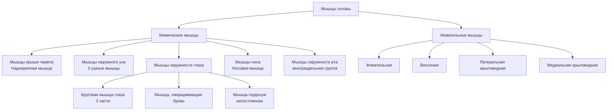
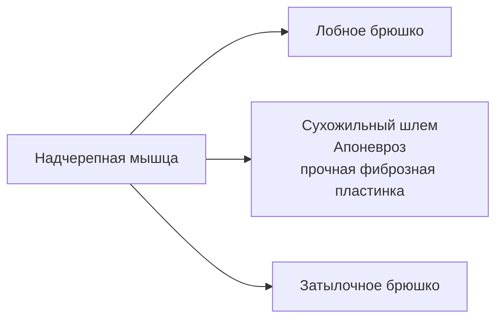

# 6.7 Мышцы, фасции и топография головы

> [!abstract] Классификация
> Мышцы головы делятся на две большие группы:
> 1. **Мимические мышцы** — 5 подгрупп по расположению
> 2. **Жевательные мышцы** — 4 мышцы, обеспечивают движения нижней челюсти

> [!note] Особенность мимических мышц
> Начинаются от **костных точек**, заканчиваются в **коже**. Расположены преимущественно вокруг естественных отверстий → роль **сжимателей** или **расширителей**. Покрыты поверхностной фасцией головы.

---

## Общая схема

---

## 🔵 Мимические мышцы

### Мышцы крыши черепа

#### Надчерепная мышца — *m. epicranius*

> Покрывает почти всю крышу черепа. Основа — **затылочно-лобная мышца**.

> [!note] Сухожильный шлем
> - Рыхло соединён с **надкостницей**
> - Очень прочно соединён с **кожей**
> - Это объясняет **скальпированный** характер ран в области крыши черепа

**Функция:** перемещает кожу головы; **поднимает брови**.

---

### Мышцы наружного уха

> Передняя, верхняя и задняя ушные мышцы (*mm. auriculares*) — у человека **развиты слабо**; движения ушной раковины возможны лишь у некоторых людей.

---

### Мышцы окружности глаза

#### Круговая мышца глаза — *m. orbicularis oculi*

> Лежит под кожей вокруг входа в глазницу. Состоит из **трёх частей**:

| Часть | Расположение | Функция |
|---|---|---|
| **Глазничная** | По краю глазницы; часть пучков — в коже бровей и щёк | Смещает **брови вниз**, кожу щеки — **вверх** |
| **Вековая** | Под кожей верхнего и нижнего век | **Смыкает** веки |
| **Слезная** | Охватывает слёзный мешок | **Расширяет** слёзный мешок → засасывание слезы из слёзного озера |

#### Мышца, сморщивающая бровь — *m. corrugator supercilii*

| Начало | Прикрепление | Функция |
|---|---|---|
| Носовая часть лобной кости | Кожа брови | Тянет бровь **вниз и медиально** → глубокие продольные бороздки над корнем носа |

#### Мышца гордецов — *m. procerus*

> Непостоянная. Начало: костная спинка носа → Прикрепление: кожа надпереносья.
> **Функция:** кожные складки в области надпереносья.

---

### Мышцы носа

#### Носовая мышца — *m. nasalis*

> Начало: верхняя челюсть (клык + латеральный резец) → охватывает ноздри → кожа носа.
> **Функция:** суживает отверстие носа; опускает крыло носа.

---

### Мышцы окружности рта

> [!info] Высокодифференцированная группа — в связи с **функцией речи**.

| Мышца | Начало | Прикрепление | Функция |
|---|---|---|---|
| **Поднимающая верхнюю губу** (*m. levator labii superioris*) | Лобный отросток верхней челюсти | Кожа носогубной складки | **Поднимает** верхнюю губу |
| **Большая скуловая** (*m. zygomaticus major*) | Скуловая кость | Кожа угла рта | Тянет угол рта **вверх и латерально** |
| **Малая скуловая** (*m. zygomaticus minor*) | Скуловая кость | Кожа угла рта / переходит в м. поднимающую верхнюю губу | То же |
| **Мышца смеха** (*m. risorius*) | Околоушная фасция (нередко **отсутствует**) | Кожа угла рта | Тянет угол рта **латерально** |
| **Опускающая угол рта** (*m. depressor anguli oris*) | Нижний край нижней челюсти | Кожа угла рта (частично → верхняя губа) | Тянет угол рта **вниз** |
| **Поднимающая угол рта** (*m. levator anguli oris*) | Верхняя челюсть ниже подглазничного отверстия | Кожа и слизистая верхней губы | Тянет угол рта **вверх** |
| **Опускающая нижнюю губу** (*m. depressor labii inferioris*) | Нижняя челюсть у подбородочного отверстия | Кожа и слизистая нижней губы | **Опускает** нижнюю губу |
| **Подбородочная** (*m. mentalis*) | Нижняя челюсть над подбородочным выступом | Кожа подбородка (сходится с мышцей другой стороны) | Поднимает кожу подбородка → **ямочки** |
| **Щёчная** (*m. buccinator*) | Альвеолярные отростки верхней и нижней челюстей | Верхняя и нижняя губы | Тянет угол рта **назад**; прижимает щёки и губы к зубам |
| **Круговая мышца рта** (*m. orbicularis oris*) | Краевая + губная части | Окаймляет ротовое отверстие | **Закрывает** ротовую щель |

> [!note] Щёчная мышца
> Лежит **глубже** других мимических мышц, прилежит к слизистой оболочке щеки. Участвует в акте **жевания**.

---

## 🔴 Жевательные мышцы

> Обеспечивают движения **нижней челюсти**.

| Мышца | Начало | Прикрепление | Функция |
|---|---|---|---|
| **Жевательная** (*m. masseter*) | Нижний край скуловой дуги | Жевательная бугристость нижней челюсти | **Поднимает** нижнюю челюсть |
| **Височная** (*m. temporalis*) | Чешуя височной кости | Венечный отросток нижней челюсти | Передние пучки → **поднимают**; задние → тянут **назад** |
| **Латеральная крыловидная** (*m. pterygoideus lateralis*) | Подвисочная поверхность большого крыла + латеральная пластинка крыловидного отростка клиновидной кости | Крыловидная ямка нижней челюсти | Одностороннее → смещает челюсть **в противоположную** сторону; двустороннее → **выдвигает вперёд** |
| **Медиальная крыловидная** (*m. pterygoideus medialis*) | Крыловидная ямка крыловидного отростка клиновидной кости | Крыловидная бугристость нижней челюсти | **Поднимает** нижнюю челюсть |

---

### Движения нижней челюсти — участие жевательных мышц

| Движение | Мышцы |
|---|---|
| **Поднятие** (смыкание) | Жевательная + височная (передние пучки) + медиальная крыловидная |
| **Опускание** | Двубрюшная + подбородочно-подъязычная + челюстно-подъязычная (мышцы шеи) |
| **Выдвижение вперёд** | Латеральная крыловидная (двустороннее) |
| **Отведение назад** | Височная (задние пучки) |
| **Боковые движения** | Латеральная крыловидная (одностороннее) |

---

## 🟢 Фасции головы

| Фасция | Описание |
|---|---|
| **Поверхностная** | Выражена **слабо**; перимизий, покрывающий большинство мимических мышц |
| **Височная** | Часть собственной; покрывает **височную** мышцу |
| **Жевательная** | Часть собственной; покрывает **жевательную** мышцу |
| **Околоушная** | Часть собственной; образует **капсулу** для околоушной слюнной железы |
| **Щёчно-глоточная** | Часть собственной; покрывает **щёчную** мышцу + переходит на боковую стенку глотки |
| **Фасция крыловидных мышц** | Перимизий — выражена **слабо** |

---

## 🟡 Топография головы

> [!note] Жировое тело щеки
> Расположено в щёчной области — между **щёчной** и **жевательной** мышцами.
> Хорошо развито у **детей** → важная роль в акте **сосания** при грудном вскармливании.

---

## 📋 Сводная таблица: мимические мышцы по функции

| Функция | Мышцы |
|---|---|
| **Поднятие брови** | Надчерепная (лобное брюшко) |
| **Смыкание век** | Круговая мышца глаза (вековая часть) |
| **Расширение слёзного мешка** | Круговая мышца глаза (слёзная часть) |
| **Угол рта вверх** | Большая и малая скуловые, поднимающая угол рта |
| **Угол рта вниз** | Опускающая угол рта |
| **Угол рта латерально** | Мышца смеха |
| **Закрытие рта** | Круговая мышца рта |
| **Прижимание щёк к зубам** | Щёчная мышца |
| **Опускание нижней губы** | Опускающая нижнюю губу |
| **Ямочки на подбородке** | Подбородочная мышца |
