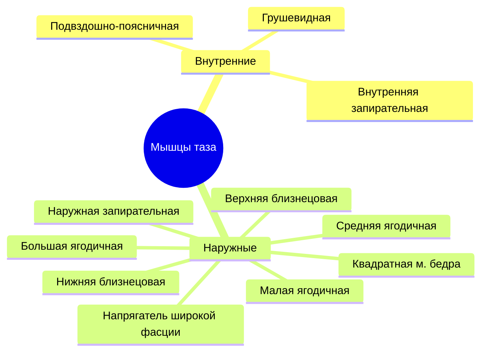
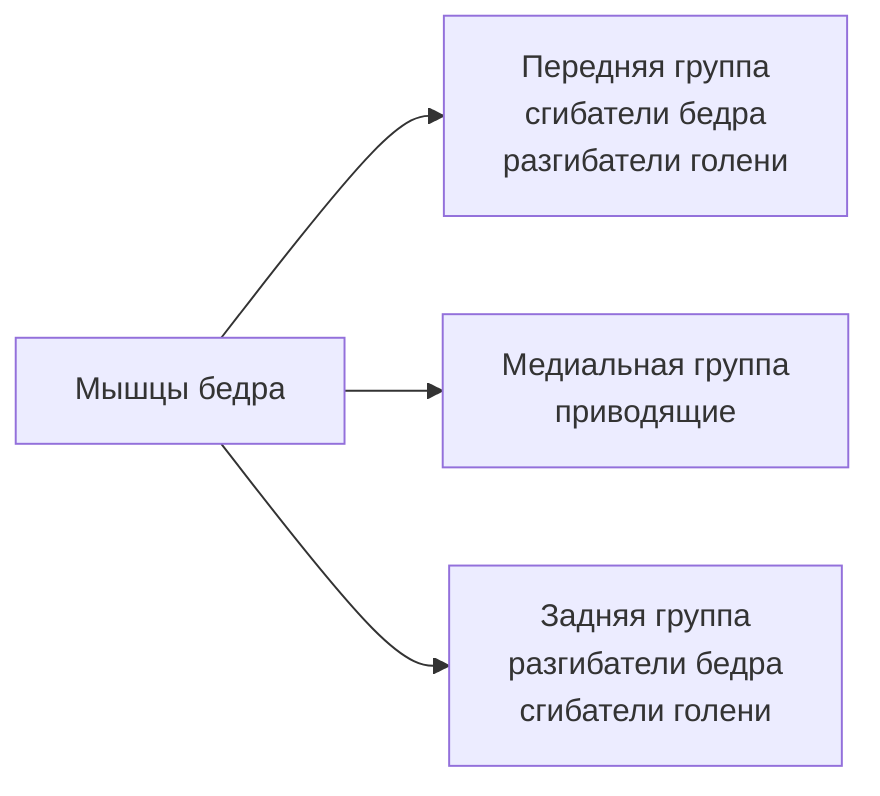
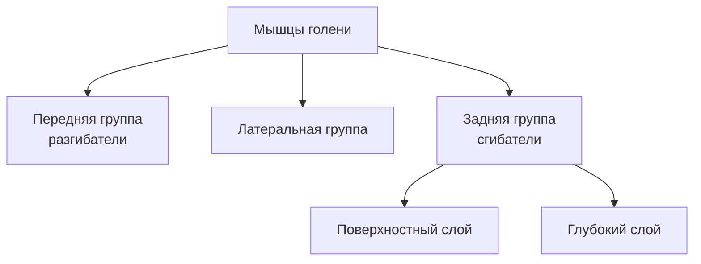
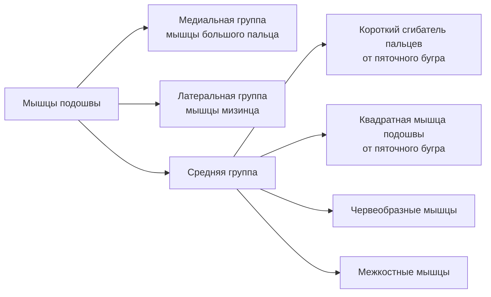
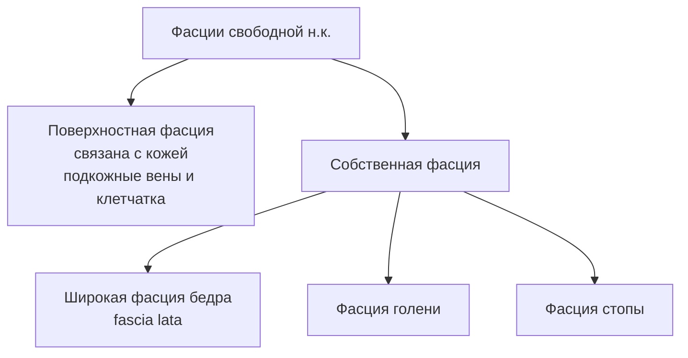
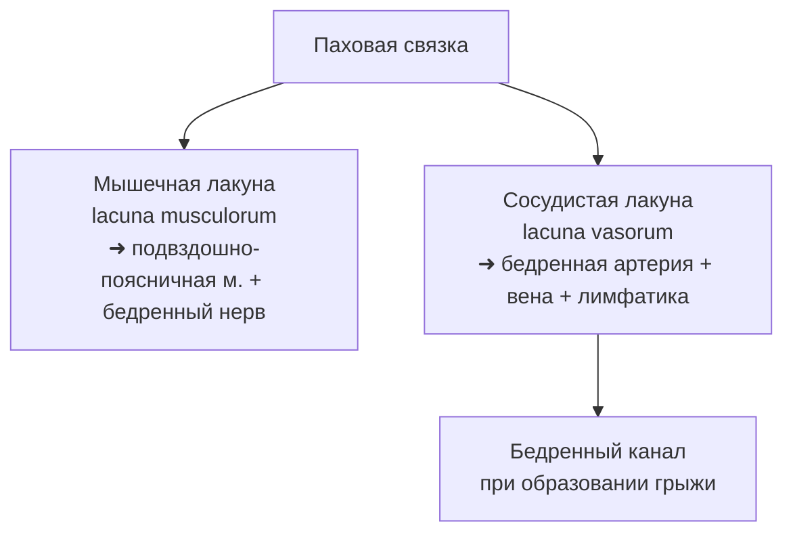

# 🦵 6.9 Мышцы, фасции и топография нижней конечности

> [!abstract] Общая структура
> Мышцы нижней конечности делятся на:
> - **Мышцы пояса** → мышцы таза
> - **Мышцы свободной нижней конечности** → бедро, голень, стопа

---

## 🔵 МЫШЦЫ ТАЗА

> [!info] Начало и прикрепление
> Начинаются от костей таза, поясничного и крестцового отделов позвоночника → прикрепляются к **верхнему концу бедренной кости**

### Классификация

---

### 🔹 Внутренние мышцы таза

| Мышца | Начало | Прикрепление | Функция |
|-------|--------|--------------|---------|
| **Подвздошно-поясничная** (m. iliopsoas) | XII грудной + все поясничные позвонки + подвздошная ямка | Малый вертел бедренной кости | Сгибание в тазобедренном суставе, вращение бедра **наружу** |
| **Малая поясничная** (m. psoas minor) | Тело XII грудного позвонка | Подвздошно-лобковое возвышение | Вспомогательная; **отсутствует в 40% случаев** |
| **Грушевидная** (m. piriformis) | Передняя поверхность крестца | Верхушка большого вертела | Вращение бедра **наружу** |
| **Внутренняя запирательная** (m. obturatorius int.) | Внутренняя поверхность запирательной мембраны | Большой вертел | Вращение бедра **наружу** |

> [!note] Строение подвздошно-поясничной мышцы
> Состоит из **двух частей**: большая поясничная (m. psoas major) + подвздошная (m. iliacus). Проходит **под паховой связкой**.

---

### 🔸 Наружные мышцы таза

| Мышца | Начало | Прикрепление | Функция |
|-------|--------|--------------|---------|
| **Большая ягодичная** (m. gluteus maximus) | Крестец, копчик, подвздошная кость (кзади от задней ягодичной линии) | Ягодичная бугристость бедра | Разгибание + наружное вращение + отведение бедра |
| **Средняя ягодичная** (m. gluteus medius) | Подвздошная кость | Большой вертел | Отведение бедра; передние пучки — вращение **внутрь**, задние — **наружу** |
| **Малая ягодичная** (m. gluteus minimus) | Подвздошная кость | Большой вертел | Аналогично средней |
| **Квадратная м. бедра** (m. quadratus femoris) | Седалищный бугор | Межвертельный гребень | Вращение бедра **наружу** |
| **Близнецовые мышцы** (верхняя и нижняя) | Седалищная ость / седалищный бугор | Большой вертел (вместе с внутр. запирательной) | Вращение бедра **наружу** |
| **Наружная запирательная** (m. obturatorius ext.) | Наружная поверхность запирательной мембраны | Большой вертел | Вращение бедра **наружу** |
| **Напрягатель широкой фасции** (m. tensor fasciae latae) | Передняя верхняя ость и гребень подвздошной кости | Латеральный мыщелок большеберцовой кости (через подвздошно-большеберцовый тракт) | Напрягает подвздошно-большеберцовый тракт; сгибание бедра |

---

## 🟢 МЫШЦЫ БЕДРА

> [!info] Функциональное значение
> Хорошо развиты у человека в связи с **прямохождением**. Выполняют статическую и динамическую функции.

---

### 🔹 Передняя группа

| Мышца | Начало | Прикрепление | Функция |
|-------|--------|--------------|---------|
| **Портняжная** (m. sartorius) — *самая длинная мышца тела* | Передняя верхняя ость подвздошной кости | Бугристость большеберцовой кости | Сгибание бедра и голени; вращение согнутой голени **внутрь** |
| **Четырёхглавая** (m. quadriceps femoris) | 4 головки (см. ниже) | Бугристость большеберцовой кости (через связку надколенника) | Разгибание голени; прямая мышца — ещё и сгибание бедра |

> [!note] Четыре головки четырёхглавой мышцы
> 1. **Прямая** (m. rectus femoris) — от передней нижней ости подвздошной кости
> 2. **Латеральная широкая** (m. vastus lateralis) — от латеральной губы шероховатой линии
> 3. **Промежуточная широкая** (m. vastus intermedius) — от передней поверхности бедра
> 4. **Медиальная широкая** (m. vastus medialis) — от медиальной губы шероховатой линии
> 
> В дистальной трети бедра → **общее сухожилие** → охватывает надколенник → связка надколенника

---

### 🔸 Медиальная группа (приводящие)

| Мышца | Начало | Прикрепление | Функция |
|-------|--------|--------------|---------|
| **Тонкая** (m. gracilis) | Нижняя ветвь лобковой кости | Бугристость большеберцовой кости | Приведение бедра, сгибание голени |
| **Гребенчатая** (m. pectineus) | Верхняя ветвь лобковой кости | Верхняя часть медиальной губы шероховатой линии | Сгибание и приведение бедра |
| **Длинная приводящая** (m. adductor longus) | Верхняя ветвь лобковой кости | Средняя треть медиальной губы | Приведение бедра |
| **Короткая приводящая** (m. adductor brevis) | Нижняя ветвь лобковой кости | Верхняя треть медиальной губы | Приведение бедра |
| **Большая приводящая** (m. adductor magnus) — *самая сильная* | Седалищный бугор + ветвь седалищной кости | Медиальная губа по всей длине + медиальный надмыщелок | Приведение бедра; образует **сухожильную дугу** для подколенных сосудов |

---

### 🔹 Задняя группа

> [!tip] Общее начало
> Все три мышцы начинаются от **седалищного бугра**

| Мышца | Дополнительное начало | Прикрепление | Функция |
|-------|----------------------|--------------|---------|
| **Двуглавая** (m. biceps femoris) | Короткая головка — от латеральной губы шероховатой линии | Головка малоберцовой кости | Разгибание бедра, сгибание голени |
| **Полусухожильная** (m. semitendinosus) | — | Медиальная сторона бугристости большеберцовой кости | Разгибание бедра, сгибание голени |
| **Полуперепончатая** (m. semimembranosus) | Широкое сухожилие | «Глубокая гусиная лапка» (3 пучка к большеберцовой кости и капсуле сустава) | Разгибание бедра, сгибание и поворот голени **внутрь** |

---

## 🟡 МЫШЦЫ ГОЛЕНИ

---

### 🔹 Передняя группа (разгибатели)

| Мышца | Начало | Прикрепление | Функция |
|-------|--------|--------------|---------|
| **Передняя большеберцовая** (m. tibialis anterior) | Большеберцовая кость + межкостная мембрана | Медиальная клиновидная + основание I плюсневой кости | Разгибание стопы, **супинация**, приведение; участвует в **стремени стопы** |
| **Длинный разгибатель пальцев** (m. extensor digitorum longus) | Латеральный мыщелок большеберцовой + головка малоберцовой | Дистальные фаланги II–V пальцев | Разгибание IV пальцев, разгибание стопы |
| **Длинный разгибатель большого пальца** (m. extensor hallucis longus) | Две нижние трети малоберцовой кости | Основание дистальной фаланги I пальца | Разгибание большого пальца и стопы |

---

### 🔸 Латеральная группа

| Мышца | Начало | Прикрепление | Функция |
|-------|--------|--------------|---------|
| **Длинная малоберцовая** (m. peroneus longus) | Головка + верхние 2/3 малоберцовой кости | I–II плюсневые кости + медиальная клиновидная (огибает латеральную лодыжку) | Сгибание стопы, **пронация**, отведение; укрепляет своды; **стремя стопы** |
| **Короткая малоберцовая** (m. peroneus brevis) | Нижняя половина малоберцовой кости | Бугристость V плюсневой кости | Сгибание стопы, подъём латерального края, отведение |

> [!warning] Стремя стопы
> Образуется **передней большеберцовой + длинной малоберцовой** мышцами — затягивает поперечные своды стопы

---

### 🔹 Задняя группа — Поверхностный слой

| Мышца | Особенности | Прикрепление | Функция |
|-------|-------------|--------------|---------|
| **Трёхглавая** (m. triceps surae) | = икроножная + камбаловидная | Пяточный бугор (**Ахиллово сухожилие**) | Сгибание голени и стопы (подошвенное); вращение голени |
| **Икроножная** (m. gastrocnemius) | Медиальная и латеральная головки от надмыщелков бедра | Сливается с камбаловидной → Ахиллово сухожилие | Сгибание голени и стопы |
| **Камбаловидная** (m. soleus) | Скрыта под икроножной | Пяточный бугор | Сгибание стопы |
| **Подошвенная** (m. plantaris) | Рудиментарная | Вплетается в Ахиллово сухожилие | Сгибание голени и стопы |

---

### 🔸 Задняя группа — Глубокий слой

| Мышца | Начало | Прикрепление | Функция |
|-------|--------|--------------|---------|
| **Подколенная** (m. popliteus) | Латеральный надмыщелок бедра | Задняя поверхность проксимального эпифиза большеберцовой кости | Сгибание голени, вращение **внутрь** |
| **Длинный сгибатель пальцев** (m. flexor digitorum longus) | Средняя треть задней поверхности большеберцовой кости | Дистальные фаланги II–V пальцев (позади медиальной лодыжки) | Сгибание стопы и ногтевых фаланг II–V пальцев |
| **Длинный сгибатель большого пальца** (m. flexor hallucis longus) | Две нижние трети малоберцовой кости | Дистальная фаланга I пальца | Сгибание большого пальца, участие в сгибании стопы |
| **Задняя большеберцовая** (m. tibialis posterior) | Межкостная мембрана + обращённые поверхности костей голени | Ладьевидная + клиновидные кости | Подошвенное сгибание, подъём медиального края |

---

## 🟠 МЫШЦЫ СТОПЫ

### Тыл стопы

| Мышца | Начало | Прикрепление | Функция |
|-------|--------|--------------|---------|
| **Короткий разгибатель пальцев** (m. extensor digitorum brevis) | Пяточная кость | Боковые поверхности средних фаланг | Разгибание пальцев |
| **Короткий разгибатель большого пальца** (m. extensor hallucis brevis) | Пяточная кость | Проксимальная фаланга I пальца | Разгибание большого пальца |

### Подошва

> [!note] Отличие от кисти
> На стопе **отсутствуют мышцы, противопоставляющие** большой палец и мизинец. Средняя группа усилена короткими сгибателем пальцев и квадратной мышцей подошвы.
> - **Подошвенные межкостные** — приводят III–V пальцы ко II
> - **Тыльные межкостные** — фиксируют II палец, отводят III и IV

---

## 🔴 ФАСЦИИ НИЖНЕЙ КОНЕЧНОСТИ

### Фасции таза

| Фасция | Особенности |
|--------|-------------|
| **Подвздошная фасция** | Образует футляр для подвздошно-поясничной мышцы; под паховой связкой делит пространство на **мышечную и сосудистую лакуны** |
| **Фасция малого таза** | Часть внутрибрюшной фасции; покрывает внутренние мышцы таза |
| **Фасция ягодичной области** | Поверхностная + собственная (покрывает ягодичные мышцы) |

### Фасции свободной нижней конечности

> [!important] Широкая фасция бедра (fascia lata)
> - Латерально — апоневротическое строение → **подвздошно-большеберцовый тракт** (tractus iliotibialis) = сухожилие напрягателя широкой фасции
> - Ниже медиального конца паховой связки — **подкожная щель (hiatus saphenus)** → место впадения большой подкожной вены в бедренную
> - Образует **3 межмышечные перегородки** → 4 фиброзных и 3 костно-фиброзных футляра

> [!important] Фасция голени
> - Образует переднюю и заднюю межмышечные перегородки
> - На уровне лодыжек — **удерживатели сухожилий** (сгибателей, разгибателей, малоберцовых мышц)
> - Под удерживателями — каналы для сухожилий и сосудисто-нервных пучков

---

## 🟣 ТОПОГРАФИЯ НИЖНЕЙ КОНЕЧНОСТИ

### Топография таза

> [!danger] Клиническое значение — инъекции
> Через надгрушевидное и подгрушевидное отверстия выходят **сосуды и нервы**. Поэтому внутримышечные инъекции проводятся только в **верхне-наружный квадрант ягодичной области**!

| Отверстие/канал | Содержимое |
|----------------|-----------|
| **Надгрушевидное отверстие** | Сосуды и нервы (выше грушевидной мышцы) |
| **Подгрушевидное отверстие** | Сосуды и нервы (ниже грушевидной мышцы) |
| **Запирательный канал** | Запирательные сосуды и нерв |

---

### Топография бедра

> [!note] Бедренный канал (при грыже)
> - **Передняя стенка** — паховая связка + верхний рог серповидного края
> - **Задняя стенка** — гребенчатая фасция
> - **Латеральная стенка** — бедренная вена
> - **Внутреннее отверстие** — медиальная часть сосудистой лакуны
> - **Наружное отверстие** — подкожная щель (hiatus saphenus)

| Борозда/канал | Границы | Содержимое |
|--------------|---------|-----------|
| **Подвздошно-гребенчатая борозда** | Подвздошно-поясничная + гребенчатая мышцы | Бедренные сосуды |
| **Передняя бедренная борозда** | Длинная приводящая + медиальная широкая мышцы | Бедренные сосуды |
| **Бедренный треугольник (Скарпа)** | Вверху — паховая связка; латерально — портняжная м.; медиально — длинная приводящая м. | Борозды с сосудами |
| **Бедренно-подколенный (приводящий) канал** | Большая приводящая + медиальная широкая + фиброзная пластинка | Бедренные сосуды; открывается в подколенную ямку |

---

### Топография голени

> [!note] Подколенная ямка
> Форма **ромба**. Верхний угол: латерально — двуглавая мышца, медиально — полуперепончатая. Нижний угол — головки икроножной. Содержит: подколенные **артерию, вену** и **седалищный нерв**.

| Канал голени | Расположение | Содержимое |
|-------------|-------------|-----------|
| **Голено-подколенный канал** | Между глубоким и поверхностным слоями задней группы | Сосуды и нервы из подколенной ямки на подошву |
| **Нижний мышечно-малоберцовый канал** | Малоберцовая кость + глубокие мышцы задней группы | Малоберцовые сосуды |
| **Верхний мышечно-малоберцовый канал** | Малоберцовая кость + длинная малоберцовая мышца | **Общий малоберцовый нерв** (ветвь седалищного) |

> [!note] Стопа
> - **Подошва**: сосудисто-нервные пучки в **медиальной и латеральной подошвенных бороздах**
> - **Тыл стопы**: сосудисто-нервные пучки под собственной фасцией
> - **Синовиальные влагалища** сухожилий пальцев стопы — короткие, за пределы пальцев не распространяются

---

## 📊 Сводная таблица функций мышц

| Движение | Основные мышцы |
|----------|---------------|
| **Сгибание бедра** | Подвздошно-поясничная, прямая мышца бедра, портняжная, гребенчатая |
| **Разгибание бедра** | Большая ягодичная, двуглавая, полусухожильная, полуперепончатая |
| **Отведение бедра** | Средняя и малая ягодичные, большая ягодичная |
| **Приведение бедра** | Медиальная группа (тонкая, гребенчатая, приводящие) |
| **Наружное вращение бедра** | Грушевидная, запирательные, близнецовые, квадратная м. бедра |
| **Разгибание голени** | Четырёхглавая мышца бедра |
| **Сгибание голени** | Двуглавая, полусухожильная, полуперепончатая, икроножная |
| **Подошвенное сгибание стопы** | Трёхглавая мышцы голени, задняя большеберцовая, малоберцовые |
| **Разгибание стопы** | Передняя большеберцовая, длинные разгибатели пальцев |
| **Пронация стопы** | Длинная малоберцовая |
| **Супинация стопы** | Передняя и задняя большеберцовые |
