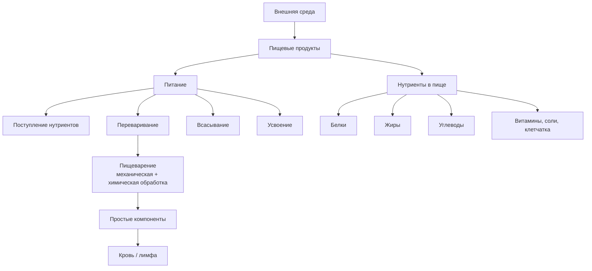
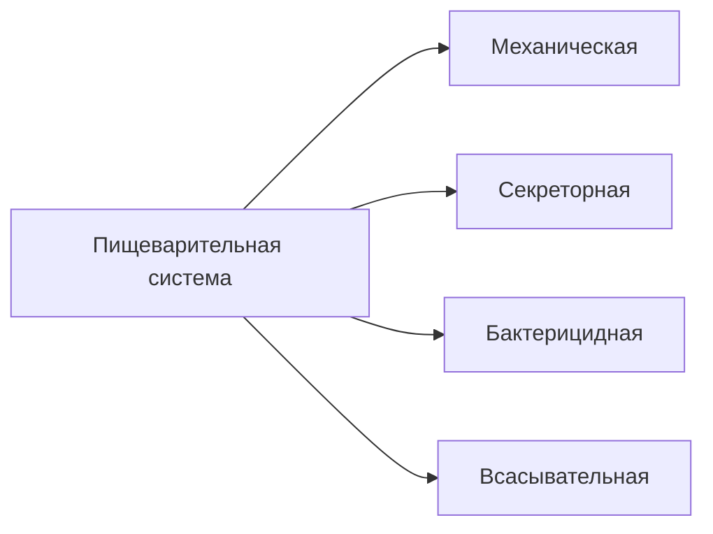
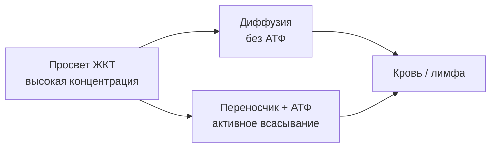

# 7.1 Основные понятия

> [!abstract] Тема
> Питание, пищеварение, нутриенты и функции пищеварительной системы. Пищеварение — **начальный этап** обмена веществ (подробнее — гл. 10 «Обмен веществ и энергии»).

> [!note] Гетеротрофы
> Человек (как и другие млекопитающие) — **гетеротрофный** организм (от греч. *heteros* — другой, иной; *trophe* — питаю): **не синтезирует** из неорганических веществ необходимые органические соединения. Органические вещества должны **поступать из внешней среды**.

---

## Общая схема понятий

---

## 🔵 Питание и пищеварение

| Понятие | Определение |
|---|---|
| **Питание** | Процесс **поступления, переваривания, всасывания и усвоения** питательных веществ (нутриентов), необходимых для нормальной жизнедеятельности, роста, развития, восполнения энерготрат |
| **Нутриенты** | Питательные вещества; поступают в организм **в виде пищи** |
| **Пищеварение** | Процесс **механической и химической** обработки пищи для выделения **простых компонентов**, способных проходить через мембраны эпителия ЖКТ и всасываться в **кровь или лимфу** |

> [!important] Соотношение понятий
> **Пищеварение** — более **узкое** понятие, чем **питание**. Для перехода питательных веществ во внутреннюю среду пищевые продукты нуждаются в предварительной механической и химической обработке.

---

## 🔵 Роль пищи для организма

Пища — источник:

| Категория | Содержание / роль |
|---|---|
| **Пластические вещества** | Белки, жиры, углеводы → построение структурных компонентов клетки |
| **Энергетические вещества** | При расщеплении → энергия в виде **АТФ** |
| **Регуляторные** | Вещества для поддержания **постоянства внутренней среды** |
| **Витамины** | Биологически активные вещества |
| **Клетчатка** | В основном **не разрушается** в ЖКТ → нормальная работа ЖКТ, формирование каловых масс |

> [!note] Основные питательные вещества
> К ним относят **белки, жиры и углеводы**. Их роль в обмене — в гл. 10.

---

## 🟡 Пищевые продукты

Человек использует пищу **животного** и **растительного** происхождения. В продуктах нутриенты в **разных соотношениях** → пища, богатая белками, жирами или углеводами.

### Углеводы — основной источник энергии

| Продукт | Особенности |
|---|---|
| Хлеб, картофель, рис, горох | Богаты углеводами |
| Сахар | **~98 %** сахарозы (глюкоза + фруктоза) |
| Большинство растительных продуктов | Преимущественно **углеводы** |

### Белки

| Продукт | Содержание белка |
|---|---|
| Сыры | до **25 %** |
| Мясо | до **20 %** |
| Горох, соя | значимое содержание |
| Растительные продукты | **менее** богаты белками, чем животные |

### Жиры

| Продукт | Содержание жира |
|---|---|
| Растительное масло | до **98 %** |
| Сливочное масло | до **87 %** |
| Сало | высокое содержание жира |

---

## 🟢 Функции пищеварительной системы

---

### 1. Механическая функция

- Захват пищи
- **Измельчение**, перемешивание
- Продвижение по пищеварительному тракту
- Выделение из организма **невсосавшихся** продуктов

---

### 2. Секреторная функция

Железы вырабатывают секреты: **слюна**, пищеварительные соки (желудочный, панкреатический, кишечный), **желчь**.

| Свойство секретов | Значение |
|---|---|
| Много **воды** | Размягчение, разжижение пищи, перевод веществ в **растворённое** состояние |
| Суточный объём секреции | Около **7–8 л** соков за 1 сут |

#### Ферменты (энзимы)

> [!note] Ферменты
> Особые **белки** в составе пищеварительных соков. **Биологические катализаторы**: связываются с компонентами пищи, расщепляют до более простых веществ, **сами не расходуются**. Мизерные количества расщепляют огромное число молекул.

| Пример | Действие |
|---|---|
| **Пепсин** (желудочный сок) | Расщепляет **только белки** |
| **Трипсин** (сок поджелудочной железы) | Расщепляет **только белки** |

> [!warning] Специфичность и условия активности
> - Каждый энзим — **строго определённое** питательное вещество
> - Активны только при **оптимальной** кислотности, температуре и др.
> - **Пепсин** активен только в **кислой** среде (**pH 1–2**)

#### pH среды

| pH | Тип среды |
|:---:|---|
| **7** | Нейтральная |
| **< 7** | Кислая |
| **> 7** | Щелочная |

> [!tip] Гидролазы
> Все пищеварительные ферменты — **гидролазы**: катализируют **гидролиз** — расщепление крупной молекулы на более мелкие **с присоединением воды**.

---

### 3. Бактерицидная функция

Вещества в пищеварительных соках **убивают** болезнетворные бактерии, проникшие в ЖКТ:

| Вещество | Где |
|---|---|
| **Лизоцим** | Слюна |
| **Соляная кислота** | Желудочный сок |

---

### 4. Всасывательная функция

Проникновение **воды, питательных веществ, витаминов, солей** через эпителий слизистой из просвета канала в **кровь и лимфу**.

#### Простая диффузия

> [!note] Диффузия
> Движение веществ из раствора с **большей** концентрацией в раствор с **меньшей**.
> - Большая концентрация → **содержимое** пищеварительного канала
> - Меньшая → **кровь и лимфа**
> - **Без затрат** энергии АТФ

#### Активное всасывание

> [!note] Активный транспорт
> Транспорт через мембраны **с затратой АТФ**. В эпителии кишечника — **белки-переносчики**:
> 1. Соединяются в просвете с молекулой питательного вещества
> 2. Расщепляют **АТФ** → получают энергию
> 3. Переводят молекулу в **цитоплазму** эпителиальной клетки
> 4. Далее — через мембрану клетки → **кровь или лимфа**

---

## 📋 Сводная таблица

| Термин | Кратко |
|---|---|
| **Гетеротроф** | Органические вещества только извне |
| **Питание** | Поступление → переваривание → всасывание → усвоение |
| **Пищеварение** | Механическая + химическая обработка пищи |
| **Нутриент** | Питательное вещество в пище |
| **Фермент** | Катализатор гидролиза, специфичен, не расходуется |
| **Гидролаза** | Фермент гидролиза с присоединением H₂O |
| **Диффузия** | Пассивный перенос по градиенту концентрации |
| **Активное всасывание** | Перенос с АТФ через переносчики |
