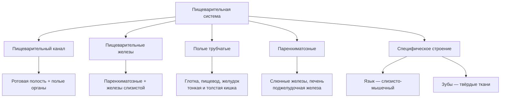
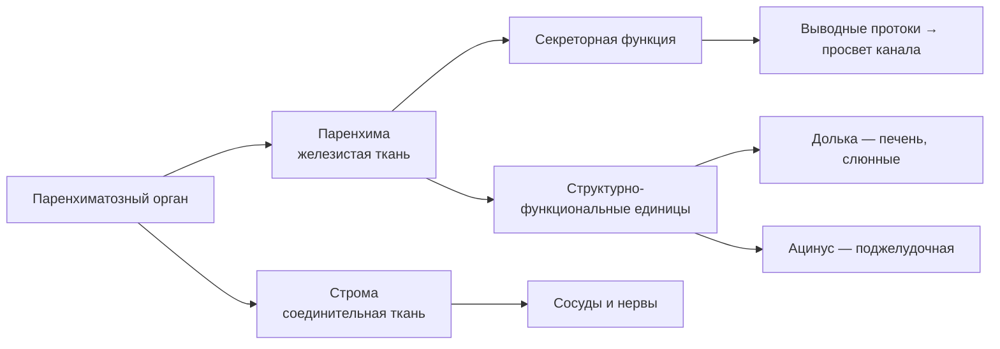
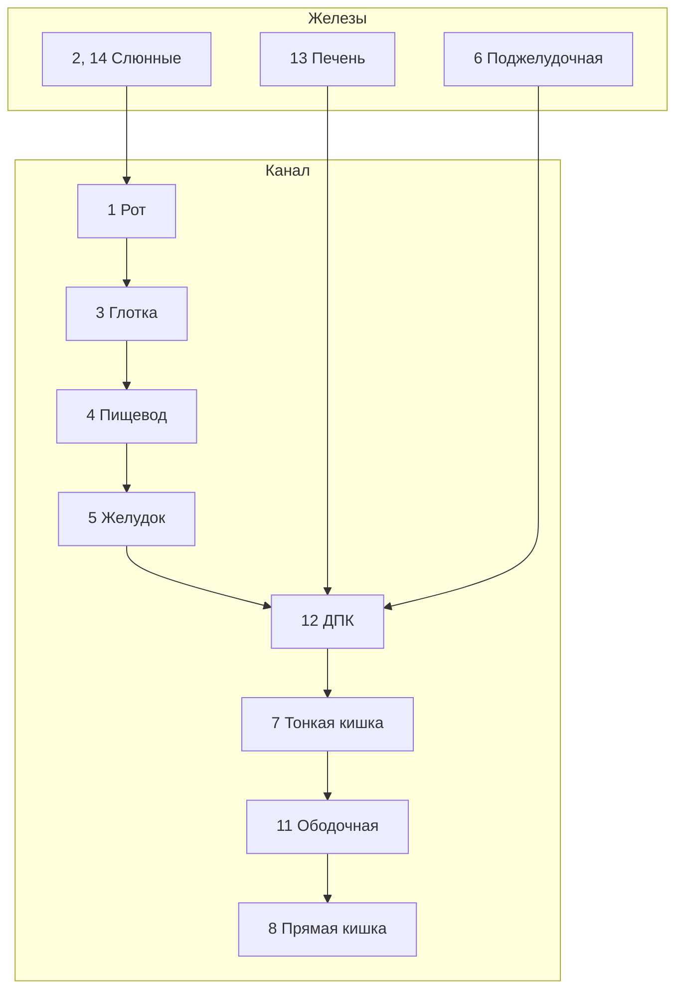

# 7.2 Общий план строения органов пищеварительной системы

> [!abstract] Тема
> Типы органов (полые, паренхиматозные, специфические), **три оболочки** стенки полых органов, строение паренхиматозных желёз. Связь с [[7.1_Основные_понятия|7.1 Основные понятия]].

---

## Классификация органов



| Тип | Признак | Примеры |
|---|---|---|
| **Полые (трубчатые)** | Сходное строение **стенки**, внутри **полость** | Глотка, пищевод, желудок, тонкая и толстая кишка |
| **Паренхиматозные (железистые)** | Однородная **железистая ткань** — паренхима | Крупные слюнные железы, печень, поджелудочная железа |
| **Специфические** | Особое строение | **Язык** (слизисто-мышечный), **зубы** (твёрдые ткани) |

---

## 🔵 Стенка полых органов — три оболочки

```
Просвет органа
    ↓
┌─────────────────────────┐
│ 1. Слизистая оболочка   │
├─────────────────────────┤
│ 2. Мышечная оболочка    │
├─────────────────────────┤
│ 3. Серозная ИЛИ         │
│    адвентициальная      │
└─────────────────────────┘
```

> Схема стенки **пищевода** (рис. 7.1): 1 — слизистая; 2 — подслизистая основа; 3 — **циркулярный** слой мышечной оболочки; 4 — **продольный** слой; 5 — **адвентиция**.

---

## 🟡 1. Слизистая оболочка (внутренняя)

### Эпителий

| Тип эпителия | Где | Значение |
|---|---|---|
| **Многослойный** | Полость рта, глотка, пищевод | Защита от механических повреждений |
| **Однослойный** | Желудок, кишечник | Легче **всасывание** в кровь и лимфу |

> [!note] Особенности эпителия
> - В состав эпителия **не входят** кровеносные сосуды
> - Клетки **плотно** прилежат друг к другу
> - **Короткая** продолжительность жизни → быстрое отмирание и обновление из **базальных клеток** (у базальной мембраны)
> - Из-за тонкости эпителия просвечивают сосуды нижележащих слоёв → **бледно-розовая** окраска слизистой внутренних органов

### Слои слизистой (сверху вниз к мышечной)

| Слой | Состав / функция |
|---|---|
| **Эпителий** | Внутренняя поверхность органа |
| **Собственная пластинка** (*lamina propria*) | Лимфоидные узелки, **железы** (слизь или секрет для химической обработки пищи) |
| **Подслизистая основа** | Рыхлая волокнистая соединительная ткань; **основные** внутриорганные сосуды и нервы |

---

## 🟡 2. Мышечная оболочка (средняя)

> [!important] Слои гладкой мышцы
> В большинстве случаев **два слоя**:
> - **Циркулярный (круговой)** — **внутренний**, прилежит к слизистой
> - **Продольный** — **наружный**

| Особенность | Описание |
|---|---|
| **Сфинктеры** | Утолщения **циркулярного** слоя; регулируют переход пищи между отделами |
| **Желудок** | До **трёх** слоёв гладких мышечных клеток |
| **Начальные отделы** (рот, глотка, **верхняя** часть пищевода) | **Поперечнополосатая** мышечная ткань |

> За счёт мышечной оболочки — **механическая** функция (продвижение и перемешивание пищи).

---

## 🟡 3. Наружная оболочка

### Адвентициальная оболочка

- Тонкая пластинка **рыхлой** соединительной ткани
- Обеспечивает **сращение** с окружающими тканями
- Орган **не смещается**; сокращения **неактивны**
- **Глотка**, большая часть **пищевода**

### Серозная оболочка

- Тонкая прозрачная плёнка; снаружи — **мезотелий** (один слой плоских клеток)
- Орган **легко смещается**, меняет форму
- **Желудок**, большая часть **тонкой** и **толстой** кишки
- В брюшной полости — **брюшина**

| Функция серозы | Механизм |
|---|---|
| **Увлажнение, снижение трения** | **Транссудация** серозной жидкости из капилляров **подсерозного** слоя |
| **Разграничительная** | Препятствует сращению органов друг с другом |
| **Защитная** | — |

---

## 🟢 Паренхиматозные органы



| Компонент | Роль |
|---|---|
| **Паренхима** (*parenchyma* — мякоть) | Железистая ткань; **секреторная** функция |
| **Строма** | Соединительная ткань; сосуды и нервы, питающие секреторные клетки |
| **Долька** | Единица в **печени**, **слюнных** железах |
| **Ацинус** | Единица в **поджелудочной** железе |

Секрет выходит в просвет пищеварительного канала по **выводным протокам**.

---

## 📋 Пищеварительный канал и железы (схема, рис. 7.2)

### Пищеварительный канал (тракт)

| № | Орган |
|:---:|---|
| 1 | Полость рта |
| 3 | Глотка |
| 4 | Пищевод |
| 5 | Желудок |
| 7 | Тонкая кишка |
| 12 | Двенадцатиперстная кишка |
| 8 | Прямая кишка |
| 9 | Червеобразный отросток |
| 10 | Слепая кишка |
| 11 | Ободочная кишка |

### Пищеварительные железы

| № | Орган |
|:---:|---|
| 2 | Подъязычная и поднижнечелюстная железы |
| 14 | Околоушная железа |
| 6 | Поджелудочная железа |
| 13 | Печень |
| — | **3 пары** крупных слюнных желез + железы **слизистых оболочек** полых органов |



---

## 📋 Сводная таблица

| Термин | Кратко |
|---|---|
| **Полый орган** | Стенка из 3 оболочек + полость |
| **Паренхима / строма** | Железистая ткань / соединительная опора |
| **Сфинктер** | Утолщение циркулярного мышечного слоя |
| **Адвентиция** | Наружная рыхлая оболочка, орган фиксирован |
| **Сероза (брюшина)** | Мезотелий, подвижность, транссудация |
| **Долька / ацинус** | Функциональная единица железы |
