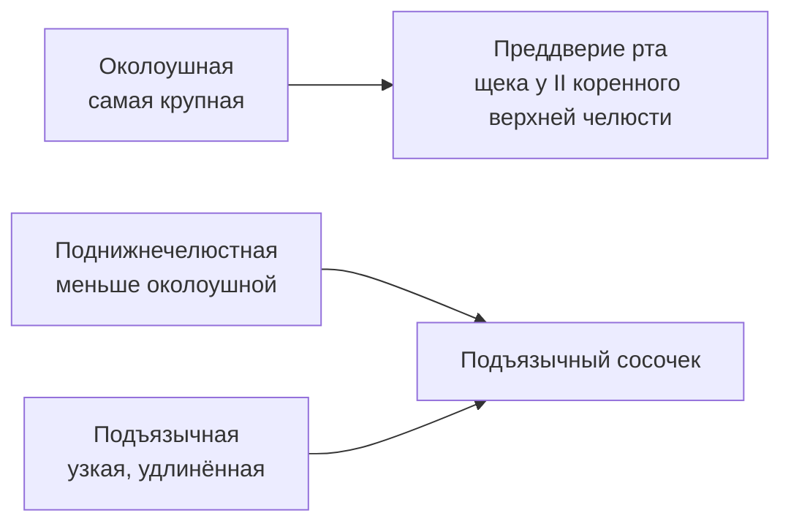
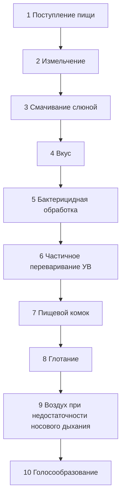

# 7.3 Полость рта и слюнные железы

> [!abstract] Тема
> Крупные слюнные железы, состав и функции слюны, процессы в полости рта, регуляция слюноотделения (И. П. Павлов). Связь: [[7.2_Общий_план_строения|7.2]], [[7.1_Основные_понятия|7.1]].

---

## 🔵 Крупные слюнные железы (3 пары)

| Железа | Латинское название | Расположение | Выводной проток |
|---|---|---|---|
| **Околоушная** | *glandula parotis* | У **височной** области; **самая крупная** | Открывается на слизистой **щеки** в **преддверии рта** на уровне **II большого коренного зуба верхней челюсти** |
| **Поднижнечелюстная** | *glandula submandibularis* | **Кнутри** и **книзу** от тела нижней челюсти; **уступает** по размеру околоушной | Под языком, на **подъязычном сосочке** |
| **Подъязычная** | *glandula sublingualis* | **Непосредственно под** слизистой оболочкой **дна** ротовой полости; узкая, удлинённая | Там же, где проток **поднижнечелюстной** железы |

> [!note] Преддверие рта
> Пространство между **губами/щеками** и **зубными рядами** — сюда открывается проток околоушной железы.

---

## 🔵 Слюна: количество и состав

| Показатель | Значение |
|---|---|
| Суточный объём | **1,5–2,0 л** |
| Вода | **~99 %** |
| Сухое вещество | **~1 %** |
| Доля сухого вещества — неорганика | **⅓** (Na⁺, K⁺, Ca²⁺, Cl⁻, HCO₃⁻ и др.) |

### Органические компоненты

| Вещество | Доля / роль |
|---|---|
| **Муцин** | **0,3 %** всей слюны; слизистый белок → **обволакивание** пищевого комка, облегчает глотание |
| **Лизоцим** | **Бактерицидная** функция — уничтожает бактерии, попавшие с пищей |
| **Амилаза** | Расщепляет **крахмал** и **гликоген** (углеводы) |
| **Мальтаза** | Расщепляет **мальтозу** → **2 молекулы глюкозы** |

> [!warning] Расщепление углеводов в рте
> Процесс **далеко не полный** (до **олигомеров**). Основное действие ферментов — в **тонкой кишке**.
> Амилаза и мальтаза активны в **слабощелочной** среде (**pH слюны при приёме пищи ~8**).

> [!tip] Вкус и слюноотделение
> Вкус пищи воспринимается рецепторами языка только при **увлажнении**. Отсутствие слюноотделения → **потеря вкуса**.

---

## 🟡 Функции слюны

1. **Смачивает** и **разжижает** пищу  
2. Способствует образованию **пищевого комка**  
3. **Защитная (обезвреживающая)** — лизоцим и др.  
4. **Начальное** расщепление углеводов (амилаза, мальтаза)  
5. Обеспечивает **вкусовое** восприятие пищи  

---

## 🟡 Регуляция слюноотделения

| Система | Эффект |
|---|---|
| **Парасимпатическая** | **Усиление** слюноотделения — много **жидкой** слюны |
| **Симпатическая** | **Необильное** отделение **концентрированной** слюны |

| Термин | Значение |
|---|---|
| **Гипосаливация** | Снижение количества слюны |
| **Гиперсаливация** | Повышение количества слюны |

- Регуляция — преимущественно **нервная система**
- **Центр слюноотделения** — **продолговатый мозг**
- Импульсы — по нервам с **парасимпатическими** и **симпатическими** волокнами

### Состав слюны и тип пищи

| Стимул / пища | Изменение слюны |
|---|---|
| Сыпучая пища, **кислый** вкус (лимон) | **Больше** слюны; ↓ органика, ↑ жидкая фракция |
| Преимущественно **углеводы** | ↑ содержание **амилазы** |
| Вид, запах, мысль о пище | «Аппетитная» слюна (мозговая фаза) |

---

## 🟢 Процессы в полости рта

| № | Процесс |
|:---:|---|
| 1 | Поступление пищи |
| 2 | **Механическая** обработка (измельчение) |
| 3 | Смачивание слюной |
| 4 | Опробование на **вкус** |
| 5 | **Бактерицидная** обработка (лизоцим) |
| 6 | Частичное переваривание **углеводов** |
| 7 | Формирование **пищевого комка** |
| 8 | **Глотание** |
| 9 | Проведение **воздуха** при недостаточности носового дыхания |
| 10 | **Голосообразование** (тембр зависит от положения языка, губ, щёк, мягкого нёба) |

---

## 🔴 И. П. Павлов: механизмы слюноотделения

### Фистульный метод (рис. 7.8)

> **Фистула** — соединение протока железы с **внешней средой**.

- На **наружную поверхность щеки** собаки выводили проток **околоушной** железы
- Слюна собиралась в **пробирку**, а не в рот
- **Без пищи** — секреция почти не наблюдалась
- При пище и раздражении рецепторов рта — **безусловный** слюноотделительный рефлекс
- Слюна **до кормления** на запах, вид пищи (зрение, обоняние) — **условный** слюноотделительный рефлекс

### Две фазы секреции (Павлов)

| Фаза | Когда | Состав слюны |
|---|---|---|
| **1. Мозговая** | Вид, запах, **мысль** о пище («аппетитная слюна») | **Не зависит** от вида и количества пищи |
| **2. Ротовая** | **Пережёвывание** пищи | **Зависит** от вида и количества пищи |

---

## 📋 Сводная таблица

| Термин | Кратко |
|---|---|
| **Преддверие рта** | Щека/губы — зубы; проток околоушной железы |
| **Подъязычный сосочек** | Устья протоков поднижнечелюстной и подъязычной желёз |
| **Муцин** | Слизь для пищевого комка |
| **Безусловный рефлекс** | Пища в рту → слюна |
| **Условный рефлекс** | Запах/вид пищи → слюна до еды |
| **Гипосаливация / гиперсаливация** | Мало / много слюны |
