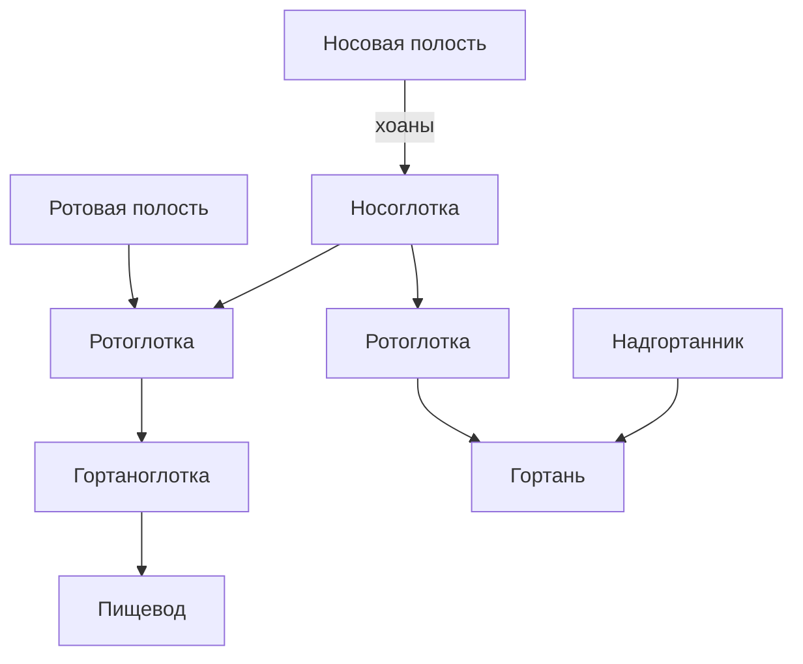
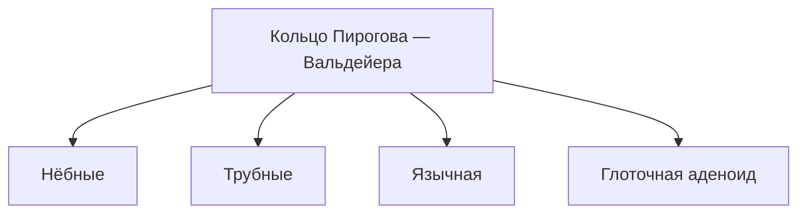

# 7.4 Глотка

> [!abstract] Тема
> Строение, отделы и функции глотки (*pharynx*). Перекрёст пищеварительного и дыхательного путей. Связь: [[7.3_Полость_рта_слюнные_железы|7.3]], [[7.2_Общий_план_строения|7.2]].

---

## 🔵 Общая характеристика

| Признак | Описание |
|---|---|
| **Форма** | **Воронкообразная** |
| **Функция проводника** | Из рта — **пережёванная**, смоченная слюной пища |
| **Прикрепление** | К **основанию черепа** |
| **Переход в пищевод** | На уровне **VII шейного** позвонка |
| **Длина** | В среднем **12–14 см** |
| **Особенность** | **Перекрёст** пищеварительного и **дыхательного** путей |

> [!note] Соседство
> Боковые участки граничат с **сосудисто-нервным пучком** шеи:
> - общая **сонная** артерия
> - внутренняя **яремная** вена
> - **блуждающий** нерв



---

## 🔵 Три отдела глотки

| № | Отдел | Латынь | Расположение |
|:---:|---|---|---|
| 1 | **Носовая** (носоглотка) | *pars nasalis* | За **носовой** полостью |
| 2 | **Ротовая** (ротоглотка) | *pars oralis* | Позади **зева** |
| 3 | **Гортанная** (гортаноглотка) | *pars laryngea* | Самый **узкий** отдел |

### Стенки глотки

- **Верхняя** (свод), **задняя**, **передняя**, **две боковых**
- **Передняя стенка** выражена только в **гортаноглотке**
- В носоглотке и ротоглотке передняя стенка **практически отсутствует** (сообщение с носом и ртом)

---

## 🟡 Носоглотка (*pars nasalis*)

| Элемент | Описание |
|---|---|
| **Сообщение** | С носовой полостью через **хоаны** → воздух в глотку |
| **Эпителий** | **Мерцательный** (как в носовой полости) |
| **Слуховая (Евстахиева) труба** | Открывается в носоглотку; сообщает **барабанную полость** с глоткой |
| **Значение трубы** | **Вентиляция** барабанной полости, **выравнивание давления** с атмосферным |

> [!tip] Слух и дыхание
> **Носовое дыхание** необходимо для нормального функционирования **органа слуха**.

*Рис. 7.9:* глоточное отверстие слуховой трубы — **2**; трубная миндалина — **15**; полость носа — **16**.

---

## 🟡 Ротоглотка (*pars oralis*)

| Элемент | Описание |
|---|---|
| **Зев** | Небольшое пространство: **две пары нёбных дужек** по бокам, **мягкое нёбо** сверху, **корень языка** снизу |
| **Границы** | Сверху — уровень **мягкого нёба**; снизу — **вход в гортань** |
| **Эпителий** | **Многослойный плоский неороговевающий** (как в ротовой полости) |
| **Перекрёст путей** | Здесь пересекаются **пищеварительный** и **дыхательный** пути |

*Рис. 7.9:* мягкое нёбо — **4**; нёбный язычок — **5**; нёбная миндалина — **6**; нёбно-глоточная дужка — **7**; ротоглотка — **8**; язычная миндалина — **13**; нёбно-язычная дужка — **14**.

---

## 🟡 Гортаноглотка (*pars laryngea*)

| Элемент | Описание |
|---|---|
| **Узкий отдел** | Спереди граничит с **задней стенкой гортани** |
| **Снизу** | Переходит в **пищевод** |
| **Эпителий** | Многослойный плоский **неороговевающий** |

### Проведение пищи и воздуха

| Среда | Путь |
|---|---|
| **Пища** | Рот → ротоглотка → гортаноглотка → **пищевод** |
| **Воздух** | Нос → носоглотка → ротоглотка → **гортань** |

> [!important] Надгортанник
> Хрящ гортани — **надгортанник** (*эпиглотта*, рис. 7.9 — **9**): роль **клапана**, препятствует попаданию пищи в дыхательные пути.

---

## 🟢 Стенка глотки — три оболочки

```
Слизистая → Мышечная (поперечнополосатая) → Адвентиция
```

> Внешняя оболочка — **адвентиция** (не сероза) → **ограничена подвижность** органа.

### Слизистая оболочка

**Вместо подслизистой основы** — **глоточно-базиллярная фасция** (соединительная ткань) → прикрепление глотки к **основанию черепа**.

#### Лимфоэпителиальное кольцо Пирогова — Вальдейера

| Миндалина | Латынь | Парность | Расположение |
|---|---|:---:|---|
| **Нёбная** | *tonsilla palatina* | Парная | Между **нёбными дужками** |
| **Трубная** | *tonsilla tubaria* | Парная | У **выхода** слуховой трубы в глотку |
| **Язычная** | *tonsilla lingualis* | Непарная | **Корень языка** |
| **Глоточная** (аденоид) | *tonsilla pharyngealis* / *adenoida* | Непарная | **Верхняя** стенка глотки |



| Особенности миндалин | Описание |
|---|---|
| **Функция** | Обезвреживание микроорганизмов с **пищей** и **воздухом**; участие в **иммунных** процессах |
| **Строение** | Слизистая со **складками** (миндаликовые **крипты**); под эпителием — **лимфоидные узелки**, **лимфоциты** |
| **С возрастом** | Утрата функций, **атрофия**; у взрослых хорошо заметны в основном **нёбные** миндалины |

---

## 🟢 Мышечная оболочка

**Поперечнополосатая** мускулатура → продвижение **пищевого комка** в пищевод.

| Группа | Мышцы | Расположение |
|---|---|---|
| **1. Сжиматели (констрикторы)** | Верхний, средний, нижний | **Циркулярно**, покрывают друг друга «**черепицей**» |
| **2. Поднимающие глотку** | **Шилоглоточная**, **нёбно-глоточная** | **Продольно**; слабее констрикторов |

---

## 📋 Схема рис. 7.9 (основные структуры)

| № | Структура |
|:---:|---|
| 1 | Твёрдое нёбо |
| 4 | Мягкое нёбо |
| 8 | Ротоглотка |
| 9 | Надгортанник |
| 10 | Пищевод |
| 11 | Трахея |
| 12 | Гортань |
| 13 | Язычная миндалина |
| 16 | Полость носа |

---

## 📋 Функции глотки

1. **Проводник пищи** — из ротовой полости в **пищевод**
2. **Проводник воздуха** — из носовой полости в **гортань**
3. **Защита** — лимфоэпителиальное кольцо **Пирогова — Вальдейера** (бактерии, вирусы)

---

## 📋 Сводная таблица

| Термин | Кратко |
|---|---|
| **Носоглотка** | Хоаны, Евстахиева труба, мерцательный эпителий |
| **Ротоглотка** | Зев, перекрёст путей |
| **Гортаноглотка** | Узкий отдел, надгортанник |
| **Кольцо Вальдейера** | 4 типа миндалин |
| **Глоточно-базиллярная фасция** | Прикрепление к основанию черепа |
| **Констрикторы** | Циркулярные «черепицей» |
