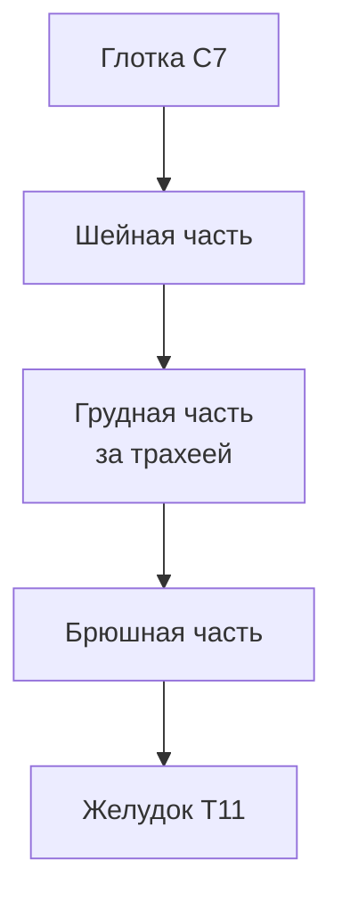
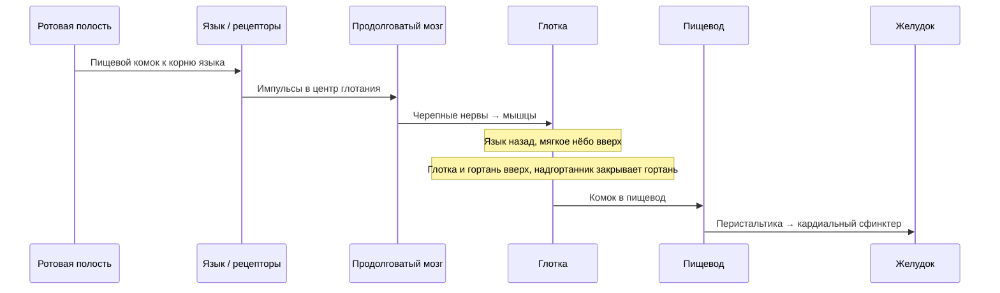

# 7.5 Пищевод

> [!abstract] Тема
> Строение, сужения, оболочки и функции пищевода (*oesophagus*). Акт глотания. Связь: [[7.4_Глотка|7.4]], [[7.2_Общий_план_строения|7.2]].

---

## 🔵 Общая характеристика

| Признак | Значение |
|---|---|
| **Тип органа** | **Полый** (трубчатый) |
| **Длина** | **25–30 см** |
| **Начало** | От **глотки**, уровень **VII шейного** позвонка |
| **Конец** | Уровень **XI грудного** позвонка → переход в **желудок** |
| **Основная функция** | **Проведение** пищи из глотки в желудок |

### Части пищевода

| Часть | Расположение |
|---|---|
| **Шейная** | **1,0–1,5 см** |
| **Грудная** | **Самая большая** часть; грудная полость |
| **Брюшная** | **1,0–1,5 см**; брюшная полость |

### Топография (рис. 7.10)

| Сосед | Описание |
|---|---|
| **Трахея** | Пищевод проходит **позади** |
| **Грудная аорта** | **Граничит** с пищеводом |
| **Блуждающие нервы** | С боков; переплетения → **сплетения** |

*Рис. 7.10:* пищевод — **15**; глотка — **1**; кардиальная вырезка — **3**; кардиальная часть желудка — **4**.

---

## 🔵 Сужения пищевода

### Постоянные (анатомические) — 3

| № | Название | Место |
|:---:|---|---|
| 1 | **Фарингеальное (глоточное)** | Переход **глотки** в пищевод |
| 2 | **Бронхиальное** | Соприкосновение с **левым главным бронхом** |
| 3 | **Диафрагмальное** | **Пищеводное отверстие** диафрагмы |

### Непостоянные (физиологические)

> Выявляются при **рентгенологическом** исследовании **только у живого** человека.

| Сужение | Место |
|---|---|
| **Аортальное** | Прилегание **дуги аорты** |
| **Кардиальное** | Переход пищевода в **желудок** |

---

## 🟡 Стенка пищевода — три оболочки

| Оболочка | Шейная + грудная | Брюшная часть |
|---|---|---|
| Слизистая | ✓ | ✓ |
| Мышечная | ✓ | ✓ |
| Наружная | **Адвентиция** | **Серозная** оболочка |

### Слизистая оболочка

- Эпителий: **многослойный плоский неороговевающий**
- Многочисленные **продольные складки**
- На поперечном срезе полость **звёздчатая** → пищевод **расширяется** при прохождении комка

### Мышечная оболочка

| Участок | Ткань |
|---|---|
| **Верхняя** часть | Только **поперечнополосатая** |
| **Средняя треть** | Поперечнополосатая + **гладкая** |
| **Нижняя** часть | Только **гладкая** |

| Слой | Расположение |
|---|---|
| **Наружный** | **Продольный** |
| **Внутренний** | **Циркулярный** |

> [!note] Отличие от типичной схемы ЖКТ (7.2)
> У пищевода **внутренний — циркулярный**, **наружный — продольный** (в 7.2 для большинства полых органов циркулярный слой указан как внутренний у слизистой — здесь та же логика для внутреннего слоя).

---

## 🟡 Продвижение пищи

| Тип пищи | Время | Механизм |
|---|---|---|
| **Жидкая** | **1–2 с** | В основном **сила тяжести**; активных сокращений мышц **нет** |
| **Более плотная** | **3–10 с** | Тяжесть + **активная** перистальтика мышц пищевода |

**Перистальтика:** волнообразное движение — ниже комка мускулатура **расслабляется**, выше — **сокращается**, проталкивая пищу.

### Кардиальный сфинктер

- В области **кардиального сужения**
- **Клапан** между желудком и пищеводом
- Пропускает пищу **в желудок**, препятствует **обратному** току (рефлюксу)

---

## 🟢 Глотание

> [!abstract] Определение
> **Сложный рефлекторный акт** перевода пищевого комка из **ротовой полости** в **желудок**.

| Элемент | Описание |
|---|---|
| **Центр глотания** | **Продолговатый мозг** |
| **Связи** | Дыхательный и **сосудодвигательный** центры → при глотании **прекращается дыхание**, меняется работа **сердца и сосудов** |

### Этапы защиты дыхательных путей

| Действие | Результат |
|---|---|
| Язык **запрокидывается**, толкает комок в глотку | Продвижение в глотку |
| **Мягкое нёбо** поднимается | Отграничивает **носоглотку** от ротоглотки → комок **не в нос** |
| Поднимаются **глотка** и **гортань** | **Надгортанник** перекрывает вход в гортань |
| Сокращение **мышц глотки** | Комок через ротоглотку и гортаноглотку → **пищевод** |

> [!danger] Асфиксия
> **Разговор при приёме пищи** может привести к попаданию комка в дыхательные пути и **смерти от удушья**.

---

## 📋 Сводная таблица

| Термин | Кратко |
|---|---|
| **Перистальтика** | Волна сокращений выше комка, расслабление ниже |
| **Кардиальный сфинктер** | Клапан у входа в желудок |
| **Анатомические сужения** | 3 (глоточное, бронхиальное, диафрагмальное) |
| **Физиологические сужения** | Аортальное, кардиальное (рентген, живой) |
| **Адвентиция / сероза** | Шея и грудь / брюшная часть |
