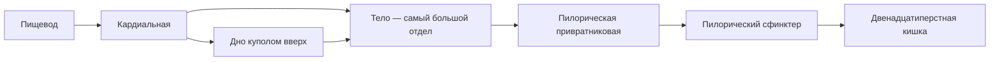

# 7.6 Желудок

> [!abstract] Тема
> Строение, желудочный сок, моторика, процессы пищеварения, регуляция (И. П. Павлов). Связь: [[7.5_Пищевод|7.5]], [[7.4_Глотка|7.4]], [[7.2_Общий_план_строения|7.2]].

---

## 🔵 Строение

| Признак | Описание |
|---|---|
| **Латынь / греч.** | *ventriculus* (*gaster*) |
| **Тип** | **Полый мышечный** орган |
| **Расположение** | **Брюшная полость**, преимущественно **левое подреберье** |
| **Просвет** | Значительно **шире**, чем у других полых органов ЖКТ |
| **Форма** | **Индивидуальна** (тип телосложения, **наполнение**) |
| **Вместимость** | **1,5–4 л** |

### Поверхности и кривизны

| Элемент | Описание |
|---|---|
| **Поверхности** | Передняя и задняя (переходят по краям) |
| **Малая кривизна** | Край, обращённый **вверх** |
| **Большая кривизна** | Край, обращённый **вниз** |

### Части желудка (рис. 7.10)

| Часть | Особенности |
|---|---|
| **Кардиальная** | Граничит с **пищеводом** |
| **Дно** | Слева от кардиальной; **купол** вверх |
| **Тело** | **Самый большой** отдел |
| **Пилорическая (привратниковая)** | Переход в **ДПК**; **пилорический сфинктер** регулирует выход в тонкую кишку |

*Рис. 7.10:* кардиальная — **4**; дно — **5**; тело / складки — **6**; большая кривизна — **7**; пилор — **8**, **13**; малая кривизна — **14**.

---

## 🔵 Стенка желудка

| Оболочка | Особенности |
|---|---|
| **Слизистая** | Много **складок**; **однослойный призматический** эпителий; до **35 млн** желёз |
| **Мышечная** | **3 слоя** гладкой мышцы: наружный **продольный**, средний **циркулярный**, у слизистой — **косой** |
| **Серозная (брюшина)** | Со всех сторон → желудок **меняет форму и объём** |

### Клетки желёз

| Клетки | Секрет | Где преобладают |
|---|---|---|
| **Главные** | **Пепсиноген** | Тело |
| **Обкладочные (париетальные)** | **Соляная кислота** | — |
| **Слизистые (мукоциты)** | **Слизь** | Кардиальные и пилорические железы |

| Тип желёз | Отдел |
|---|---|
| Кардиальные | Кардиальная часть |
| Тела | Тело |
| Пилорические | Пилорический отдел |

> **Желудочный сок** — смесь секретов всех желёз в просвете. Суточно **1,5–2,0 л** → разжижение пищи, образование **химуса** (кашицы).

---

## 🟡 Состав желудочного сока

| Показатель | Значение |
|---|---|
| **pH при пищеварении** | **0,8–1,5** (сильнокислая среда) |
| **pH в покое** | **~6** |
| **Вода** | **99–99,5 %** |

### Органические вещества

| Компонент | Роль / активность |
|---|---|
| **Муцин** | Обволакивание комка; **защита** слизистой от агрессивных факторов сока |
| **Пепсин** | Из **пепсиногена** (главные клетки) под **HCl** и воздухом у **дна**; активен при **pH 1–2**; рвёт **пептидные связи** → **полипептиды** (всасывание — в **тонкой кишке**) |
| **Гастриксин** | Белки; pH **3,2–3,5** |
| **Реннин** | Белки; pH **5–6**; активен у **грудных детей** (молоко) |
| **Желудочная липаза** | Жиры; активность **слабая** (у младенцев значимее) |

> [!tip] Активность пепсина
> **1 г** пепсина за **2 ч** может гидролизовать **50 кг** яичного альбумина, свернуть **100 000 л** молока.

### Неорганические вещества

**HCl**, SO₄²⁻, Na⁺, K⁺, HCO₃⁻, Ca²⁺. Основное — **соляная кислота** (париетальные клетки).

| Функция HCl | Описание |
|---|---|
| Активация | **Пепсиноген → пепсин** |
| Среда для пепсина | pH **1–2** |
| **Денатурация** белков пищи | Облегчает работу ферментов |
| **Бактерицидная** | Большинство микробов не выдерживает кислотность просвета |

### Внутренний фактор Кастла и железо

| Вещество | Значение |
|---|---|
| **Внутренний фактор Кастла** | Синтез в железах; нужен для **всасывания витамина B₁₂** (комплекс → эпителий тонкой кишки → кровь) |
| **Железо** | Обработка HCl → **легковсасываемые** формы → гемоглобин |
| **При гастритах** (↓ кислота, ↓ фактор Кастла) | Часто **анемия** |

---

## 🟡 Моторная функция

| Тип сокращений | Роль |
|---|---|
| **Тонические** | Приспособление к **объёму** пищи |
| **Перистальтические** | **Перемешивание** и **эвакуация** |
| **Голодные** | В **пустом** желудке; участвуют в **чувстве голода** |

- **Химус** в ДПК **порциями** после **нейтрализации** кислоты секретами печени, поджелудочной, кишечника → затем открывается **пилорический сфинктер**
- **Обратные** движения при плохой/раздражающей пище → **рвотный рефлекс**
- Пища в желудке: **1,5–2 до 10 ч** (состав и консистенция)

### Антральный сфинктер и «пищеварительный мешок»

> **Физиологический антральный сфинктер** между **телом** и **пилорической** частью — тонус **циркулярного** слоя.

| Зона | Название | Процессы |
|---|---|---|
| **Кардиальная + дно + тело** | **Пищеварительный мешок** | Основное **переваривание** |
| **Пилорическая часть** | **Эвакуаторный канал** | Смешивание с **слизью**, ↓ кислотность химуса → тонкая кишка |

---

## 🟢 Процессы в желудке

1. **Накопление** пищи  
2. **Механическая** обработка (перемешивание)  
3. **Денатурация** белков (HCl)  
4. **Переваривание** белков (**пепсин**)  
5. **Углеводы** — продолжение действия **амилазы слюны** в комке (в соке амилаза **инактивируется**)  
6. **Бактерицидная** обработка (HCl)  
7. Образование **химуса**  
8. **Железо** + **фактор Кастла** (антианемическая функция)  
9. Продвижение химуса в **тонкую кишку**  

---

## 🔴 И. П. Павлов: секреция желудочного сока

| Опыт | Суть |
|---|---|
| **Мнимое кормление** | Перерезка пищевода, пища из рта **не в желудок**; сок через **фистулу** |
| **Малый желудочек** | Изолированный участок с иннервацией и кровоснабжением, фистула (рис. 7.11) |

| Рефлекс | Стимул | Центр |
|---|---|---|
| **Безусловный сокоотделительный** | Раздражение рецепторов **рта** при кормлении | **Продолговатый мозг** |
| **Условный** | **Вид, запах** пищи без контакта с ртом | — |
| **Аппетитный сок** | При условном рефлексе | Состав как при мнимом кормлении |

### Три фазы секреции (Павлов)

| Фаза | Когда | Состав сока |
|---|---|---|
| **1. Мозговая** | Вид, запах, пища **в рту** | **Не зависит** от вида и количества пищи |
| **2. Желудочная** | Пища **в желудке** | **Зависит** от вида и количества пищи |
| **3. Кишечная** | Рецепторы **кишечника** (недостаточно обработанный химус в ДПК) | Корректировка желудочной секреции |

> Нобелевская премия **1904 г.** за работы по пищеварению.

---

## 🟢 Регуляция

| Механизм | Эффект |
|---|---|
| **Парасимпатика** | ↑ секреция желёз, ↑ моторика |
| **Симпатика** | Противоположный эффект |

### Гуморальная регуляция

| Вещество | Секреция |
|---|---|
| **Глюкоза, аминокислоты** (в крови) | **↓** |
| **Гастрин, гистамин** (клетки слизистой) | **↑** |
| **Секретин, холецистокинин** | **↓** |

> **Белковая пища** → ↑ **пепсин**, ↑ **соляная кислота**.

---

## 📋 Сводная таблица

| Термин | Кратко |
|---|---|
| **Химус** | Пищевая кашица в желудке |
| **Пепсиноген → пепсин** | HCl + дно желудка |
| **Пищеварительный мешок** | Кардиальная + дно + тело |
| **Эвакуаторный канал** | Пилорическая часть |
| **Фактор Кастла** | B₁₂ всасывание |
